### TREBALL DE RECERCA · TECNOLOGIA

# Machine Learning: Xarxes neuronals i aplicacions


<center></center>

## Abstract

El aprendizaje automático es una rama de la inteligencia artificial que se ocupa de la creación de algoritmos que pueden aprender de los datos y hacer predicciones sobre ellos. Las redes neuronales son un tipo de algoritmo de aprendizaje automático, especialmente adecuado para tareas que requieren el aprendizaje de patrones complejos.

En este proyecto de investigación, me he centrado en la inteligencia artificial, concretamente en el subcampo del aprendizaje automático. He investigado el funcionamiento de las redes neuronales, empezando por la neurona artificial más sencilla y avanzando hacia modelos de aprendizaje más complejos. El objetivo es comprender mejor cómo funcionan estos algoritmos y cómo pueden utilizarse para resolver diversos problemas, en concreto, problemas de clasificación.

Por último, he puesto en práctica estos conocimientos teóricos con la ayuda de un lenguaje y un entorno de programación.

---

Machine learning is a branch of artificial intelligence that deals with the creation of algorithms that can learn from data and make predictions about it. Neural networks are a type of machine learning algorithm particularly suited for tasks that require learning complex patterns.

In this research project, I have focused on artificial intelligence, specifically in the subfield of machine learning. I have investigated the operation of neural networks, starting with the simplest artificial neuron and moving towards more complex learning models. The goal is to better understand how these algorithms work and how they can be used to solve various problems, in particular, classification problems.

Finally, I have put this theoretical knowledge into practice with the help of a programming language and environment.

# Índex

[**Abstract**](#abstract)

[**1. Introducció**](#1.-introducció)

> [**1.1. Hipòtesi i objectius**](#1.1.-hipòtesi-i-objectius)

> [**1.2. Motivació**](#1.2.-motivació)

> [**1.3. Coneixements inicials**](#1.3.-coneixements-inicials)

[**Part Teòrica**](#part-teòrica)

[**2. Conceptes inicials**](#2.-conceptes-inicials)

> [**2.1. Orígens**](#2.1.-orígens)

> [**2.2. Intel·ligència artificial**](#2.2.-intel·ligència-artificial)

> [**2.3. Machine Learning**](#2.3.-machine-learning)

> [**2.4. Xarxes neuronals**](#2.4.-xarxes-neuronals)

[**3. Xarxes neuronals**](#3.-xarxes-neuronals)

> [**3.1. Neurona biològica**](#3.1.-neurona-biològica)

> [**3.2. Perceptró**](#3.2.-perceptró)

> [**3.3. Xarxes neuronals**](#3.3.-xarxes-neuronals)

> [**3.4. Xarxes neuronals convolucionals**](#3.4.-xarxes-neuronals-convolucionals)

[**4. Entrenament**](#4.-entrenament)

> [**4.1. Paradigmes d’aprenentatge**](#4.1.-paradigmes-d’aprenentatge)

> [**4.2. L'error**](#4.2.-l'error)

> [**4.3. Backpropagation**](#4.3.-backpropagation)

[**Part Pràctica**](#part-pràctica)

[**5. Programació**](#5.-programació)

> [**5.1. Google Colab**](#5.1.-google-colab)

> [**5.2. TensorFlow**](#5.2.-tensorflow)

> [**5.3. Altres llibreries**](#5.3.-altres-llibreries)

[**6. Exemples pràctics**](#6.-exemples-pràctics)

> [**6.1. Perceptró**](#6.1.-perceptró)

> [**6.2. Perceptró: Classificació binària**](#6.2.-perceptró:-classificació-binària)

> [**6.3. Classificació binària**](#6.3.-classificació-binària)

[**7. Primer projecte: Classificador de gossos i gats**](#7.-primer-projecte:-classificador-de-gossos-i-gats)

> [**7.1. Objectius**](#7.1.-objectius)

> [**7.2. Noves tècniques utilitzades**](#7.2.-noves-tècniques-utilitzades)

> [**7.3. Codi**](#7.3.-codi)

> [**7.4. Anàlisi dels resultats**](#7.4.-anàlisi-dels-resultats)

> [**7.5. Conclusions**](#7.5.-conclusions)

[**8. Segon projecte: Classificador d’edats**](#8.-segon-projecte:-classificador-d’edats)

> [**8.1. Plantejament**](#8.1.-plantejament)

> [**8.2. Codi**](#8.2.-codi)

> [**8.3. Resultats**](#8.3.-resultats)

> [**8.4. Conclusions**](#8.4.-conclusions)

[**9. Resultats dels models**](#9.-resultats-dels-models)

> [**9.1. Gràfics models**](#9.1.-gràfics-models)

> [**9.2. Web dels models**](#9.2.-web-dels-models)

[**10. Conclusions finals**](#10.-conclusions-finals)

[**11. Agraïments**](#11.-agraïments)

[**12. Webgrafia**](#12.-webgrafia)

> [**12.1. Imatges**](#12.1.-imatges)

> [**12.2. Fonts i recursos**](#12.2.-fonts-i-recursos)

# 1. Introducció

La intel·ligència artificial ha suposat un dels grans avenços de la tecnologia en els últims anys, aquesta busca la creació de màquines que puguin imitar comportaments intel·ligents. En l’actualitat, la intel·ligència artificial (abreujada com “IA”), ha estat utilitzada en un gran nombre de camps, incloent-hi diagnòstics mèdics, comerç d'accions, control robòtic, percepció remota, descobriments científics i joguines. Els exemples d’ús poden ser molt diversos: conduir vehicles i màquines, analitzar patrons, reconèixer veus o guanyar jocs.

Dins del camp de la intel·ligència artificial podem trobar-nos diferents subcategories/camps que responguin a diferents comportaments intel·ligents com la robòtica, el processament del llenguatge natural, la visió o la veu. Però en aquest treball em dedicaré a investigar sobre la seva capacitat d’aprendre: el Machine Learning (aprenentatge automàtic).

En concret, em centraré a descobrir el funcionament de les xarxes neuronals, i la seva capacitat per a aprendre de manera jerarquitzada, és a dir, per nivell/capes, començant pel més petit, la neurona artificial, fins a arribar als models d’aprenentatge.

Conclouré la recerca posant en pràctica el coneixement teòric amb l'ajuda d'un llenguatge i entorn de programació. El meu objectiu és aconseguir desenvolupar un model d’aprenentatge que sigui capaç de classificar imatges fent servir les eines disponibles en l’actualitat.

## 1.1. Hipòtesi i objectius

Partint de la hipòtesi que sí que és possible desenvolupar una intel·ligència artificial pròpia amb les eines disponibles actualment, intentaré comprovar-la amb l’entrenament de diversos models de classificació.

L’objectiu final d’aquest treball serà intentar crear la meva IA pròpia entrenada per classificar imatges, utilitzant llibreries ja creades, i comprovar quina és la millor tècnica per a dur a terme aquest tipus de funció. 

## 1.2. Motivació

Des de petit, la intel·ligència artificial m’ha semblat un camp molt interessant de la informàtica. El fet que una màquina sigui capaç d'actuar semblant a una persona o un animal sempre m’ha sorprès. En aquest treball de recerca em proposo investigar i experimentar la intel·ligència artificial des del seu interior, per entendre el seu funcionament i els processos que utilitza per aprendre.

## 1.3. Coneixements inicials

He començat aquest treball amb coneixements bàsics de Python i programació i amb diversos documentals vistos sobre el tema. Abans de començar, vaig experimentar amb intel·ligències artificials pel meu propi compte per entreteniment.

# 2. Conceptes inicials

Si volem endinsar-nos en el camp de la intel·ligència artificial, abans hem d'entendre i tenir clar a què ens referim quan parlem de diferents conceptes i termes necessaris per a comprendre el tema: conceptes com intel·ligència artificial, Machine Learning, xarxes neuronals, Big Data o Deep Learning. Conceptes que de vegades s’interpreten de manera diferent i són utilitzats amb molta confusió.

## 2.1. Orígens

La història de la intel·ligència artificial es remunta a l'antiguitat, quan eren habituals els mites i històries sobre éssers artificials dotats d'intel·ligència o consciència.

No obstant això, no va ser fins a la invenció de l'ordinador digital programable, en la dècada de 1940, quan el camp modern de la IA va començar a prendre forma. Aquesta màquina va inspirar a alguns científics a discutir seriosament la possibilitat de construir un cervell electrònic.

Es pot considerar el seu inici formal l’any 1950, quan es va considerar la intenció de fer que les màquines fossin capaces de resoldre problemes sense suport de l'ésser humà, de manera autònoma.

Va ser Alan Turing a finals de la II Guerra Mundial qui va establir les primeres bases de la intel·ligència artificial.

Anys després, juntament amb Alan Turing, diversos investigadors li van conferir existència formal a l'àrea d'exploració i estudi d'aquestes matèries. Entre ells es poden esmentar els següents: McCarthy, Minsky, Edmonds, Papert i Carbonell, entre altres.

Al llarg dels anys, la recerca sobre la IA ha conduït al desenvolupament de nombroses i potents tecnologies informàtiques que han tingut un profund impacte en la societat.

## 2.2. Intel·ligència artificial

Donar una definició a la intel·ligència artificial és una tasca complicada perquè aquesta depèn de la mateixa definició d'intel·ligència. Però podem arribar a la conclusió que la intel·ligència artificial és una branca de la Informàtica, que busca la creació de màquines que puguin imitar comportaments intel·ligents. Alguns comportaments intel·ligents podrien ser: conduir vehicles i màquines, analitzar patrons, reconèixer veus o guanyar jocs.

Algunes persones fan servir el terme IA per a descriure les màquines que imiten les funcions cognitives que els humans associen amb la ment humana, com aprendre i resoldre problemes. No obstant això, aquesta definició no és gaire correcta, ja que es correspon a una subcategoria d’aquesta: l’aprenentatge automàtic.

## 2.3. Machine Learning

Dins del camp de la intel·ligència artificial, podem trobar-nos diferents subcategories/camps que responguin a diferents comportaments intel·ligents com la robòtica, el processament del llenguatge natural (NLP), la visió o la veu. Però la capacitat que defineix a les persones com a éssers intel·ligents és la capacitat d'aprendre, és a dir, el Machine Learning (aprenentatge automàtic).


*Figura 2.3.1: Esquema conceptual de la intel·ligència artificial*

És molt comú confondre Machine Learning amb intel·ligència artificial, però no és el mateix programar una màquina perquè pugui moure's a programar a una màquina perquè aprengui a moure's.

Dins del Machine Learning, ens trobem amb diferents tècniques que serveixen per a cobrir diferents tipus d'aplicacions. Per exemple, tenim tècniques com els arbres de decisió, models de regressió, models de classificació i moltíssimes altres més. No obstant això, si una d'aquestes tècniques ha donat fama al camp de l’aprenentatge automàtic durant l'última dècada, aquesta han estat les xarxes neuronals.


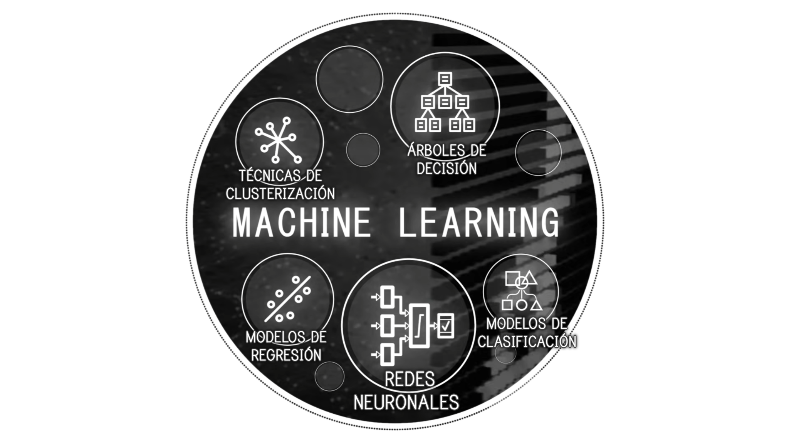

*Figura 2.3.2: Esquema conceptual del Machine Learning*

## 2.4. Xarxes neuronals

Les xarxes neuronals són capaces d'aprendre de manera jerarquitzada, és a dir, la informació s'aprèn per nivells/capes. A mesura que afegim més capes, la informació que s'aprèn és cada vegada més abstracta i interessant. No hi ha límit de capes i la tendència és que cada vegada a aquests algorismes se'ls afegeixin més i més capes.

# 3. Xarxes neuronals

## 3.1. Neurona biològica

Per entendre les xarxes neuronals i les neurones artificials hem de començar entenent com funciona una neurona natural.

Les neurones són cèl·lules nervioses interconnectades que permeten el tractament i la transmissió de senyals químiques i elèctriques. Les dendrites són ramificacions que reben la informació d'altres neurones. Els nuclis cel·lulars tracten la informació rebuda de les dendrites. Finalment, les sinapsis i l'axó serveixen de connexió entre les neurones, i transmeten la informació processada cap a una altra neurona.


*Figura 3.1: Representació gràfica neurona biològica*

Les neurones artificials imiten el funcionament d’una neurona biològica. Es basen d’una funció matemàtica que rep unes dades, les pesa, calcula la suma i presenta un resultat per mitjà una funció no lineal.

## 3.2. Perceptró

L'algorisme del perceptró o neurona artificial va ser publicat en 1957 per Frank Rosenblatt. L'objectiu del perceptró és trobar un hiperplà, anomenat límit de decisió, que separi correctament un conjunt de dades, linealment separables, en dues regions dins l'espai.

Podem entendre un hiperplà com un objecte que divideix un espai en dues parts: En un espai unidimensional, un hiperplà és un punt que divideix una línia en dues; en un espai bidimensional, és una recta que divideix el pla en dues meitats; en un espai tridimensional, és un pla corrent que divideix l'espai en dues meitats. Aquest concepte també pot ser aplicat a espais de quatre dimensions o més.

Una vegada obtingut l’hiperplà, aquest pot utilitzar-se per a classificacions binàries.


*Figura 3.2.1: Exemple d'un cas on es podria emprar un perceptró per a classificar dues classes segons característiques d'entrada.*

Encara que aquest algorisme d'aprenentatge és molt simple, entendre el seu funcionament és essencial per a aprendre altres mètodes més complexos com les xarxes neuronals artificials.

### Components

El perceptró simple és un model neuronal unidireccional, que està compost per una capa d’entrada i una altra de sortida. Aquest model està compost per diversos components:

- **Valors d’entrada *(Inputs)*:** És la informació rebuda que se li ha proporcionat.

- **Pesos *(Weights)*:** Cada valor d’entrada està relacionat amb un pes. Aquests controlen la força de la connexió de l'entrada fins a la part del processament, això vol dir que marquen la importància que té cada una de les entrades en el resultat final. Els pesos seran els valors a aprendre, aquests es van modificant per anar millorant el resultat de sortida.

- **Biaix i Llindar *(Sesgo/Bias o Umbral/Threshold)*:** El biaix altera la posició del límit de decisió, però no l'orientació. Matemàticament, aquest valor se sumarà amb el resultat de la suma ponderada. El llindar és com una entrada amb valor constant d'1 i amb un pes corresponent al biaix que és variable.

- **Funció d’activació:** Aquestes s’encarreguen de modificar i normalitzar els valors obtinguts de la suma ponderada. Existeixen diferents tipus de funcions d’activació. Per exemple, la funció binària, que tracta els valors obtinguts per aconseguir resultats binaris, útils en classificacions.

- **Valors de sortida *(Outputs)*:** Després de tots els càlculs realitzats, s’aconsegueixen uns valors de sortida que poden ser transmesos a altres neurones o ser comparats amb resultats verificats i utilitzar aquesta comparació per trobar errors i millorar els valors dels pesos.


*Figura 3.2.2: Representació gràfica neurona artificial*

### Explicació matemàtica

Primerament, tenim el vector x, amb totes les entrades donades, i el vector w, amb tots els pesos de cada entrada. A més, tenim un biaix b establert i una funció d’activació f(). Així doncs, el resultat de sortida serà: 

$$ y = f(z) = f(x · w + b) $$

$$ z = Σ = x　· w + b = x_1· w_1 + x_2 · w_2 + x_3 · w_3 + ··· + x_n · w_n + b $$


*Figura 3.2.3: Representació gràfica perceptró*

### Exemple amb perceptró

Imaginem que volem aconseguir un dia perfecte, arribem a la conclusió que per aconseguir-ho necessitem dues coses: jugar a videojocs i fer esport. Totes dues variables seran binàries, el seu valor només pot ser 0 o 1. La variable de sortida ens indicarà si el dia ha estat perfecte o no, també en binari.

· Exemple interactiu: [Exemple Perceptró](https://docs.google.com/spreadsheets/d/19ZZPV0xgRLsNb7_vNBh6uezyW3X1ls__-jmpNME201Q/edit?usp=sharing)

· Representació gràfica: [*www.geogebra.org/calculator/e2efnygv*](http://www.geogebra.org/calculator/e2efnygv)

El resultat obtingut sense fer ús de cap funció d’activació es pot representar en forma de recta que separa els punts en dues classes. Per aconseguir que el resultat sigui binari, utilitzo la funció d’activació *Step* que, depenent de si el valor resultant és positiu o negatiu, ens retorna un 0 o un 1. Com a resultat obtenim una porta lògica *AND*.

### Funcions d’activació

Una xarxa neuronal sense funcions d’activació és molt limitada, ja que el resultat és lineal. La funció principal d’una funció d’activació és afegir components no lineals a la xarxa. La funció d'activació retorna una sortida que és generada per la neurona donada una entrada o conjunt d'entrades. Existeixen diferents funcions d’activació amb diferents usos:

- **Funció lineal:**

  - **Regressió lineal:**

    Les funcions lineals són la base de molts algorismes d'aprenentatge. Són molt útils per aconseguir resultats numèrics a partir d’entrades, però no serveixen per fer classificacions de més de dues classes. Un exemple de problema amb funció lineal seria una conversió d’unitats o per anàlisis de dades.

$$ f(z) = z $$

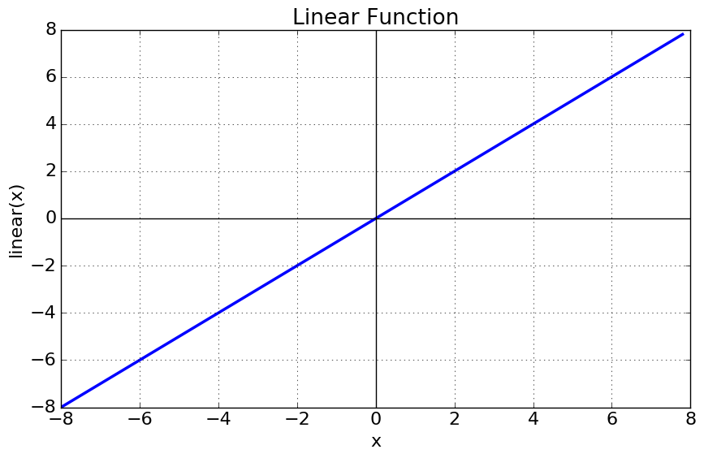

*Figura 3.2.4: Funció lineal*

- **Funcions no lineals:**

  - **Funció Step:**
  
    Aquesta funció indica que si el resultat és menor que zero, la sortida serà 0, però quan és major o igual a zero, donarà com a sortida igual 1. Aquesta funció s'utilitza per fer classificacions o quan hi ha sortides categòriques. Per exemple, per desenvolupar portes lògiques simples com AND o OR.

$$ si z<0 →f(z)=0 $$
$$ si z≥0 →f(z)=1 $$


*Figura 3.2.5: Gràfica funció Step*

- **Funció Logística / Sigmoide:**

  Aquesta funció té un rang de valors de sortida entre 0 i 1, però aquesta té una corba suau, que ens serveix per aconseguir una classificació interpretada com una probabilitat de 0 a 1. El seu ús es recomana només en la capa de sortida, quan requerim un resultat binari. Un cas d’utilització d’aquesta funció seria en un classificador d’imatges amb dos grups com, per exemple, gossos i gats.

$$ f(z) = \frac{1}{1 + e^{-z}} $$
$$ e ≃ 2,7182 $$


*Figura 3.2.6: Gràfica funció logística*

- **Funció tangent hiperbòlica:**

  Aquesta funció d'activació anomenada tangent hiperbòlica és similar a la funció logística, però té un rang de valors de sortida de -1 a 1. És superior a la funció logística per a capes ocultes, però no sol donar resultats superiors als de ReLU. Es pot utilitzar per classificacions i per resoldre problemes on decideixes una cosa o la contraria.

$$ f(z) = tanh(z) = \frac{e^z - e^{-z}}{e^z + e^{-z}} $$


*Figura 3.2.7: Gràfica funció tangent hiperbòlica*

- **Funció ReLU:**

  Aquesta funció és la més emprada pel fet que permet un aprenentatge molt ràpid en les xarxes neuronals. Si a aquesta funció se li dona valors d'entrada negatius, el resultat és zero, però si se li dona valors positius, és igual a aquest valor. ReLU és la funció que normalment farem servir. Per exemple, es pot fer servir en models relacionats amb imatges perquè funciona molt bé amb aquestes.

$$ f(z) = max(0, x) $$


*Figura 3.2.8: Gràfica funció ReLU*

- **Funció Softmax:**

  Aquesta funció es fa servir per a classificar informació. Softmax s'utilitza per a classes múltiples i assigna probabilitats per a cada classe que pertanyi. És la més popular a l’hora de fer una classificació on hi ha més de dos grups, per exemple, per diferenciar distintes peces de roba.

$$ f(z) = \frac{e^z}{Σ(e^z)} $$


*Figura 3.2.9: Exemple funció Softmax*

## 3.3. Xarxes neuronals

Amb una sola neurona no podem resoldre problemes complexos. Quan un conjunt de neurones es connecten entre si, formen les anomenades xarxes neuronals, que estan conformades per capes de neurones les quals s’envien i comparteixen informació rellevant per a determinar els *outputs* corresponents.

Les capes es poden dividir en 3 grups:

- **Capa d’entrada *(input)***

  Està composta per les neurones que reben les dades o senyals d’entrada.

- **Capes ocultes *(hidden)***

  Hi poden haver més d’una i no tenen una connexió directa amb l’exterior, no tenen connexió amb les dades d’entrada ni amb les dades de sortida.

- **Capa de sortida *(output)***

  Està composta de les neurones que proporcionen la resposta de la xarxa neuronal.

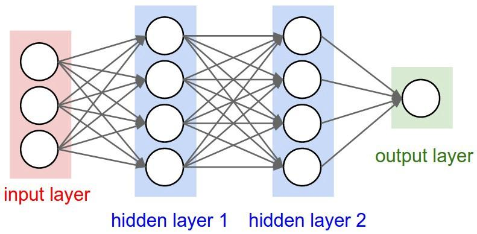

*Figura 3.3: Representació xarxa neuronal*

Una vegada entès el funcionament intern d'una neurona i xarxa neuronal, necessitem entrenar-la.

## 3.4. Xarxes neuronals convolucionals

Una xarxa neuronal convolucional és un tipus de xarxa neuronal que s'utilitza comunament per a fer anàlisi d'imatges. Les xarxes convolucionals són molt efectives per a tasques de visió artificial, com en la classificació i segmentació d'imatges, entre altres aplicacions.

El disseny de les xarxes convolucionals s'aprofita de l'estructura espacial de les imatges. Amb una xarxa neuronal normal, introduiríem els valors dels píxels com si fossin variables independents sense cap mena de relació, com si fos un vector pla. Normalment, el valor d'un píxel en una imatge està molt relacionat amb el valor dels píxels veïns. 

Les xarxes neuronals convolucionals es caracteritzen per fer ús d'un tipus de capa on es realitza una operació matemàtica coneguda com a convolució. Una convolució aplicada en una imatge és una operació que és capaç de produir una nova imatge utilitzant un filtre.

Les xarxes neuronals convolucionals són com els ulls de les mosques: el seu camp de visió es troba fragmentat en milers de petites imatges que extreuen patrons molt senzills com nivells de llum i ombra, que el seu cervell integra en diverses capes d'abstracció. En l'entrada a penes veu un mosaic, el cervell el relaciona i el classifica en parts, i els següents nivells superiors li assignen etiquetes com a menjar, obstacle, matamosques, etc.

Cada píxel nou es calcularà col·locant una matriu de números, anomenada filtre o kernel, sobre la imatge original. Cada valor del filtre es multiplicarà amb cada píxel i se sumarà tot per a trobar el valor del píxel resultant.


*Figura 3.4.1: Exemple convolució d’una imatge*

Aquesta operació de convolució sobre una imatge pot detectar diferents característiques segons quins siguin els valors del filtre que definim. Aquests valors són els que la xarxa neuronal anirà aprenent.

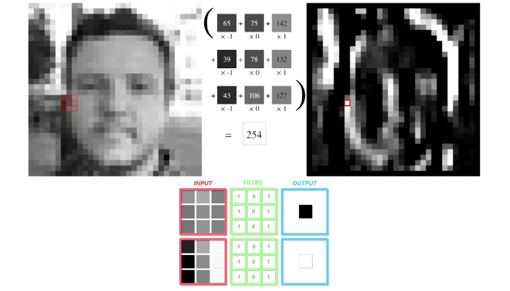

*Figura 3.4.2: Exemple d’un filtre que s’activarà quan trobi diferències de contrast i, com a resultat, detecti vores verticals.*

Les imatges generades són anomenades mapes de característiques, ja que s’encarreguen de trobar patrons i característiques en les imatges.

Els valors de cada píxel van de 0 (negre) a 255 (blanc). Quan hi hagi píxels blancs en un mapa de característiques voldrà dir que existeix una característica present en la imatge d’entrada.

En una xarxa neuronal convolucional, aquesta operació es realitza seqüencialment, on en les seves capes més inicials aprèn patrons molt genèrics, com a vores, cantonades i textures, i en les seves capes finals patrons més complexos i avançats, com a ulls o boques.

La capa d'entrada és la que processa més intensivament la imatge. Les capes següents treballen sobre el resum de les anteriors, i obtenen patrons cada vegada més abstractes. La primera capa a penes sap detectar contrastos verticals o horitzontals, les intermèdies ja poden detectar vores i regions, i les superiors ja saben on hi ha un gos en una foto.

En aquesta mena de xarxes, la imatge inicial es va comprimint espacialment, la seva resolució va disminuint, alhora que el seu gruix va augmentant, és a dir, el nombre de mapes de característiques augmenta. Aquests mapes de característiques finals seran els inputs que donarem a la xarxa.


*Figura 3.4.3: Xarxa neuronal convolucional.*

En el cas de la figura 3.4.3, la imatge inicial està composta per 3 mapes de característiques (vermell/verd/blau RGB) amb una resolució de 224 per 224 píxels. Després de la convolució s’aconsegueixen 4096 mapes de característiques d’un únic valor, valors que s’introdueixen en una xarxa neuronal. Les capes convolucionals no disminueixen la resolució, això ho fan les capes de Max Pooling.

Per disminuir les resolucions entre capes convolucionals s’utilitzen capes de Max Pooling, que no deixen de ser un tipus filtre que pren el valor més gran de la quadrícula. Reduint la resolució dels mapes, però augmentant la quantitat.

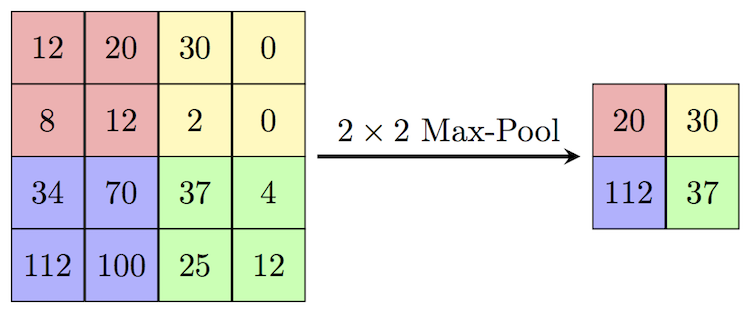

*Figura 3.4.4: Max Pooling*

# 4. Entrenament

El procediment utilitzat per dur a terme el procés d'aprenentatge en una xarxa neuronal es denomina entrenament.

## 4.1. Paradigmes d’aprenentatge

Són els mecanismes que permeten que puguem processar tota aquella informació nova que percebem per acabar transformant-la en coneixement. Tots els algorismes i tècniques dintre d’aquest camp poden ser classificats en tres grups segons el paradigma d’aprenentatge que estiguin aplicant.

### Aprenentatge supervisat

Quan parlem d’un aprenentatge supervisat, ens referim a un tipus d’aprenentatge que s’encarrega de descobrir la relació existent que hi ha entre unes variables d’entrada i unes de sortida. L'aprenentatge d’aquests algorismes apareixen d'ensenyar-los els resultats que vols aconseguir per a un determinat valor. Després de molts exemples, l’algorisme serà capaç de donar un resultat correcte encara que li mostris valors que no ha vist mai.

A aquests conjunts d'exemples se'ls sol anomenar *dataset*, que és un conjunt de dades tabulades. Un exemple de *dataset* seria el cas d’un conjunt d’imatges de fruites on cadascuna està etiquetada segons la fruita que sigui. Si entrenem un model amb aquest conjunt de dades, al final aprendrà a diferenciar de quin tipus de fruita es tracta encara que la imatge d’entrada no pertanyi al *dataset*.

### Aprenentatge no supervisat

El paradigma de l’aprenentatge no supervisat és aquell que aconsegueix produir coneixement únicament de les dades proporcionades com a entrada, sense especificar quin resultat volem arribar a obtenir. Aquest és útil per trobar patrons de similitud entre els valors d’entrada.

### Aprenentatge reforçat

En l'aprenentatge reforçat, es desenvolupen agents que han de triar quines accions han de fer en un entorn, simulat o real, per a maximitzar una recompensa o premi. El cas més comú d’aquest paradigma d’aprenentatge es troba en el camp dels videojocs, aquests agents aprenen a desembolicar-se en un entorn desconegut per tal de guanyar el joc o per aconseguir la puntuació més gran possible, i això ho aconsegueix a base de prova i error.

## 4.2. L'error

Volem que les prediccions de la xarxa s'acostin el màxim possible a les dades reals.

La funció de pèrdua (loss function $L(y_r, y_e)$) ens permet mesurar errors en la predicció, hi ha diverses funcions de cost, però totes mesuren l’error tenint en compte els valors predits (expected) i els reals. Per exemple, la més simple és trobar la distància entre tots dos:

$$ L(y_r, y_e)= (y_r - y_e) $$


*Figura 4.1.1: Aquest exemple mostra gràficament el valor predit $y_e$, el valor real $y_r$ i l'error, la distància entre els dos valors.*

Si fem la mitjana de tots els errors per a cada valor, ens serveix per valorar que tan bé han funcionat els valors dels pesos i el biaix de la xarxa en general.

$$ mitjana(y_r - y_e) $$

De totes les funcions de pèrdua, les més emprades són l'error quadràtic mitjà (*mean squared error*) i entropia creuada binària (*binary crossentropy*).

### Error quadràtic mitjà

L’error quadràtic mitjà agafa totes les distàncies entre els valors predits i els reals i en calcula la mitjana dels seus quadrats. Quan elevem al quadrat penalitzem amb major intensitat als punts que estan més allunyats de la recta i amb menor intensitat als més propers.

$$ mitjana((y_r - y_e)^2) $$

La tasca de la xarxa neuronal es anar manipulant els paràmetres (pesos i biaix) de la funció per trobar la combinació que minimitzi aquesta suma de quadrats.

### Binary crossentropy

Binary crossentropy és una funció de pèrdua que s'utilitza en tasques de classificació binària. Aquesta compara cadascuna de les probabilitats predites amb el resultat real de la classe, que pot ser 0 o 1. A continuació, calcula la puntuació que penalitza les probabilitats en funció de la distància al valor esperat.

## 4.3. Backpropagation

Quan creem una xarxa neuronal, primer necessitem entrenar-la abans de poder fer prediccions.

Durant l’entrenament, li donem exemples que passen per totes les capes de la xarxa, una per una cap endavant, realitzant les operacions de les neurones i ens dona un resultat final. Després de diversos exemples, utilitzem la funció de cost per veure que tan bé o malament ha estat la xarxa en les seves prediccions.

Depenent de com de malament ha anat, volem ajustar els paràmetres de la xarxa per millorar els pesos i els biaixos. Segons la importància de cada neurona en el resultat final de la xarxa, es van calculant els errors dels seus paràmetres i les correccions corresponents per a millorar el resultat. Per saber com ajustar-los, calculem el gradient de la funció de cost, respecte a cada un dels pesos i biaixos, i ho fem capa per capa cap endarrere fins a arribar a l’inici. 

Aquest procés és anomenat Backpropagation (Propagació cap endarrere), i per fer-ho utilitzem derivades, i necessitem poder calcular les derivades de les funcions d’activació que estem fent servir en la nostra xarxa.

· Exemple Backpropagation:
[¿Qué es una Red Neuronal? Parte 3 : Backpropagation | DotCSV <sub>(6:06 - 9:51)</sub>](https://youtu.be/eNIqz_noix8?t=366)

### Raonament matemàtic

Backpropagation és un algorisme d'optimització utilitzat per a trobar els millors paràmetres possibles per a la nostra xarxa neuronal.

Per a aconseguir-ho es troben les derivades parcials per a cada pes i biaix dins del nostre conjunt de neurones.

Les derivades parcials d'una funció amb diverses variables ens informen de com canvia la funció quan es produeix un petit canvi en una única variable independent.

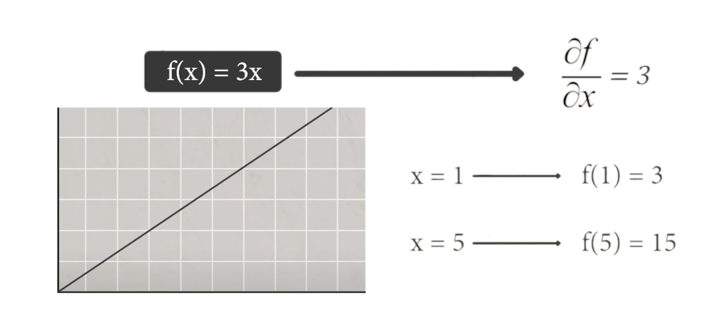

*Figura 4.2.1: Exemple de la derivada d’una funció. La derivada de la funció $f(x)$ respecte de la variable $x$ és 3. Ens mostra el pendent de la recta tangent a la funció.*

El que tractem de fer és trobar el fragment de l’error que li correspon a cada paràmetre, quant afecta cada paràmetre de pesos $w$ i biaixos $b$ a la funció de cost $L(a, y)$, on el valor predit és $a$ i el valor real és $y$.


*Figura 4.2.2: Procés de matemàtic amb derivades per trobar la influència de cada pes en el resultat final $\frac{∂L}{∂W}$.*

Una vegada aconseguida la influència de cadascun, se li resta al paràmetre inicial en qüestió:

$$ W = W - \frac{∂L}{∂W} $$

$$ b = b - \frac{∂L}{∂b} $$ 

Però per trobar la solució òptima hem de multiplicar el resultat anterior per un valor conegut com a “Learning rate”.

$$ W = W - α \frac{∂L}{∂W} $$

$$ b = b - α \frac{∂L}{∂b} $$

El “Learning rate” és un valor utilitzat per a suavitzar el procés d’aprenentatge. Si aquest és molt alt pot fer que l’algorisme mai arribi a una solució o que aquesta no sigui òptima, però si aquest és molt petit pot fer que el procés d'entrenament s’allargui massa o fins i tot que s’estanqui.

S'ha de descobrir una taxa d'aprenentatge bona a través de prova i error. El rang de valors per a una taxa d'aprenentatge satisfactòria van de 10<sup>-6</sup> a 1. Un valor predeterminat tradicional per a la taxa d'aprenentatge és 0,1 o 0,01.

### Descens del gradient

És un algorisme clau dintre del camp del Machine Learning, aquest és un mètode iteratiu d'optimització per a trobar el mínim d'una funció. Això ens serveix per a trobar el valor mínim de la funció d’error i, per tant, per esbrinar els valors necessaris dels pesos de les neurones per a aconseguir un percentatge d’error més baix. Calculem la derivada en el punt on ens trobem i ens movem en la direcció on descendeix el pendent, canviant el valor dels paràmetres.

**· Exemple descens del gradient:**
[¡Extraños Patrones dentro de una RED NEURONAL! <sub>(3:42 - 6:09)</sub>](https://youtu.be/ysqpl6w6Wzg?t=222)

**· Visualitzar el procediment:**
Exemple interactiu per trobar el mínim d’una funció per mitjà del descens del gradient. Indicant el punt on ens trobem inicialment i el *learning rate*. ([*https://uclaacm.github.io/
gradient-descent-visualiser/#playground*](https://uclaacm.github.io/gradient-descent-visualiser/#playground))

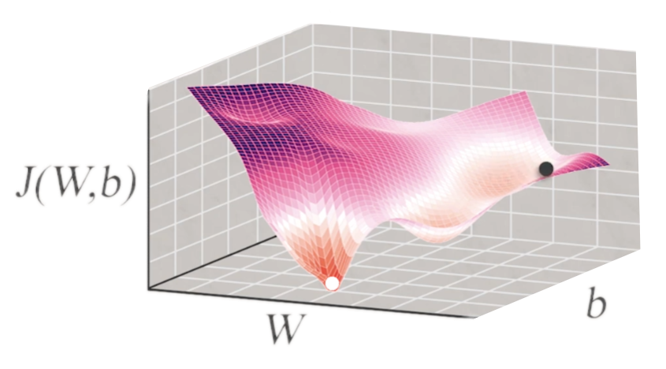

*Figura 4.2.3: Representació gràfica de la funció d’error $J(W,b)$. Amb el descens del gradient, volem minimitzar el valor d’aquesta, que gràficament seria trobar el punt inferior de la funció. Per aconseguir-ho, la xarxa va provant diferents valors de $W$ i $b$.*

En el cas del perceptró, si utilitzem el descens del gradient, podem obtenir els resultats de les derivades mencionades anteriorment.

$$ \frac{∂L}{∂W} = -y · x $$

$$ \frac{∂L}{∂b} = -y $$

Llavors arribem al següent resultat, on aconseguim una funció que ens indica el valor necessari dels paràmetres per reduir l’error:

$$ W = W - α \frac{∂L}{∂W} → W = W + α · y · x $$

$$ b = b - α \frac{∂L}{∂b} → b = b + α · y $$

### Adam

Adam és un algorisme d'optimització que serveix per entrenar models d'aprenentatge. Adam és la fusió de *RMSprop*, propagació quadràtica mitjana, i el *Descens del Gradient*. RMSprop es complementa amb el descens del gradient per fer que l’algorisme convergeixi més ràpidament en la solució i estalvia recursos. En Adam es combinen els dos mètodes en una sola equació. Els resultats de l’optimitzador Adam són millors que els de qualsevol altre algorisme d'optimització, tenen un temps de càlcul més ràpid i requereixen menys paràmetres per a l'afinació.

### Funcions d’activació

Quan utilitzem Backpropagation per entrenar la xarxa, necessitem poder calcular les derivades de les funcions d’activació que estem utilitzant. Si la derivada de la funció és 0, això vol dir que no té cap inclinació, no es podrà fer el càlcul necessari per dur a terme el procés d’aprenentatge. Si les derivades són molt petites o tendeixen a 0, els canvis dels paràmetres de la xarxa seran molt petits, aquest problema és anomenat esvaïment de gradient (Vanishing gradient problem).

Hi ha algunes funcions d’activació que tenen alguns inconvenients a l’hora de fer Backpropagation. Aquestes són les funcions d’activació que no tenen inclinació, com la funció Step que no es pot utilitzar amb aquest mètode, o algunes on la derivada tendeix a 0 quan les entrades són molt grans o molt petites, com la funció Sigmoide.

### Iteracions

La correcció dels valors dels paràmetres es fa repetides vegades, aquestes repeticions són les anomenades iteracions o èpoques (*epochs*).

Per a cada època el model s’entrena amb totes les dades del *dataset* i, en general, ho fa per passos (*steps*) on els valors es processen en petits grups (*batch size*). La quantitat d’iteracions s’especifica a l’hora de fer l’entrenament.

## Batch Size

El *batch size* (mida del lot) defineix el nombre de mostres que es propagaran per la xarxa. Per exemple, si tenim 2000 mostres d'entrenament i establim un *batch size* de 100, l'algorisme pren les primeres 100 mostres del conjunt de dades d'entrenament i entrena la xarxa. A continuació, pren les segones 100 mostres i torna a entrenar la xarxa. Podem continuar fent aquest procediment fins que hàgim propagat totes les mostres a través de la xarxa.

Com s'entrena la xarxa utilitzant menys mostres, el procediment d'entrenament global requereix menys memòria.

Normalment, les xarxes s'entrenen més ràpidament. Això es deu al fet que actualitzem els pesos després de cada propagació. Si féssim servir totes les mostres durant la propagació, només faríem una actualització dels paràmetres de la xarxa a cada iteració.

Però com més petit sigui el lot, menys precisa serà l'estimació del gradient.

El valor de *batch size* que s’utilitza per defecte és 32, perquè té la menor taxa d'error.

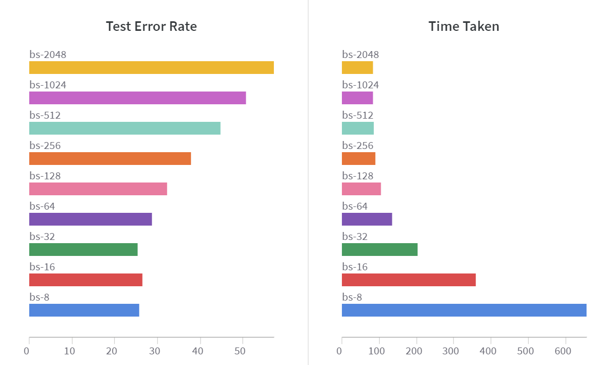

*Figura 4.2.4: Gràfic de *batch size* segons la taxa d’error i el temps emprat.*

# 5. Programació

En l'actualitat existeixen una gran quantitat de repositoris i biblioteques de codi obert dedicats a l'aprenentatge automàtic. Moltes llibreries ens faciliten l'experimentació amb xarxes neuronals, simplificant el procés necessari per a crear i modificar-les, estalviant-nos així molt temps.

Machine Learning és un camp complex, però existeixen biblioteques, com TensorFlow de Google, que faciliten el procés d’obtenció de dades, entrenament de models, realització de prediccions i perfeccionament dels resultats.

## 5.1. Google Colab

Google Colab és una eina que permet a qualsevol usuari escriure i executar codi Python en el núvol de Google. En cas de necessitar altes prestacions de còmput, l'entorn permet configurar algunes propietats de l'equip sobre el qual s'executa el codi i permet disposar d'un entorn per a dur a terme tasques que serien difícils de realitzar en un equip personal. És especialment adequat per a tasques d'aprenentatge automàtic, anàlisi de dades i educació.

## 5.2. TensorFlow

TensorFlow és una biblioteca de codi obert per a la computació numèrica i aprenentatge automàtic desenvolupada per Google. Aquest reuneix una sèrie de models i algorismes de Machine Learning, que es poden utilitzar amb Python per a crear aplicacions.

### Keras

Dins de TensorFlow es pot trobar el mòdul Keras, una de les llibreries més utilitzades per a implementar models d'aprenentatge automàtic. És un entorn de treball que posseeix unes certes eines i característiques útils que agiliten el desenvolupament d'un projecte de programació. Ens permet fer les xarxes neuronals de manera senzilla, estalviant moltes línies de codi.

## 5.3. Altres llibreries

A més d’utilitzar TensorFlow, utilitzaré altres llibreries més genèriques en l’ús de Python:

### NumPy

NumPy és una biblioteca que dona suport per a crear vectors i matrius grans multidimensionals, juntament amb una gran quantitat de funcions matemàtiques per a operar amb elles.

### Matplotlib

Matplotlib és una biblioteca per a la generació de gràfics a partir de dades contingudes en llistes, també anomenades *arrays*, en el llenguatge de programació Python i la seva extensió matemàtica NumPy.

# 6. Exemples pràctics

## 6.1. Perceptró

Començo desenvolupant una xarxa neuronal d’una única neurona (perceptró), que s’encarregui d’analitzar un *dataset* per trobar la relació que hi ha entre les unitats de velocitat km/h i m/s, i pugui fer prediccions de conversió.

### Codi

Importo totes les llibreries necessàries i alguns mòduls de Keras.

- El model `Sequential` és apropiat per a una simple xarxa neuronal per capes, ens serveix per a agregar capes seqüencialment al model.

- Una capa `Dense` és un tipus de capa on cada neurona d’aquesta està connectada a totes les neurones de la capa següent.

```python
# Importo les llibreries necessàries
import tensorflow as tf
import numpy as np
import matplotlib.pyplot as plt

from keras.models import Sequential # Tipus de model
from keras.layers.core import Dense # Tipus de capa
from tensorflow.keras.optimizers import Adam # Algorisme d’aprenentatge
```

Genero el *dataset* amb uns valors d’entrada i sortida, que serviran per entrenar al model, i els represento gràficament. Utilitzo *arrays* per fer-ho, que són cadenes on s’emmagatzemen un conjunt de valors.

#### Dataset

| Input (km/h) | Output (m/s) |
|:---:|:---:|
| 123<br>324<br>-22<br>23.4<br>5<br>-76<br>-45<br>5.7<br>-8.98<br>100<br>-180 | 34.1667<br>90<br>-6.11111<br>6.5<br>1.38889<br>-21.1111<br>-12.5<br>1.58333<br>-2.494444<br>27.7778<br>-50 |

```python
# Dataset: Obtenim els valors de entrada (km/h) i els de sortida (m/s)
kmh = np.array([123, 324, -22, 23.4, 5, -76, -45, 5.7, -8.98, 100, -180], dtype = float)
ms = np.array([34.1667, 90, -6.11111, 6.5, 1.38889, -21.1111, -12.5, 1.58333, -2.494444, 27.7778, -50], dtype = float)

# Representació gràfica dataset
plt.xlabel('km / h')
plt.ylabel('m / s')
plt.scatter(kmh, ms, c='skyblue')
plt.show()
```

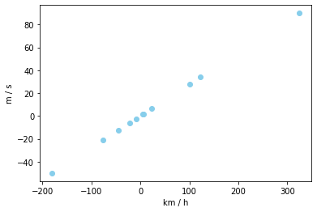

Indico l’estructura de la xarxa neuronal, utilitzant un model de tipus seqüencial amb només una capa densa formada per una sola neurona.

```python
# Creació de la xarxa neuronal
model = Sequential(name='xarxa-neuronal') # Inicialitzo el model

capa = Dense( # Configuro la capa
units = 1, # Nombre de neurones
input_dim = 1, # Nombre d’entrades
activation = 'linear', # Funció d'activació
name = 'perceptron' # Nom per identificar-la
)

model.add(capa) # Afegim la capa al model

# Informació de la xarxa neuronal
model.summary()
```

```
# Model: "xarxa-neuronal"
# _________________________________________________________________
#  Layer (type)                Output Shape              Param #   
# =================================================================
#  perceptron (Dense)          (None, 1)                 2         
#                                                                  
# =================================================================
# Total params: 2
# Trainable params: 2
# Non-trainable params: 0
```

Compilo el model, definint la funció de cost i l'optimitzador. Seguidament, ho entreno amb el *dataset*, especificant el nombre d’iteracions (*epochs*) que farà el model. El model inicialitza els paràmetres (pesos i biaix) de manera aleatòria. En cada iteració, els paràmetres el resultat s’acostarà més a la solució, disminuint la quantitat d’error.

```python
# Compilació del model
model.compile(
loss = 'mean_squared_error', # Funció de pèrdua
optimizer = Adam(learning_rate=0.001) # Optimitzador
)

# Entrenament del model
historial = model.fit(
x = kmh, # Valors de entrada
y = ms, # Valors de sortida
epochs = 10000, # Nombre d'iteracions
verbose = False) # Evita que imprimeixi informació de cada iteració
```

Una vegada finalitzat l’entrenament, es poden consultar els valors dels paràmetres i fer una predicció.

```python
# Resultat dels paràmetres
w, b = capa.get_weights()
print(f'Paràmetres: w = {w[0][0]}, b = {b[0]}')

# Prova del model
x = 36
y = model.predict([x])
print(f'''La IA diu que {x} km/h són {y[0][0]} m/s.
({x} km/h son {x/3.6} m/s)''')
```

```
# Paràmetres: w = 0.2777777314186096, b = 5.537603556149406e-06
# La IA diu que 36 km/h són 10.000003814697266 m/s.
# (36 km/h són 10.0 m/s)
```

També es poden fer diferents gràfics d'algunes mesures registrades durant el procés d'aprenentatge.

```python
# Gràfics dels resultats
plt.title('Error vs. Iteracions')
plt.xlabel('Iteracions')
plt.ylabel('Error')
plt.plot(historial.history['loss'], c='skyblue')
plt.show()

plt.title('Dades originals i línia de regressió lineal')
yPredicted = model.predict(kmh)
plt.scatter(kmh, ms, c='skyblue')
plt.plot(kmh, yPredicted, c='salmon')
plt.show()
```

 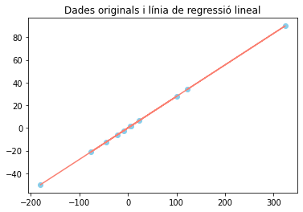

`Google Colab:`
[*`https://colab.research.google.com/drive/1DV90yZHUp9WwaG-
E5kRNOogXHLuqrjGN?usp=sharing`*](https://colab.research.google.com/drive/1DV90yZHUp9WwaG-E5kRNOogXHLuqrjGN?usp=sharing)

## 6.2. Perceptró: Classificació binària

Continuo desenvolupant un model que s’encarregui d’analitzar un conjunt de punts per trobar una relació i els classifiqui en dos grups.

Faré un model utilitzant Keras i l’altre només amb NumPy.

### Codi NumPy

Primer he d’importar les llibreries i crear el *dataset*. En aquest cas seran quatre punts, la sortida només serà 1 quan els dos valors de l’input siguin 1. (Porta lògica AND)

```python
# IMPORTEM LLIBRERIES
import numpy as np
import matplotlib.pyplot as plt

# CREACIÓ DATASET
X = np.array([[0,0], [0,1], [1,0], [1,1]])
Y = np.array([[0], [0], [0], [1]])
```

A continuació, especifico algunes funcions que utilitzaré, la funció d’activació Step i la funció de cost. Seguidament, inicialitzo els valors dels paràmetres del perceptró de manera aleatòria i indico el *learning rate*.

```python
# FUNCIONS D'ACTIVACIÓ I COST
step = lambda x: np.heaviside(x, 1) # si x >= 0 ==> y = 1; si x < 0 ==> y = 0 
lossFunc = lambda Yr, Ye: Yr - Ye # Error = ValorReal - ValorPredit

# CONFIGURACIÓ DEL PERCEPTRÓ
learningRate = 0.01
numEntrades = len(X[0])
W = np.random.rand(1, numEntrades) # Pesos (2 valors)
b = np.random.rand() # Biaix
print('Weights:', W)
print('Bias:', b)
```

```
# Weights: [[0.68096276 0.90747431]]
# Bias: 0.985178751811559
```

Defineixo la funció de predicció de la neurona que empraré més endavant, faig servir la funció d’activació Step per fer la classificació binària: Si el resultat és més gran que 0,5 la sortida serà 1 i si no, serà 0.

Quant a la funció d’entrenament, faig un bucle segons les iteracions indicades, on en cadascuna es calcularan els errors per a cada punt i s'actualitzaran els valors dels paràmetres. Abans s’han de calcular els resultats de predicció actuals per tal de poder  calcular l’error. Al perceptró, al només tenir una capa i una neurona, es poden calcular les correccions dels paràmetres amb les següents equacions: $ W = W + α · y · x $ i $ b = b + α · y $ 

```python
# PREDICCIONS
def predict(x):
  z = x @ W[0] + b # Ponderació dels inputs amb els pesos, més el biaix.
  output = step(z)
  return output

# ENTRENAMENT
errors = []
def train(x, y, lr, epochs):
  global W, b
  stepsPerEpoch = len(x)
  for epoch in range(epochs):
    stepError = []
    for step in range(stepsPerEpoch):
      # Forward pass
      output = predict(x[step])

      # Backpropagation
      error = lossFunc(float(y[step]), output)
      stepError.append(error)
      W = W + (lr * error * x[step]) # W = W(inicial) + (lr * error * x)
      b = b + (lr * error) # b = b(inicial) + (lr * error * 1)

    stepError = np.mean(stepError)
    errors.append(abs(stepError)) # Recopilació d’error per realitzar gràfic de l’entrenament
```

Utilitzant Matplotlib es poden visualitzar els resultats obtinguts.

```python
showResults("Resultats abans d'Entrenament")

train(X, Y, learningRate, 100)

# Error per època
plt.title('Error vs. Iteracions')
plt.xlabel('Iteracions')
plt.ylabel('Error')
plt.plot(range(len(errors)), errors, c='skyblue')
plt.show()

# Resultats finals
showResults("Resultats abans d'Entrenament")
print(f'Paràmetres: w = {W[0]}, b = {b}')
```

```
# Paràmetres: w = [0.1849843  0.24473538], b = -0.2645967804709866
```

 
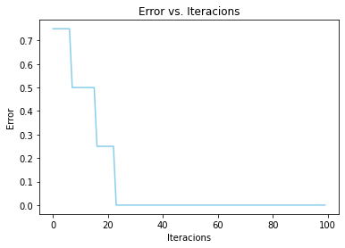


Una vegada realitzat tot l’entrenament del model es pot observar que el perceptró sí que ha aconseguit classificar els quatre punts en dues classes, en aquest cas una porta lògica AND. Però aquest resultat és exitós perquè els dos grups són linealment separables, és a dir, que són separables utilitzant només una recta. El perceptró es caracteritza per un límit de decisió format per una única recta, llavor sí que pot resoldre aquest tipus de problema.

### Codi Keras

En el cas d’utilitzar Keras, a més d'importar les llibreries NumPy i Matplotlib, importo els mòduls que necessito i faré servir de Keras: el model *Sequential* i el tipus de capa *Dense*. El *dataset* continuarà sent el mateix, una porta lògica AND.

```python
# IMPORTACIÓ LLIBRERIES
import numpy as np
import matplotlib.pyplot as plt

from keras.models import Sequential # Tipus de model
from keras.layers.core import Dense # Tipus de capa
from keras.optimizers import Adam # Optimitzador

# CREACIÓ DATASET
X = np.array([[0,0], [0,1], [1,0], [1,1]])
Y = np.array([[0], [0], [0], [1]])
```

Amb Keras no fa falta desenvolupar les funcions de predicció ni d’entrenament, només s’han d'especificar els valors i les dades necessàries per a entrenar a la xarxa.

Indico que la xarxa tindrà dues entrades i una neurona. A l’hora de crear la capa s’ha d’especificar la funció d’activació, faré servir la sigmoide, ja que volem fer una classificació binària i aquesta ens dona valors de 0 a 1. No es pot utilitzar la funció Step perquè aquesta és lineal i Keras necessita que aquestes funcions tinguin pendent per tal de disminuir l’error.

```python
# CREACIÓ PERCEPTRÓ
inputs = 2
neurones = 1 # Neurones per capa

perceptro = Sequential(
    Dense(
        units = neurones,
        input_dim = inputs, # Nombre d'entrades
        activation = 'sigmoid',
        name = 'perceptron'
        )
    )

perceptro.compile(
    loss = 'binary_crossentropy', # Funció de pèrdua (Error quadràtic mitjà)
    optimizer = Adam(learning_rate=0.5), # Funció de cost i learning rate
    metrics = ['accuracy'] # Magnituds mesurades durant el procés
    )

# Informació de la xarxa neuronal
perceptro.summary()
```

```
# Weights: [[0.68096276 0.90747431]]
# Bias: 0.985178751811559
```

Faig l’entrenament del perceptró indicant el nombre d’iteracions i emmagatzemo l’historial de l’entrenament en una variable que consultaré més endavant per analitzar l’error per a cada època.

```python
showResults("Resultats abans d'Entrenament")

# ENTRENAMENT
historial = perceptro.fit(
  x = X, # Valors de entrada
  y = Y, # Valors de sortida
  epochs = 10000, # Nombre d'iteracions que es farà a l'entrenament per apropar-se als valors reals
  verbose = False, # Evita que imprimeixi en pantalla informació de cadascuna de les iteracions
  )

# Resultats finals
plt.title('Error vs. Iteracions')
plt.xlabel('Iteracions')
plt.ylabel('Error')
plt.plot(historial.history['loss'], c='#053061')
plt.show()

showResults("Resultats abans d'Entrenament")

parametres = perceptro.get_weights()
weights, bias = parametres
print(f'Paràmetres: w = {weights[0]}, {weights[1]}, b = {b}')
```

Entrenament de 1000 iteracions amb *learning rate* de 0,01: 

```
# Paràmetres: w = [8.809489], [8.77294], b = -1.4852206919837063
```

 
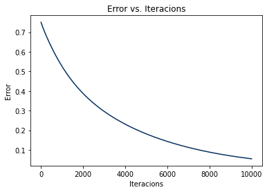

Entrenament de 100 iteracions amb *learning rate* de 0,5:

```
# Paràmetres: w = [8.809489], [8.77294], b = -1.4852206919837063
```

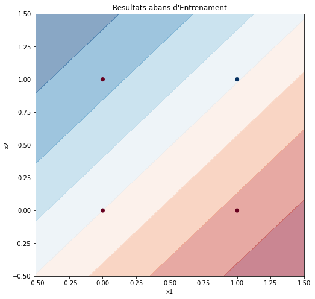 
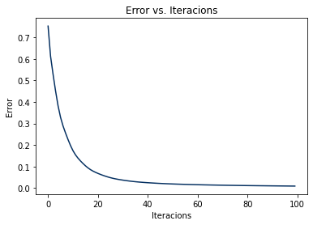

En aquest cas, si utilitzem un *learning rate* de 0,5, la neurona arriba més ràpidament a error 0 que amb un *learning rate* de 0,01. Com més elevat és aquest valor més ràpid s’aproxima al mínim de la funció de cost, però hi ha casos que si aquest és molt elevat, mai convergeix en una solució.

`Google Colab:`
[*`https://colab.research.google.com/drive/1O1nqoLvMnXhJfZC1
h2fkb9PyQKaQw3ue?usp=sharing`*](https://colab.research.google.com/drive/1O1nqoLvMnXhJfZC1h2fkb9PyQKaQw3ue?usp=sharing)

## 6.3. Classificació binària

Continuarem desenvolupant una xarxa neuronal que s’encarregui d’analitzar un *dataset* per trobar la relació que hi ha en un conjunt de punts i els classifiqui en dos grups.

### Codi

Importo totes les llibreries necessàries i alguns mòduls de Keras.

- El mòdul `datasets` de `sklearn` ens permetrà generar *datasets* amb característiques concretes.

```python
# Importo les llibreries necessàries
import tensorflow as tf
import numpy as np
import matplotlib.pyplot as plt

from keras.models import Sequential # Tipus de model
from keras.layers.core import Dense # Tipus de capa
from tensorflow.keras.optimizers import SGD # Algorisme d’aprenentatge

from sklearn import datasets # Generació de datasets
```

Genero un *dataset* amb diferents formes i el visualitzo utilitzant Matplotlib. Represento els punts de diferent color segons el valor de $y$.

```python
# Obtenció del dataset
dataset = 1 # Podem escollir entre dataset de cercles o taques
if dataset == 1:
X, Y = datasets.make_circles(
n_samples=1000, # Nombre de punts
factor=0.5, # Relació d’escala entre els dos cercles
noise=0.05 # Com d'escampat estan els punts
)
elif dataset == 2:
X, Y = datasets.make_blobs(
n_samples=1000, # Nombre de punts
centers=2, # Nombre de centres
n_features=2, # Nombre de columnes del dataset (X, Y)
random_state=1, # Aleatorització
cluster_std=3 # Concentració
)
# Visualització dataset
plt.figure(figsize=(8, 8))
plt.axes().set_facecolor('#FAFAFA')
plt.title('Dataset')
plt.xlabel('x1')
plt.ylabel('x2')

plt.scatter(X[Y == 0,0], X[Y == 0,1], c='#67001F', label='0 ')
plt.scatter(X[Y == 1,0], X[Y == 1,1], c='#053061', label='1')

plt.legend(title='y')
plt.show()
```


En aquest cas, crearé una xarxa neuronal formada per 4 capes: una d’entrada amb 2 neurones, dues ocultes de 16 i 8 neurones amb ReLU i una de sortida d'una neurona amb funció d’activació Sigmoide. El resultat obtingut serà entre 0 i 1, una probabilitat de quin grup pertany.


```python
# Creació de la xarxa neuronal
nn = [2, 16, 8, 1] # Neurones per capa

model = Sequential(name='xarxa-neuronal') # Inicialització del model

model.add(Dense( # Capa oculta de 16 neurones ReLU
units = nn[1],
input_dim = nn[0], # Nombre d'entrades
activation = 'relu',
name = 'hidden1'
))

model.add(Dense( # Capa oculta de 8 neurones ReLU
units = nn[2],
activation = 'relu',
name = 'hidden2'
))
model.add(Dense( # Neurona de sortida Sigmoide
units = nn[3],
activation = sigmoid',
name = 'output'
))

# Informació de la xarxa neuronal
model.summary()
```

```
# Model: "xarxa-neuronal"
# _________________________________________________________________
#  Layer (type)                Output Shape              Param #   
# =================================================================
#  hidden1 (Dense)             (None, 16)                48        
#                                                                  
#  hidden2 (Dense)             (None, 8)                 136       
#                                                                  
#  output (Dense)              (None, 1)                 9         
#                                                                  
# =================================================================
# Total params: 193
# Trainable params: 193
# Non-trainable params: 0
# _________________________________________________________________
```

Desenvoluparé una funció per visualitzar els resultats de la xarxa, crearé una quadrícula de 100x100 punts on es faran prediccions i es dibuixaran utilitzant `plt.contourf()`. Els valors d’entrada de la xarxa neuronal han d'estar organitzats en 2 columnes i per aconseguir-ho es fa servir `np.T.reshape(-1, 2)`.


```python
# Funció per visualitzar els resultats
def showResults(numIteracions):

# Delimitació de la visualització (Punts més llunyans)
maxX1, maxX2 = np.max(X, axis=0) 
minX1, minX2 = np.min(X, axis=0)

# Coordenades mapa de predicció
x1 = np.linspace(minX1-1, maxX1+1, 100) # Arrays de 100 punts 
x2 = np.linspace(minX2-1, maxX2+1, 100) # equidistants
x, y = np.meshgrid(x1, x2) # Quadrícula de predicció 100x100

# Predicció amb cada punt de la quadrícula
input = np.stack((x, y)).T.reshape(-1, 2)
output = model.predict(input).T.reshape(100,100)

# Visualització
if numIteracions == -1:
plt.figure(figsize=(8, 8))
plt.title('Resultats finals')
else:
plt.figure(figsize=(5, 5))
plt.title(f'Resultats actuals ({numIteracions} iteracions)')

plt.xlabel('x1')
plt.ylabel('x2')

# Límit de la decisió
plt.contourf(x, y, output, cmap='RdBu', alpha=0.5)

# Dataset
plt.scatter(X[Y == 0,0], X[Y == 0,1], c='#67001F', label='0 ')
plt.scatter(X[Y == 1,0], X[Y == 1,1], c='#053061', label='1')

plt.legend(title='y')

plt.show()
```

Compilo el model, utilitzaré l’error quadràtic mitjà com a funció de pèrdua i el Descens del gradient com a optimitzador, i ho entreno amb el *dataset*. He programat una funció perquè es mostrin els resultats cada 500 iteracions.


```python
# Compilo el model d’aprenentatge
model.compile(
loss = 'mse', # Funció de pèrdua (Error quadràtic mitjà)
optimizer = SGD(learning_rate=0.003), # Funció de cost
metrics = ['accuracy'] # Mètriques mesurades durant el procés
)

# Entrenament del model
print('Iniciant entrenament...')

# Creo objecte de tipus Callback
class epochsResults(tf.keras.callbacks.Callback):
# Quan acabi cada iteració s'executarà la funció
def on_epoch_end(self, epoch, logs):
n = 500 # Cada n iteracions es mostraran els resultats
if epoch%n == 0:
showResults(epoch)

historial = model.fit(
x = X, # Valors de entrada
y = Y, # Valors de sortida
epochs = 4000, # Nombre d'iteracions
verbose = False, # Evita que imprimeixi informació de cada iteració
callbacks=[epochsResults()] # Funció per mostrar resultats
)

showResults(-1)

print('Model entrenat.')
```

```
# Iniciant entrenament…
```
  

```
# Model entrenat.
```

Una vegada finalitzat l’entrenament, es poden analitzar les millores dels resultats. La precisió és una de les mètriques utilitzades per a avaluar els models de classificació. La precisió és la fracció de prediccions que el nostre model ha encertat. ($ Precisió = \frac{Prediccions\,correctes}{Prediccions\,totals} $)

```python
# Gràfics de l'entrenament
plt.title('Error vs. Iteracions')
plt.xlabel('Iteracions')
plt.ylabel('Error')
plt.plot(historial.history['loss'], c='#053061')
plt.show()
plt.title('Precisió vs. Iteracions')
plt.xlabel('Iteracions')
plt.ylabel('Precisió')
plt.plot(historial.history['accuracy'], c='#053061')
plt.show()
```

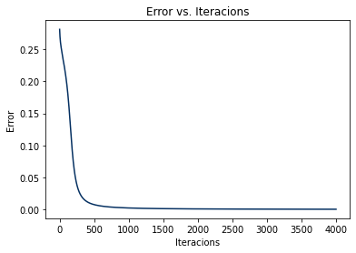 

Es poden fer prediccions una vegada finalitzat el procés d’aprenentatge. Els valors d’entrada s’han d'organitzar perquè la xarxa els pugui utilitzar.

```python
# Prova del model
x = (0, 0)
print('Prova del model:')
input = np.array(x).T.reshape(-1, 2)
output = model.predict(input)
print(f'La IA diu que el punt ({input[0,0]}, {input[0,1]}) és de la classe {int(np.round(output[0,0]))}.')
```

```
# Prova del model:
# La IA diu que el punt (0, 0) és de la classe 1.
```

`Google Colab:`
[*`https://colab.research.google.com/drive/114ym1lio1XeDr
OKabxYeIvF0AHRVwkBc?usp=sharing`*](https://colab.research.google.com/drive/114ym1lio1XeDrOKabxYeIvF0AHRVwkBc?usp=sharing)

# 7. Primer projecte: Classificador de gossos i gats

## 7.1. Objectius

L’objectiu final del primer projecte serà desenvolupar un classificador binari d’imatges que pugui diferenciar si l’animal que apareix a la imatge és un gos o un gat. Provaré de fer-ho amb quatre models diferents i analitzaré els resultats obtinguts, per tal de fer una comparació entre els quatre models: dos Densos i dos Convolucionals, amb augment de dades i sense.

## 7.2. Noves tècniques utilitzades

### Augment de dades

La idea de l’augment de dades és aplicar diverses transformacions sobre les entrades originals, obtenint mostres lleugerament diferents, però iguals en essència, la qual cosa actua com un regularitzador i ajuda a reduir el sobreajustament quan s'entrena un model d'aprenentatge automàtic. 

Aquest sobreajustament, o també anomenat *overfitting*, fa referència al fet d’entrenar a una xarxa amb tanta informació que acaba memoritzant-la en comptes d’aprendre els patrons. Si per exemple entrenem la xarxa amb unes imatges d’animals concretes, donarà tots els resultats correctes amb les imatges entrenades, però amb imatges que no hagi vist mai els resultats no seran correctes. En entrenar la xarxa amb imatges editades i modificades, els valors seran més globals i, en comptes de memoritzar, entendrà el que veu i aprendrà a trobar els patrons de qualsevol imatge, aconseguint un model entrenat més versàtil.

## 7.3. Codi

Importo totes les llibreries necessàries i els mòduls de Keras necessaris.

- La llibreria `cv2` permet editar imatges i visualitzar-les. També serveix per normalitzar les imatges d’entrada.
- `TensorBoard` permet visualitzar els gràfics dels entrenaments, per analitzar-los.
- Per fer la xarxa convolucional necessitaré les capes de tipus `Conv2D`, per aplicar els filtres convolucionals, i `MaxPooling2D`, per disminuir la resolució dels mapes de característiques.

```python
# Importo les llibreries necessàries
import tensorflow as tf
import tensorflow_datasets as tf_datasets
import numpy as np
import matplotlib.pyplot as plt
import cv2 # Edició d'imatges
import keras as kr

from keras.models import Sequential # Tipus de model
from keras.layers import Flatten, Dense, Conv2D, MaxPooling2D # Tipus de capa
from keras.preprocessing.image import ImageDataGenerator # Generador d'imatges
from keras.callbacks import TensorBoard # Anàlisi dels resultats
```

Importo el *dataset* de Gats i Gossos de TensorFlow.

```python
# Correcció temporal:
# TensorFlow datasets té error en descarregar el dataset de gossos i
# gats. El van solucionar el 16 de maig, però continua fallant en Google # Colab.
# Llavors s'agrega aquesta línia addicional. Més informació aquí:
# https://github.com/tensorflow/datasets/issues/3918
setattr(tf_datasets.image_classification.cats_vs_dogs, '_URL', 'https://download.microsoft.com/download/3/E/1/3E1C3F21-ECDB-4869-8368-6DEBA77B919F/kagglecatsanddogs_5340.zip')

dataset, datasetInfo = tf_datasets.load('cats_vs_dogs', as_supervised=True, with_info=True)

# Informació del dataset
print('Informació dataset:')
print(datasetInfo)
```

```
# Downloading and preparing dataset cats_vs_dogs/4.0.0
# Dataset cats_vs_dogs downloaded and prepared... (Microsoft, s. f.)
```

Es poden visualitzar les imatges d’entrenament del *dataset* de diferents maneres.

```python
# Mostrar 5 exemples del dataset
print('Primers 5 exemples:')
tf_datasets.as_dataframe(dataset['train'].take(5), datasetInfo)
```

```
# Informació dataset:
```


```python
# Visualització exemples del dataset inicial
plt.figure(figsize = (20, 20))
for num, (image, animal) in enumerate(dataset['train'].take(5)):
plt.subplot(1, 5, num + 1) # Faig una taula de 1 fila i 5 columnes
plt.xticks([])
plt.yticks([])
plt.imshow(image) # Es mostren les imatges
```


Les xarxes neuronals tenen un nombre d’entrades específic i, per tant, si es volen entrenar amb diverses imatges, s’han de canviar les resolucions de les imatges perquè siguin iguals. A més, cada color RGB (red/vermell, green/verd, blue/blau) és considerat com un mapa de característiques diferent, per tal de simplificar el funcionament de la xarxa es passen totes a un únic mapa de característiques inicial (Blanc i negre).

```python
# Manipulació del dataset inicial (Per a visualitzar-ho)
# Canvio la resolució de les imatges i les passo a blanc i negre.
imageSize = 100
imageResolution = (imageSize, imageSize)
plt.figure(figsize = (20, 20))

for num, (image, animal) in enumerate(dataset['train'].take(20)): # Es seleccionen 20 exemples
image = cv2.resize( # Canvi de resolució
image.numpy(), # Array numpy de la imatge
imageResolution # Resolució
)
image = cv2.cvtColor( # Canvi de color
image,
cv2.COLOR_BGR2GRAY # Blanc i negre
)
  
plt.subplot(5, 5, num + 1) # Faig una taula de 5 fila i 5 columnes
plt.xticks([])
plt.yticks([])
plt.imshow(image, cmap = 'gray') # Es mostren els resultats en escala de grisos
```


El codi anterior serveix per poder visualitzar les entrades com ho veuria la xarxa, ara s’han d’editar totes les imatges i afegir-les al *dataset* d’entrenament. Els valors dels píxels, que són de 0 a 255, els passaré a valors d’entre 0 i 1 per facilitar les operacions. Normalitzar els valors serveix per facilitar les operacions requerides per la xarxa amb més facilitat.


```python
# Manipulació del dataset (Per a l'entrenament)
trainingData = []

for i, (image, animal) in enumerate(dataset['train']):
image = cv2.resize(image.numpy(), imageResolution) # Canvi resolució
image = cv2.cvtColor(image, cv2.COLOR_BGR2GRAY) # Canvi color
image = image.reshape(imageSize, imageSize, 1) # Canvi de forma
trainingData.append([image, animal])

print('Núm. Dades Entrenament:', len(trainingData))

# Normalització del dataset
X = []
Y = []

for image, animal in trainingData:
X.append(image)
Y.append(animal)

X = np.array(X).astype(float)/255 # Es normalitzen els valors inicials (de 0 a 255) -> (de 0 a 1)
Y = np.array(Y).astype(int)
```

```
# Núm. Dades Entrenament: 23262
```

Especifico les variables d’entrenament que faré servir en tots els models. Utilitzaré la funció de pèrdua de *Binary Crossentropy* perquè és un problema binari i l'optimitzador Adam perquè és un optimitzador ràpid i eficient.

```python
# Variables de l'entrenament
lossFunction = 'binary_crossentropy'
adamOpti = 'adam' # learning_rate = 0.001 (per defecte)
iteracions = 100
batchSize = 32 # Exemples per iteració
showInfo = True
```

Els models Densos estaran composts per dues capes de 100 neurones amb ReLU i una capa d’una neurona Sigmoide.

```python
# Model Dens
modelDens = Sequential([
Flatten(input_shape=(imageSize, imageSize, 1)),
Dense(units=100, activation='relu'),
Dense(units=100, activation='relu'),
Dense(units=1, activation='sigmoid')
])

modelDens.compile(
loss = lossFunction,
optimizer = adamOpti,
metrics = ['accuracy']
)
```

Els models Convolucionals tindran 4 capes convolucionals de 32, 64 i 128 filtres de 3x3. Escullo filtres de 3x3 perquè són els més econòmics que són simètrics des de totes direccions, ja que tenen un píxel al centre. Aquests comprimiran la resolució de les entrades per aconseguir mapes de característiques amb la informació útil que necessita la xarxa per aprendre. Utilitzant capes de Max Pooling, es redueix la resolució dels mapes de característiques a la meitat i es duplica la seva quantitat. Els mapes finals s’utilitzaran d’entrada en un model format per una capa de 100 neurones amb ReLU i una capa amb una neurona Sigmoide.

```python
# Model Convolucional
modelConv = Sequential([
# Xarxa convolucional
Conv2D(
filters=32,
kernel_size=(3,3),
activation='relu',
input_shape=(imageSize, imageSize, 1)
),
MaxPooling2D(pool_size=2, strides=2),

Conv2D(filters=64, kernel_size=(3,3), activation='relu'),
MaxPooling2D(pool_size=2, strides=2),

Conv2D(filters=128, kernel_size=(3,3), activation='relu'),
MaxPooling2D(pool_size=2, strides=2),
                        
# Xarxa neuronal
Flatten(),
Dense(units=100, activation='relu'),
Dense(units=1, activation='sigmoid')
])

modelConv.compile(
loss = lossFunction,
optimizer = adamOpti,
metrics = ['accuracy']
)
```

Faig un *dataset* utilitzant Augment de Dades a partir de les imatges d’entrada utilitzant el generador d’imatges de Keras per tal d’aconseguir noves imatges i que el model no es memoritzi les imatges d’entrenament. Aquest *dataset* es farà servir posteriorment per a entrenar els altres models.

```python
# Augment de dades
examples = 10

plt.figure(figsize = (20, 20))
# Visualització imatges originals
for i in range(examples):
plt.subplot(5, 5, i + 1)
plt.xticks([])
plt.yticks([])
plt.imshow(X[i].reshape(imageResolution), cmap = 'gray')

# Configuració del generador d'imatges
dataGenerator = ImageDataGenerator(
rotation_range = 30, # Rotació
width_shift_range = 0.2, # Desplaçament als costats
height_shift_range = 0.2, # Desplaçament a dalt o a baix
shear_range = 15, # Inclinació
zoom_range = [0.75, 1.5], # Zoom
horizontal_flip = True, # Voltejar horitzontalment
vertical_flip = True # Voltejar verticalment
)
dataGenerator.fit(X) # Aplico la configuració

# Visualització imatges generades
plt.figure(figsize = (20, 20))
for imatge, etiqueta in dataGenerator.flow(X, Y, shuffle = False):
for i in range(examples):
plt.subplot(5, 5, i + 1)
plt.xticks([])
plt.yticks([])
plt.imshow(imatge[i].reshape(imageResolution), cmap = 'gray')
break
```

Si s’utilitza augment de dades, s’ha de dividir manualment el *dataset*, el 85% dels exemples seran per entrenament i el 15% serà per validar els resultats.

```python
# Separació dades entrenament i validació
print('Dades totals:', len(X))
trainData = round(len(X) * 0.85)
print('Dades entrenament:', trainData)
print('Dades validació:', len(X) - trainData)

# Dividim el dataset
X_train = X[:trainData]
X_valid = X[trainData:]

Y_train = Y[:trainData]
Y_valid = Y[trainData:]

# Dataset d'entrenament amb augment de dades
trainingDataset = dataGenerator.flow(X_train, Y_train, batch_size = batchSize)
```

```
# Dades totals: 23262
# Dades entrenament: 19773
# Dades validació: 3489
```

Els models amb augment de dades seran iguals que els altres.

```python
# Model Dens (Augment de Dades)
modelDensAD = Sequential([
Flatten(input_shape=(imageSize, imageSize, 1)),
Dense(units=100, activation='relu'),
Dense(units=100, activation='relu'),
Dense(units=1, activation='sigmoid')
])

modelDensAD.compile(
loss=lossFunction,
optimizer=adamOpti,
metrics=['accuracy']
)
```

```python
# Model Convolucional (Augment de Dades)
modelConvAD = Sequential([
Conv2D(filters=32, kernel_size=(3,3), activation='relu', input_shape=(imageSize, imageSize, 1)),
MaxPooling2D((2, 2)),
Conv2D(filters=64, kernel_size=(3,3), activation='relu'),
MaxPooling2D((2, 2)),
Conv2D(filters=128, kernel_size=(3,3), activation='relu'),
MaxPooling2D((2, 2)),
Flatten(),
Dense(units=100, activation='relu'),
Dense(units=1, activation='sigmoid')
])

modelConvAD.compile(
loss=lossFunction,
optimizer=adamOpti,
metrics=['accuracy']
)
```

Primer entreno els models sense augment de dades, utilitzo el *callback* de TensorBoard per guardar l’historial de l'entrenament.

```python
# Entrenament Model Dens
tensorboardDens = TensorBoard(log_dir='logs/dens') # Visualització amb TensorBoard

print('Iniciant entrenament...')
modelDens.fit(
X, Y, # Exemples
batch_size = batchSize,
validation_split = 0.15, # Percentatge de dades de validació
epochs = iteracions, # Iteracions
verbose = showInfo,
callbacks=[tensorboardDens] # Callback de TensorBoard
)
print('Model Dens entrenat.')

# Guardo el model
modelDens.save('Dens.h5')
modelDens.save_weights('weightsDens.h5')
```

```
# Iniciant entrenament...
# Epoch 1/100
# 618/618 - 6s - loss: 0.7045 - accuracy: 0.5408 - val_loss: 0.6843 - 
# val_accuracy: 0.5648 - 6s/epoch - 9ms/step
# Epoch 2/100
# 618/618 - 2s - loss: 0.6771 - accuracy: 0.5748 - val_loss: 0.7114 - 
# val_accuracy: 0.5261 - 2s/epoch - 3ms/step
# ···
# Epoch 99/100
# 618/618 - 3s - loss: 0.5578 - accuracy: 0.7204 - val_loss: 0.7333 - 
# val_accuracy: 0.5742 - 3s/epoch - 5ms/step
# Epoch 100/100
# 618/618 - 2s - loss: 0.5544 - accuracy: 0.7214 - val_loss: 0.7404 - 
# val_accuracy: 0.5745 - 2s/epoch - 3ms/step
# Model Dens entrenat
```

```python
# Entrenament Model Convolucional
tensorboardConv = TensorBoard(log_dir='logs/conv')
print('Iniciant entrenament...')
modelConv.fit(
X, Y,
batch_size = batchSize,
validation_split = 0.15,
epochs = iteracions,
verbose = showInfo,
callbacks = [tensorboardConv]
)
print('Model Convolucional entrenat.')

# Es guarda el model
modelConv.save('Conv.h5')
modelConv.save_weights('weightsConv.h5')
```

```
# Iniciant entrenament...
# Epoch 1/100
# 618/618 - 19s - loss: 0.6255 - accuracy: 0.6329 - val_loss: 0.5472 - 
# val_accuracy: 0.7198 - 19s/epoch - 30ms/step
# Epoch 2/100
# 618/618 - 8s - loss: 0.4732 - accuracy: 0.7732 - val_loss: 0.4669 - 
# val_accuracy: 0.7688 - 8s/epoch - 13ms/step
# ···
# Epoch 99/100
# 618/618 - 8s - loss: 7.0674e-05 - accuracy: 0.9999 - val_loss: 2.9432 - 
# val_accuracy: 0.8424 - 8s/epoch - 13ms/step
# Epoch 100/100
# 618/618 - 9s - loss: 7.0683e-05 - accuracy: 0.9999 - val_loss: 2.9497 - 
# val_accuracy: 0.8438 - 9s/epoch - 14ms/step
# Model Convolucional entrenat.
```

Després, entreno els models amb augment de dades per fer la comparativa posteriorment entre tots els models entrenats.

```python
# Entrenament Model Dens (Augment de Dades)
tensorboardDensAD = TensorBoard(log_dir='logs/densAD')

print('Iniciant entrenament...')
modelDensAD.fit(
trainingDataset, # Exemples d’entrenament
epochs = iteracions,
batch_size = batchSize,
validation_data = (X_valid, Y_valid), # Exemples de validació
verbose = showInfo,
callbacks = [tensorboardDensAD]
)
print('Model DensAD entrenat.')
# Guardo el model
modelDensAD.save('DensAD.h5')
modelDensAD.save_weights('weightsDensAD.h5')
```

```
# Iniciant entrenament...
# Epoch 1/100
# 618/618 - 19s - loss: 0.7165 - accuracy: 0.5085 - val_loss: 0.6931 - 
# val_accuracy: 0.4809 - 19s/epoch - 30ms/step
# Epoch 2/100
# 618/618 - 18s - loss: 0.6936 - accuracy: 0.4992 - val_loss: 0.6932 - 
# val_accuracy: 0.4993 - 18s/epoch - 28ms/step
# ···
# Epoch 99/100
# 618/618 - 17s - loss: 0.6932 - accuracy: 0.4979 - val_loss: 0.6932 - 
# val_accuracy: 0.4999 - 17s/epoch - 27ms/step
# Epoch 100/100
# 618/618 - 16s - loss: 0.6932 - accuracy: 0.5007 - val_loss: 0.6932 - 
# val_accuracy: 0.4999 - 16s/epoch - 27ms/step
# Model DensAD entrenat.
```

```python
# Entrenament Model Convolutional (Augment de Dades)
tensorboardConvAD = TensorBoard(log_dir='logs/convAD')

print('Iniciant entrenament...')
modelConvAD.fit(
trainingDataset,
epochs = iteracions,
batch_size = batchSize,
validation_data = (X_valid, Y_valid),
verbose = showInfo,
callbacks = [tensorboardConvAD]
)
print('Model ConvolucionalAD entrenat.')

# Guardo el model
modelConvAD.save('ConvAD.h5')
modelConvAD.save_weights(weightsConvAD.h5')
```

```
# Iniciant entrenament...
# Epoch 1/100
# 618/618 - 21s - loss: 0.6862 - accuracy: 0.5455 - val_loss: 0.6751 - 
# val_accuracy: 0.5678 - 21s/epoch - 33ms/step
# ···
# val_accuracy: 0.8478 - 20s/epoch - 33ms/step
# Epoch 100/100
# 618/618 - 21s - loss: 0.3519 - accuracy: 0.8440 - val_loss: 0.2881 - 
# val_accuracy: 0.8707 - 21s/epoch - 33ms/step
# Model ConvolucionalAD entrenat.
```

Una vegada finalitzat l’entrenament, es poden observar els resultats de cada entrenament utilitzant TensorBoard. 

Es visualitzen la quantitat d'error i el percentatge de precisió de cada model per a cada època. Les èpoques eren les iteracions que es produïen en l’entrenament on s’anaven millorant els valors dels paràmetres per tal de millorar els resultats.

```python
# Resultats finals
%load_ext tensorboard
%tensorboard --logdir logs
```

```
- Precisió per època
```

 

```
- Quantitat d’error per època
```

 

Si és necessari, es poden tornar a carregar altres models prèviament guardats ja entrenats.

```python
# Carrego els models.
import keras as kr

modelDens = kr.models.load_model('Dens.h5')
modelDens.load_weights('weightsDens.h5')

modelConv = kr.models.load_model('Conv.h5')
modelConv.load_weights('weightsConv.h5')

modelDensAD = kr.models.load_model('DensAD.h5')
modelDensAD .load_weights('weightsDensAD.h5')

modelConvAD = kr.models.load_model('ConvAD.h5')
modelConvAD.load_weights('weightsConvAD.h5')
```

Una vegada es té el model final entrenat ja es poden fer prediccions amb noves imatges per poder-les classificar.

```python
# Provar models guardats
from google.colab import files, output
import PIL.Image

# Edito l'imatge d'entrada per aconseguir les 
# mateixes característiques que les d'entrenament.
def normalitzarImatge (image):
try:
imageResolution
except:
imageResolution = (100, 100)

image = np.array(image) # Convertim l'imatge a un array
image = cv2.resize(image, imageResolution) # Canvi de resolució
image = cv2.cvtColor(np.float32(image), cv2.COLOR_BGR2GRAY) # Imatge a blanc i negre
image = np.array(image).astype(float)/255 # Normalització dels píxels
visualitzarInput(image)
input = image.reshape(1, imageSize, imageSize, 1) # Canvi de forma
return input

# Visualització de la imatge d'entrada
def visualitzarInput (image):
# Visualització de l'input amb Matplotlib
plt.figure(figsize=(10, 10))
plt.subplot(3, 3, 1)
plt.imshow(image, cmap='gray')
plt.title('Input')
plt.axis('off')
plt.show()

# Segons l'output es troba la classe. 0 = Gat  1 = Gos
def resultat (output):
print(f'Output:\n{float(output)}')
# Si l'output és més gran que 0.5, és un gos i si no, és un gat.
output = round(float(output), 2)
if output >= 0.5:
resultat = 'Gos'
else:
resultat = 'Gat'
return resultat

uploadedFiles = files.upload()
output.clear()
print('PROVES FINALS DEL MODEL\n')

for nameFile in uploadedFiles.keys():
# Càrrega del model pujat 
if nameFile.endswith('.h5'):
if 'weights' in nameFile:
model.load_weights('__weights.h5')
else:
model = kr.models.load_model('__model.h5')
# Predicció de les imatges pujades 
else:
imagen = PIL.Image.open(str(nameFile))
input = normalitzarImatge(imagen)
output = model.predict(input)
print(f'És un {resultat(output)}.\n')
```

**PROVES FINALS DEL MODEL**


`Google Colab:`
[*`https://colab.research.google.com/drive/1a-grtvD1fC7eMjpRZs
c3L5idoNU_TCfl?usp=sharing`*](https://colab.research.google.com/drive/1a-grtvD1fC7eMjpRZsc3L5idoNU_TCfl?usp=sharing)

## 7.4. Anàlisi dels resultats

Gràcies als gràfics finals es poden analitzar els resultats de cada model entrenat:

### Dens

En el model dens es pot observar un clar exemple d’*overfitting*, ja que amb les dades d’entrenament té molta precisió i poc error, però amb les imatges de validació passa tot el contrari. Això vol dir que la xarxa es memoritza les imatges d’entrenament, però a l’hora de fer prediccions amb imatges que mai ha vist la xarxa no sap com classificar-les.

· Precisió per època:


· Error per època:


### Convolucional

En el model convolucional es veu un cas més exagerat de sobreajustament que en el model dens, ja que els models de convolució tenen millors resultats amb l'anàlisi d’imatges que els densos. El model arriba ràpidament a una precisió del 100% i a un percentatge d’error del 0%, però només amb les imatges d’entrenament. En canvi, amb les imatges de validació la quantitat d’error es dispara. 

· Precisió per època:


· Error per època:

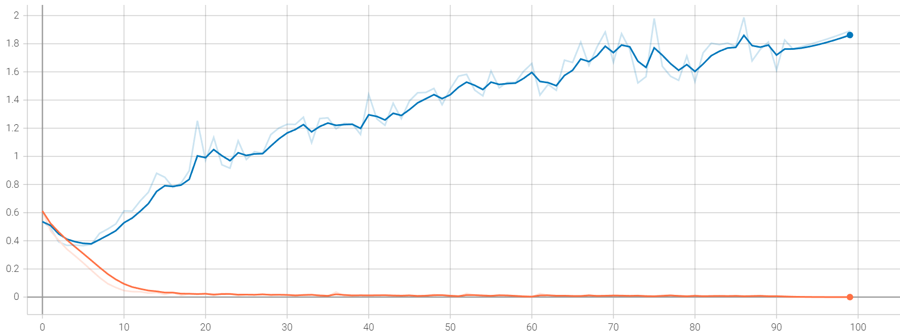

### Dens (Augment de dades)

Amb augment de dades es pot observar que els resultats d'entrenament i validació van junts, augmentant i disminuint a la vegada. Però en ser un model dens i no veure les imatges en el seu conjunt, aquest no aprèn res, ja que acaba amb resultats quasi iguals als inicials.

· Precisió per època:


· Error per època:

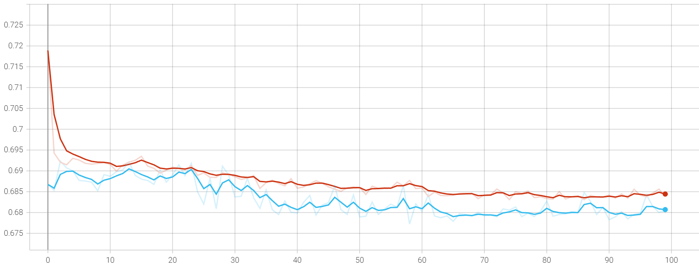

### Convolucional (Augment de dades)

En el model convolucional amb augment de dades, tots dos gràfics van junts, però a més a més, aquesta xarxa sí que aprèn. Finalment, s’aconsegueix aproximadament una precisió del 85% i un percentatge d’error d’un 32%. Tot això amb només 100 èpoques, si entrenéssim més el model, s'obtindrien millors resultats.

· Precisió per època:


· Error per època:


## 7.5. Conclusions
Els models densos no han funcionat res bé per fer classificacions amb imatges, ja que aquestes reben els valors de cada píxel per separat i no acaben de trobar cap relació de cada píxel amb els píxels adjacents.

En canvi, els models convolucionals sí que poden trobar una relació de cada píxel amb els seus veïns gràcies a les capes de convolució. Acaben comprimint la informació que hi ha en diversos píxels en un únic valor.

Respecte a l’augment de dades, es veu una clara diferència entre els models que en tenen i els que no. Aquest mètode serveix per fer les xarxes neuronals més versàtils a l’hora d'entrenar models amb imatges, ja que modifica les imatges d’entrada per poder identificar cada grup estigui en la posició i rotació que sigui.

Per exemple, si entrenem un classificador de números amb imatges on es trobin sempre centrats, el model sense augment de dades aprendrà a classificar números correctament sempre que aquests es trobin centrats en la imatge. Si aquests es posen en petit en una cantonada de la imatge, el model donarà resultats erronis. L’augment de dades serveix per això, en aquest cas, per identificar gossos i gats estiguin de la manera que sigui: rotats, cap avall, en la posició que sigui, etc.

En conclusió, en l’àmbit de classificar imatges amb *Machine Learning*, l’augment de dades és clau per a evitar l’*overfitting* juntament amb les capes convolucionals per augmentar la precisió.

# 8. Segon projecte: Classificador d’edats

Encara que el projecte de classificador de gossos i gats va tenir un resultat exitós, vam decidir realitzar un model una mica més complex com, per exemple, un classificador d’edats per comprovar si una persona és o no alumne del centre educatiu, tenint en compte només l’edat.

## 8.1. Plantejament

Vaig prendre com a base el model de classificador anterior canviant algunes línies de codi, així com la funció d’activació de l’última capa de la xarxa a Softmax, perquè en comptes de fer una classificació binària, en aquest cas, hi ha més de dues classes.

Vaig fer una recerca de datasets formats per imatges de persones classificades per edat i vaig trobar un projecte anomenat “UTKFace” [(Zhifei Z., Yang S., Hairong Q., 2017)](https://susanqq.github.io/UTKFace/). Per sort, estava disponible al públic amb finalitats de recerca no comercials, conformat per 24107 imatges classificades.

També vaig haver de separar manualment les entrades d’exemple, encara que venien etiquetades amb el nom de l’arxiu (*[edat]\_[gènere]\_[ètnia]\_[data/hora].jpg*), vaig haver de crear un *array* amb els diferents valors.

## 8.2. Codi

El que primer vaig haver de canviar va ser la manera de carregar el *dataset*. Vaig fer un bucle on s’anessin carregant d’una en una cada imatge, i s’anessin etiquetant segons el nom de l’arxiu. Després vaig visualitzar alguns exemples del *dataset* per veure com el model rebria els inputs.

```python
path = '/content/drive/MyDrive/AI/AgeChecker/Dataset'
imgSize = 100
plt.figure(figsize = (20, 20))
print('Age (0 - 116 Years) - Gender (0 Male, 1 Female) - Race (0 White, 1 Black, 2 Asian, 3 Indian, 4 Others)\n')

i = 0
for img in os.listdir(path):
if i == 5:
break
i += 1

# img = [edat]_[gènere]_[ètnia]_[data/hora].jpg
classData = str(img).split('_') # classData = (edat, gènere, ètnia, data)
ageValue = int(classData[0])
genderValue = int(classData[1])
raceValue = int(classData[2])

if genderValue == 0:
gender = 'Male'
else:
gender = 'Female'
  
if raceValue == 0:
race = 'White'
elif raceValue == 1:
race = 'Black'
elif raceValue == 2:
race = 'Asian'
elif raceValue == 3:
race = 'Indian'
else:
race = 'Other'
         
dataInfo = f'{ageValue} year(s), {race} {gender}'

img_array = cv2.imread(os.path.join(path,img), cv2.IMREAD_GRAYSCALE) # Canvi de color (Blanc i negre)
img_array = cv2.resize(img_array, (imgSize, imgSize)) # Canvi resolució (Quadrada)

plt.subplot(5, 5, i) # Faig una taula de 5 fila i 5 columnes
plt.title(dataInfo)
plt.xticks([])
plt.yticks([])
plt.imshow(img_array, cmap = 'gray')
```

```
# Age (0 - 116 Years) - Gender (0 Male, 1 Female) - Race (0 White, 1 Black, 2 Asian, 3 Indian, 4 Others)
```


Per tal d’entrenar a la xarxa, vaig crear dos *arrays* amb les imatges, en blanc i negre, passades a una cadena de valors, de 0 a 1 segons cada píxel, que serien els inputs i aquestes estarien relacionats amb cada grup d’edat.

Vaig decidir fer-ho dues vegades, un entrenament amb intervals de cinc anys i un altre amb intervals de deu anys, per veure si hi havia alguna diferència.

Després desordeno l’ordre dels exemples d’entrenament i canvio els valors dels píxels a un rang de 0 a 1. També canvio les etiquetes a una cadena de valors, ja que és el que vull que em retorni el model en fer una predicció. Rebré les probabilitats de cada classe d’on acabaré escollit la classe amb més probabilitat de ser la solució correcta.

```python
trainingData = []

totalSamples = len(os.listdir(path))
i = 1

agesClasses = [10, 20, 30, 40, 50, 60, 70, 80, 90, 100]

# Creació del dataset
def createTrainingData():
  global i
  path = '/content/drive/MyDrive/AI/AgeChecker/Dataset'
  imgSize = 100

  for img in os.listdir(path):
    console.clear()
    print(f'{i}/{totalSamples}')

    i += 1
    classData = str(img).split('_')
    ageValue = int(classData[0])

    if ageValue <= 10:
      classNum = 0
    elif ageValue <= 20:
      classNum = 1
    elif ageValue <= 30:
      classNum = 2
    elif ageValue <= 40:
      classNum = 3
    elif ageValue <= 50:
      classNum = 4
    elif ageValue <= 60:
      classNum = 5
    elif ageValue <= 70:
      classNum = 6
    elif ageValue <= 80:
      classNum = 7
    elif ageValue <= 90:
      classNum = 8
    else:
      classNum = 9

    img_array = cv2.imread(os.path.join(path,img), cv2.IMREAD_GRAYSCALE)
    img_array = cv2.resize(img_array, (imgSize, imgSize))
    trainingData.append([img_array, classNum])

createTrainingData()


import random
random.shuffle(trainingData)

X = []
y = []

for features, label in trainingData:
  X.append(features)
  y.append(label)

X = np.array(X).astype(float)/255 # Transforma valors de (0, 255) => (0, 1)
X = np.array(X).reshape(-1, imgSize, imgSize, 1)
y = np.array(y).astype(int)
y = kr.utils.np_utils.to_categorical(y, len(agesClasses))
# Transforma els valors enters a arrays de probabilitat
# Exemple: [5] => [0, 0, 0, 0, 0, 1, 0, 0, 0, 0]
#          [3] => [0, 0, 0, 1, 0, 0, 0, 0, 0, 0]
```

```
# 24107/24107
```

Realitzo un augment de dades per intentar millorar la precisió dels resultats. Utilitzo el mateix codi que el model de gossos i gats.

```python
# Augment de dades
examples = 10
imageResolution = (imgSize, imgSize)

# Visualització imatges originals
print('Dataset Original:')
plt.figure(figsize = (20, 20))
for i in range(examples):
  plt.subplot(5, 5, i + 1)
  plt.xticks([])
  plt.yticks([])
  plt.imshow(X[i].reshape(imageResolution), cmap = 'gray')
plt.show()

# Configuració del generador d'imatges
dataGenerator = ImageDataGenerator(
    rotation_range = 30, # Rotació
    width_shift_range = 0.2, # Desplaçament als costats
    height_shift_range = 0.2, # Desplaçament a dalt o a baix
    shear_range = 15, # Inclinació
    zoom_range = [0.75, 1.5], # Zoom
    horizontal_flip = True, # Voltejar horitzontalment
    vertical_flip = True # Voltejar verticalment
    )
dataGenerator.fit(X) # Apliquem la configuració

# Visualització imatges generades
print('\nDataset Augment de Dades:')
plt.figure(figsize = (20, 20))
for imatge, etiqueta in dataGenerator.flow(X, y, shuffle = False):
  for i in range(examples):
    plt.subplot(5, 5, i + 1)
    plt.xticks([])
    plt.yticks([])
    plt.imshow(imatge[i].reshape(imageResolution), cmap = 'gray')
  plt.show()
  break
```

```
# Dataset Original:
```

```
# Dataset Augment de Dades:
```


A l'hora d’entrenar el model he utilitzat la mateixa part de codi que en el model convolucional amb augment de dades que el de gossos i gats. Que està compost de 4 capes convolucionals de 32, 64 i 128 filtres de 3x3, una capa ReLU amb 100 neurones i una capa Sigmoide amb una neurona.

Per fer prediccions amb els models entrenats s’ha de canviar la forma de les imatges d’entrada a la mateixa forma que les imatges emprades per l’entrenament: resolució quadrada de 100x100 píxels en blanc i negre amb valors de 0 a 1 per a cada píxel. El resultat de la predicció serà una llista de les probabilitats que té cada interval d’edat de ser l'edat correcta.

S'agafa la probabilitat més altra de totes com a resultat final de la predicció.

```python
# Provar models guardats
from google.colab import files, output # Pujar arxius al Colab
import PIL.Image # Obrir imatges

# Editem l'imatge d'entrada per aconseguir les 
# mateixes característiques que les d'entrenament.
def normalitzarImatge (image):
  try:
    imageResolution
  except:
    imageSize = 100
    imageResolution = (imageSize, imageSize)

  image = np.array(image) # Convertim l'imatge a un array
  image = cv2.resize(image, imageResolution) # Canvi de resolució
  image = cv2.cvtColor(np.float32(image), cv2.COLOR_BGR2GRAY) # Imatge a blanc i negre
  image = np.array(image).astype(float)/255 # Normalització dels píxels
  visualitzarInput(image)
  input = image.reshape(1, imageSize, imageSize, 1) # Canvi de forma
  return input

# Visualització de la imatge d'entrada
def visualitzarInput (image):
  # Visualització l'input amb Matplotlib
  plt.figure(figsize=(10, 10))
  plt.subplot(3, 3, 1)
  plt.imshow(image, cmap='gray')
  plt.title('Input')
  plt.axis('off')
  plt.show()

# Segons l'output en trobem la classe.
def resultat (output):
  print(f'Output:\n{round(100*np.max(output), 2)}% segur.')

  resultat = int(np.argmax(output))
  agesClasses = [10, 20, 30, 40, 50, 60, 70, 80, 90, 100]
  resultat = agesClasses[resultat]

  resultat = f'Té uns {resultat} anys.'
  return resultat


uploadedFiles = files.upload()
output.clear()
print('PROVES FINALS DEL MODEL\n')

for nameFile in uploadedFiles.keys():
  # Cárrega del model pujat
  if nameFile.endswith('.h5'):
    if 'weights' in nameFile:
      model.load_weights('__weights.h5')
    else:
      model = kr.models.load_model('__model.h5')
  # Predicció de les imatges pujades
  else:
    try:
      imagen = PIL.Image.open(str(nameFile))
      input = normalitzarImatge(imagen)

      output = model.predict(input)
      print(f'{resultat(output)}\n')
    except:
      print(f'¡Error {str(nameFile)}!')
```

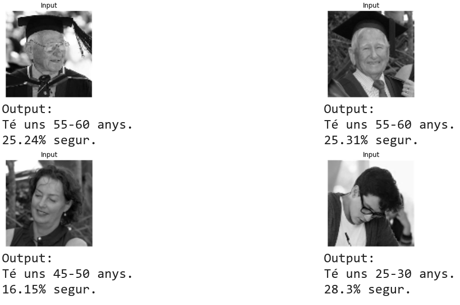

`Google Colab:`
[*`https://colab.research.google.com/drive/1lOvxgnW7f4D
Q8mUYKWn7mtkjzEGwCFBl?usp=sharing`*](https://colab.research.google.com/drive/1lOvxgnW7f4DQ8mUYKWn7mtkjzEGwCFBl?usp=sharing)

## 8.3. Resultats

Després de realitzar l’entrenament del model de classificació per edats, es pot veure diferències de precisió final amb altres models entrenats prèviament de classificadors binaris, com el de gossos i gats.

### Gossos i gats

Mostra un bon rendiment durant tot l’entrenament, la quantitat d’error disminueix i el percentatge de precisió augmenta tant amb valors d’entrenament com amb els valors de validació. Acaba aconseguint una precisió d’un 90% després de 300 iteracions.


### Edats

Els models de classificació no binaris no mostren un rendiment tan bo com el model anterior. Al principi la quantitat d’error disminueix i la precisió augmenta tant amb imatges d’entrenament i validació, però després d’unes iteracions el model només té un aprenentatge positiu amb les imatges d’entrenament mentre que amb les imatges de validació no passa igual. Un possible cas d'*overfitting*, causat molt probablement per la falta d'exemples d’entrenament encara que s’han utilitzat 20491 imatges de persones, en comptes de 19773 imatges en el cas dels gossos i gats.

Resultats amb intervals de 5 anys:

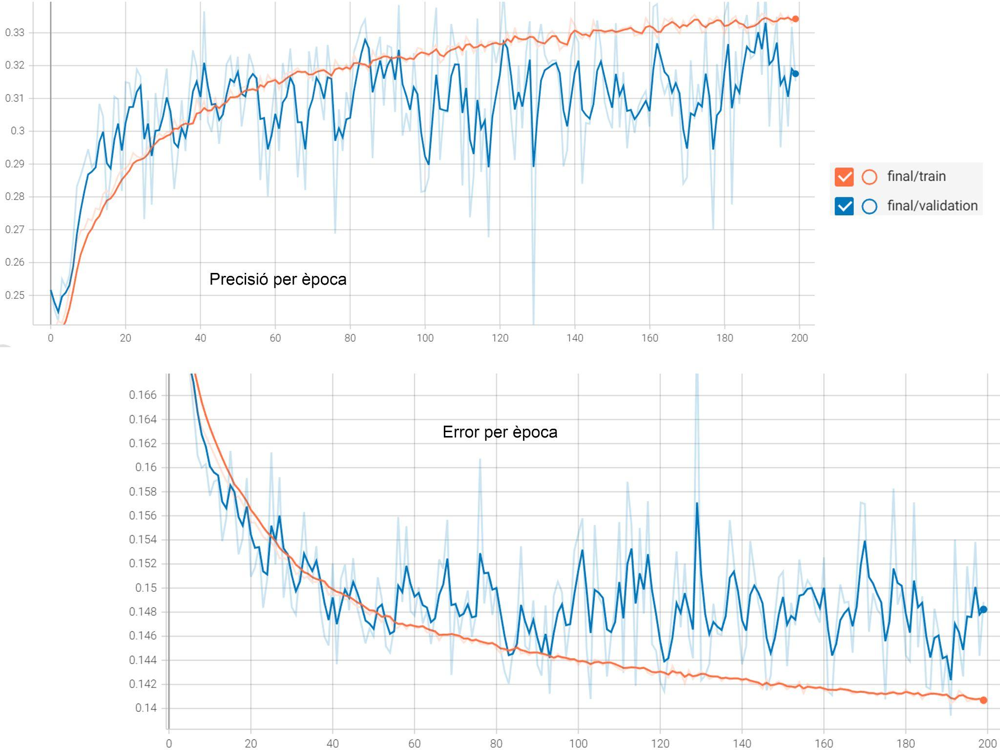

Resultats amb intervals de 10 anys:

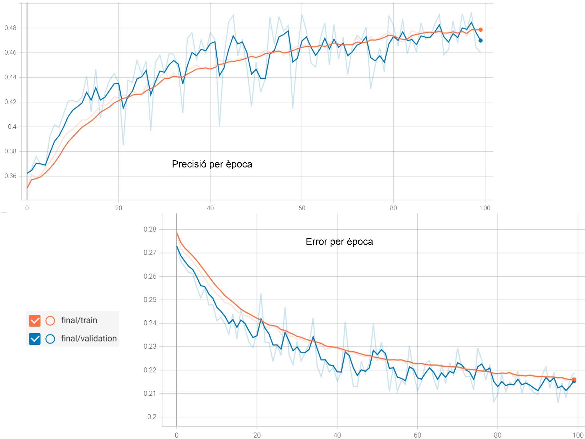

Després de finalitzar l’entrenament el model d’intervals de 5 aconsegueix una precisió d’un 30% i el d’intervals de 10 aconsegueix una precisió de poc menys del 50%. S’ha de tenir en compte que el primer model es va entrenar per 200 iteracions i el segons només per 100.

## 8.4. Conclusions

Per tant, es pot arribar a la conclusió que els models de classificació no binaris d’imatges aprenen millor quan hi ha menys grups per classificar.

També s’ha de tenir en compte que en el cas anterior de classificació de gossos i gats, els dos grups eren més fàcils de diferenciar, en canvi, en aquest cas hi ha més de dos grups i tots tenen molts trets en comú totes les imatges s'assemblen.

Com a observacions, es pot afegir que l’entrenament dels models no és instantani i que els temps per entrenar cada model és d'unes quantes hores. Utilitzant Google Colab, el procediment d’entrenament és molt més lent que en un ordinador potent i per això vaig acabar decidint entrenar-los en el meu propi ordinador. En ser Google Colab un recurs gratuït, és normal que estigui una mica limitat en aquest sentit. Per altra banda, si deixaves el programa funcionant durant un temps, aquest demanava verificació de si estaven a prop i si no ho estaven, el programa deixava de funcionar. Com a punts positius d’aquesta eina és que és molt útil si estàs fent servir un portàtil o un mòbil.

# 9. Resultats dels models

Una vegada finalitzat la part pràctica, vaig provar d'entrenar els models canviant algunes dades per veure el seu impacte en el resultat final. En el mateix document he guardat l'historial d’entrenaments dels tres models finals.

Per tal de provar els models, també vaig crear una web, reutilitzant el codi d’una plantilla per provar models entrenats amb Keras [(Ringa Tech., YouTube)](https://www.youtube.com/c/RingaTech).

## 9.1. Gràfics models

Per tal de visualitzar el comportament del *learning rate*, el nombre d'èpoques, l’augment de dades i els diferents tipus de models, vaig realitzar els entrenaments canviant les diferents variables i vaig formar una taula amb els diferents gràfics dels resultats finals. També estan els gràfics de tots els models finals que he publicat en la pàgina de classificació (*<https://classificador.vercel.app>*). [Taula Models Classificació](https://docs.google.com/spreadsheets/d/1l83isgMk8DEoyaeg716v9KQvrtVLO5eJOdUv59d6nz4/edit?usp=sharing)

## 9.2. Web dels models

Vaig acabar aprofitant els models de classificació finals per desenvolupar una simple pàgina web on es poden posar a prova. Vaig utilitzar GitHub per penjar el codi font de la web a la xarxa. GitHub és una plataforma amb la capacitat d’allotjar projectes al núvol, emprada principalment per a emmagatzemar i compartir el codi de programes informàtics. Per fer-la accessible públicament, vaig fer servir Vercel, una plataforma que brinda allotjament gratuït per a pàgines web estàtiques. La web ha estat publicada a l'URL de *<https://classificador.vercel.app>* i el codi font a *<https://github.com/zVictorium/classificador>*.

# 10. Conclusions finals

Amb aquest treball he pogut aprendre que les xarxes neuronals no són més que càlculs i funcions matemàtiques entrellaçades que formen una gran funció molt complexa i, segons els valors d’entrada, s’aconsegueix un o més d’un valor com a resultat.

Les derivades tenen un rol fonamental en el procés d’entrenament de les xarxes neuronals, ja que ajuden a trobar el mínim de la funció de cost, i apropar-nos als valors dels paràmetres adequats per obtenir bons resultats. Per altra banda, he d’admetre que he tingut dificultats a l’hora de la comprensió del funcionament de les derivades parcials, però he entès el funcionament teòric que s’utilitza per a l’aprenentatge.

Si fem ús de Machine Learning, és imprescindible comptar amb un bon *dataset* amb una gran quantitat d’exemples.

Gràcies a les eines disponibles en l’actualitat, he comprovat que és possible el desenvolupament i entrenament de xarxes neuronals amb relativa facilitat, sense la necessitat de tenir un ordinador potent ni d'haver d'escriure tant de codi.

També he confirmat que és molt important utilitzar xarxes neuronals convolucionals per a l’anàlisi d’imatges, junt amb un procediment d’augment de dades per fer al model més versàtil, malgrat que els models de classificació d’edat no han tingut resultats tan positius.

Per finalitzar, he d’admetre que aquest treball m’ha servit per aprendre molt sobre aquest camp en el qual estava molt interessat des de feia temps i que m’ha permès conèixer i analitzar el comportament que hi ha a l’interior de les xarxes sense limitar-me a l’experimentació amb models creats per altres persones.

També animo a totes les persones interessades que facin una continuació de la recerca o que aprofitin la informació d’aquest treball com a font per entendre millor l’interior de l’aprenentatge automàtic.

# 11. Agraïments

Aquest treball ha estat interessant i gratificant, però a la vegada molt complex pel que fa a la part teòrica. Al principi no sabia per on començar, però, gràcies a l’ajuda dels meus professors, vaig poder iniciar la recerca amb millor orientació. Per aquest motiu vull agrair a les persones que han dedicat el seu temps en donar-me suport:

Al meu tutor del treball, Miguel Ángel, per donar-me consell sobre els punts que podria millorar i per facilitar-me l’accés a fonts d’informació i cursos sobre el tema.

A Ignasi Fibla, per accedir a fer-me una introducció i orientació sobre intel·ligència artificial.

A Eusebi López, el meu professor de tecnologia, per dedicar el seu temps en buscar cursos i contactes amb coneixement d’IA.

# 12. Webgrafia

## 12.1. Imatges

- Fig. 2.3 : Santana, C. [Dot CSV]. (2017, 1 de novembre). “¿Qué es el Machine Learning?¿Y Deep Learning? Un mapa conceptual | DotCSV” [Vídeo]. YouTube. <https://youtu.be/KytW151dpqU?t=266>

- Fig. 3.1 : Esquema de la neurona. (2020, 16 de setembre). Esquema.net. Recuperat 14 d’octubre de 2022, de <https://esquema.net/neurona/>

- Fig. 3.2.1 : Byte, B. Y. (s. f.). Programando una red neuronal simple. Recuperat 14 d’octubre de 2022, de <https://bitybyte.github.io/Programando-una-red-neuronal/>

- Fig. 3.2.2 : La neurona artificial. (s. f.). Recuperat 14 d’octubre de 2022, de <https://www.ibiblio.org/pub/linux/docs/LuCaS/Presentaciones/200304curso-glisa/redes_neuronales/curso-glisa-redes_neuronales-html/x38.html>

- Fig. 3.2.3 : Colaboradores de Wikipedia. (2021, 12 de novembre). Perceptrón. Wikipedia, la enciclopedia libre. Recuperat 14 d’octubre de 2022, de <https://es.wikipedia.org/wiki/Perceptrón>

- Fig. 3.2.4-3.2.8, 3.3 : Ai, B. (2021, 12 de desembre). Redes neuronales - Bootcamp AI. Medium. Recuperat 14 d’octubre de 2022, de <https://bootcampai.medium.com/redes-neuronales-13349dd1a5bb>

- Fig. 3.2.9 : Ringa Tech. (2022, 25 de maig). “Funciones de activación a detalle (Redes neuronales)” [Vídeo]. YouTube. <https://youtu.be/_0wdproot34?t=1177>

- Fig. 2.3 : Santana, C. [Dot CSV]. (2020, 12 de novembre). “👁‍🗨 ¡Redes Neuronales CONVOLUCIONALES! ¿Cómo funcionan?” [Vídeo]. YouTube. <https://youtu.be/V8j1oENVz00?t=420>

- Fig. 3.4.3 : ¿Qué son las Redes Convolucionales? (s. f.). Codificando Bits. Recuperat 14 d’octubre de 2022, de <https://www.codificandobits.com/blog/redes-convolucionales-introduccion/>

- Fig. 3.4.4 : Max-pooling / Pooling - Computer Science Wiki. (s. f.). Recuperat 14 d’octubre de 2022, de [https://computersciencewiki.org/
index.php/Max-pooling_/_Pooling](https://computersciencewiki.org/index.php/Max-pooling_/_Pooling)

- Fig. 4.1.1 : Santana, C. [Dot CSV]. (2017, 16 de desembre). “Regresión Lineal y Mínimos Cuadrados Ordinarios | DotCSV” [Vídeo]. YouTube. <https://youtu.be/k964_uNn3l0?t=360>

- Fig. 4.2.1-4.2.3 : AprendeInnovando. (2021, 24 de gener). “CÓMO FUNCIONA el entrenamiento de Redes Neuronales 🧠 (5 Minutos)” [Vídeo]. YouTube. <https://youtu.be/t1EIJNk-gdA>

- Fig. 4.2.4 : Thakur, A. (2022, 24 de març). What’s the Optimal Batch Size to Train a Neural Network? W&B. Recuperat 14 d’octubre de 2022, de <https://wandb.ai/ayush-thakur/dl-question-bank/reports/What-s-the-Optimal-Batch-Size-to-Train-a-Neural-Network---VmlldzoyMDkyNDU>

## 12.2. Fonts i recursos

- edX. (s. f.). Introducción a la Inteligencia Artificial. Recuperat 28 d’octubre de 2022, de <https://www.edx.org/course/introduccion-a-la-inteligencia-artificial?index=product>

- edX. (s. f.). CS50’s Introduction to Artificial Intelligence with Python. Recuperat 28 d’octubre de 2022, de <https://www.edx.org/course/cs50s-introduction-to-artificial-intelligence-with-python?index=product>

- Santana, C. [Dot CSV]. (s.f.). Inicio [YouTube channel]. YouTube. Recuperat el 14 d’octubre de 2022, de <https://www.youtube.com/c/DotCSV>

- Ringa Tech. (s.f.). Inicio [YouTube channel]. YouTube. Recuperat el 14 d’octubre, 2022, de <https://www.youtube.com/c/RingaTech>

- Zhifei Z., Yang S., Hairong Q. (2017). Age Progression/Regression by Conditional Adversarial Autoencoder. Recuperat 14 d’octubre de 2022, de <https://susanqq.github.io/UTKFace/>

- Microsoft. (s. f.). Kaggle Cats and Dogs Dataset. Microsoft Downloads. Recuperat 20 d’octubre de 2022, de <https://www.microsoft.com/en-us/download/details.aspx?id=54765>

- Wikipedia contributors. (2022, 25 d’octubre). Machine learning. Wikipedia. <https://en.wikipedia.org/wiki/Machine_learning>

- Wikipedia contributors. (2022, 24 d’agost). Perceptron. Wikipedia. Recuperat 14 d’octubre de 2022, de <https://en.wikipedia.org/wiki/Perceptron>

- Wikipedia contributors. (2022, 25 d’agost). Activation function. Wikipedia. Recuperat 14 d’octubre de 2022, de <https://en.wikipedia.org/wiki/Activation_function>

- Wikipedia contributors. (2022, 25 d’octubre). Machine learning. Wikipedia. <https://en.wikipedia.org/wiki/Machine_learning>

- Wikipedia contributors. (2022, 13 d’octubre). Convolutional neural network. Wikipedia. Recuperat 14 d’octubre de 2022, de <https://en.wikipedia.org/wiki/Convolutional_neural_network>

- Ramírez, F. (2021, 25 juny). Las matemáticas del Machine Learning: Funciones de activación - Think Big Empresas. Think Big. Recuperat 28 d’octubre de 2022, de <https://empresas.blogthinkbig.com/las-matematicas-del-machine-learning-funciones-de-activacion/>

- Descenso de gradiente (artículo). (s. f.). Khan Academy. Recuperat 28 d’octubre de 2022, de <https://es.khanacademy.org/math/multivariable-calculus/applications-of-multivariable-derivatives/optimizing-multivariable-functions/a/what-is-gradient-descent>

- Ai, B. (2021, 12 de desembre). Redes neuronales - Bootcamp AI. Medium.  Recuperado 28 de octubre de 2022, de <https://bootcampai.medium.com/redes-neuronales-13349dd1a5bb>

- Calvo, J. (s. f.). Crear Red Neuronal desde las matemáticas. Blog EuropeanValley. Recuperado 28 de octubre de 2022, de <https://www.europeanvalley.es/noticias/crear-red-neuronal-desde-las-matematicas/>

- La neurona artificial. (s. f.). Recuperat 28 d’octubre de 2022, de <https://www.ibiblio.org/pub/linux/docs/LuCaS/Presentaciones/200304curso-glisa/redes_neuronales/curso-glisa-redes_neuronales-html/x38.html>

*Aquesta és una versió modificada del document del treball, pots veure la versió original [aquí](docs/original.pdf).*