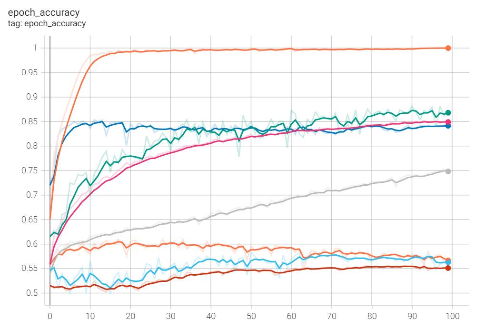

Here is the English translation of the Catalan Markdown file:

### RESEARCH PROJECT · TECHNOLOGY

# Machine Learning: Neural Networks and Applications


<center></center>

## Abstract

El aprendizaje automático es una rama de la inteligencia artificial que se ocupa de la creación de algoritmos que pueden aprender de los datos y hacer predicciones sobre ellos. Las redes neuronales son un tipo de algoritmo de aprendizaje automático, especialmente adecuado para tareas que requieren el aprendizaje de patrones complejos.

En este proyecto de investigación, me he centrado en la inteligencia artificial, concretamente en el subcampo del aprendizaje automático. He investigado el funcionamiento de las redes neuronales, empezando por la neurona artificial más sencilla y avanzando hacia modelos de aprendizaje más complejos. El objetivo es comprender mejor cómo funcionan estos algoritmos y cómo pueden utilizarse para resolver diversos problemas, en concreto, problemas de clasificación.

Por último, he puesto en práctica estos conocimientos teóricos con la ayuda de un lenguaje y un entorno de programación.

---

Machine learning is a branch of artificial intelligence that deals with the creation of algorithms that can learn from data and make predictions about it. Neural networks are a type of machine learning algorithm particularly suited for tasks that require learning complex patterns.

In this research project, I have focused on artificial intelligence, specifically in the subfield of machine learning. I have investigated the operation of neural networks, starting with the simplest artificial neuron and moving towards more complex learning models. The goal is to better understand how these algorithms work and how they can be used to solve various problems, in particular, classification problems.

Finally, I have put this theoretical knowledge into practice with the help of a programming language and environment.

# Index

[**Abstract**](#abstract)

[**1. Introduction**](#1.-introduction)

> [**1.1. Hypothesis and Objectives**](#1.1.-hypothesis-and-objectives)

> [**1.2. Motivation**](#1.2.-motivation)  

> [**1.3. Initial Knowledge**](#1.3.-initial-knowledge)

[**Theoretical Part**](#theoretical-part)  

[**2. Initial Concepts**](#2.-initial-concepts)

> [**2.1. Origins**](#2.1.-origins)

> [**2.2. Artificial Intelligence**](#2.2.-artificial-intelligence)

> [**2.3. Machine Learning**](#2.3.-machine-learning)

> [**2.4. Neural Networks**](#2.4.-neural-networks)

[**3. Neural Networks**](#3.-neural-networks)

> [**3.1. Biological Neuron**](#3.1.-biological-neuron)

> [**3.2. Perceptron**](#3.2.-perceptron)

> [**3.3. Neural Networks**](#3.3.-neural-networks) 

> [**3.4. Convolutional Neural Networks**](#3.4.-convolutional-neural-networks)

[**4. Training**](#4.-training)  

> [**4.1. Learning Paradigms**](#4.1.-learning-paradigms)

> [**4.2. Error**](#4.2.-error)

> [**4.3. Backpropagation**](#4.3.-backpropagation)

[**Practical Part**](#practical-part)

[**5. Programming**](#5.-programming)

> [**5.1. Google Colab**](#5.1.-google-colab)

> [**5.2. TensorFlow**](#5.2.-tensorflow)

> [**5.3. Other Libraries**](#5.3.-other-libraries)

[**6. Practical Examples**](#6.-practical-examples)  

> [**6.1. Perceptron**](#6.1.-perceptron)

> [**6.2. Perceptron: Binary Classification**](#6.2.-perceptron:-binary-classification)

> [**6.3. Binary Classification**](#6.3.-binary-classification)

[**7. First Project: Dog and Cat Classifier**](#7.-first-project:-dog-and-cat-classifier)

> [**7.1. Objectives**](#7.1.-objectives)

> [**7.2. New Techniques Used**](#7.2.-new-techniques-used) 

> [**7.3. Code**](#7.3.-code)

> [**7.4. Analysis of Results**](#7.4.-analysis-of-results)

> [**7.5. Conclusions**](#7.5.-conclusions)

[**8. Second Project: Age Classifier**](#8.-second-project:-age-classifier)

> [**8.1. Approach**](#8.1.-approach)

> [**8.2. Code**](#8.2.-code)

> [**8.3. Results**](#8.3.-results) 

> [**8.4. Conclusions**](#8.4.-conclusions)

[**9. Model Results**](#9.-model-results)

> [**9.1. Model Graphs**](#9.1.-model-graphs)

> [**9.2. Model Web**](#9.2.-model-web)

[**10. Final Conclusions**](#10.-final-conclusions)

[**11. Acknowledgements**](#11.-acknowledgements) 

[**12. References**](#12.-references)

> [**12.1. Images**](#12.1.-images)

> [**12.2. Sources and Resources**](#12.2.-sources-and-resources)

# 1. Introduction

Artificial intelligence has been one of the great technological advances in recent years. It seeks to create machines that can imitate intelligent behavior. Currently, artificial intelligence (AI for short) has been used in a wide range of fields, including medical diagnosis, stock trading, robot control, remote sensing, scientific discovery, and toys. Examples of uses can be very diverse: driving vehicles and machines, analyzing patterns, recognizing voices or winning games. 

Within the field of artificial intelligence we can find different subcategories/fields that respond to different intelligent behaviors such as robotics, natural language processing, vision or voice. But in this work I will focus on investigating its ability to learn: Machine Learning.

Specifically, I will focus on discovering the operation of neural networks, and their ability to learn in a hierarchical way, that is, by level/layers, starting with the smallest, the artificial neuron, up to the learning models.

I will conclude the research by putting theoretical knowledge into practice with the help of a programming language and environment. My goal is to be able to develop a learning model that is capable of classifying images using the tools available today.

## 1.1. Hypothesis and Objectives

Starting from the hypothesis that it is possible to develop your own artificial intelligence with the tools currently available, I will try to prove it by training various classification models.

The ultimate goal of this work will be to try to create my own AI trained to classify images, using already created libraries, and find out what is the best technique to perform this type of function.

## 1.2. Motivation

Since I was little, artificial intelligence has seemed like a very interesting field of computer science to me. The fact that a machine can act similar to a person or animal has always surprised me. In this research work I intend to investigate and experiment with artificial intelligence from the inside, to understand its operation and the processes it uses to learn.

## 1.3. Initial Knowledge

I started this work with basic knowledge of Python and programming and with various documentaries seen on the subject. Before starting, I experimented with artificial intelligences on my own for entertainment.

# 2. Initial Concepts

If we want to delve into the field of artificial intelligence, we must first understand and be clear about what we mean when we talk about different concepts and terms necessary to understand the topic: concepts such as artificial intelligence, machine learning, neural networks, big data or deep learning. Concepts that are sometimes interpreted differently and are used with a lot of confusion.

## 2.1. Origins 

The history of artificial intelligence dates back to antiquity, when myths and stories about artificial beings endowed with intelligence or consciousness were common.

However, it was not until the invention of the programmable digital computer in the 1940s that the modern field of AI began to take shape. This machine inspired some scientists to seriously discuss the possibility of building an electronic brain.

Its formal beginning can be considered the year 1950, when it was considered the intention to make machines capable of solving problems without human support, in an autonomous way.

It was Alan Turing at the end of World War II who established the first foundations of artificial intelligence. 

Years later, along with Alan Turing, several researchers conferred formal existence to the area of exploration and study of these subjects. Among them can be mentioned the following: McCarthy, Minsky, Edmonds, Papert and Carbonell, among others.

Over the years, research on AI has led to the development of numerous powerful information technologies that have had a profound impact on society.

## 2.2. Artificial Intelligence

Giving a definition of artificial intelligence is a complicated task because it depends on the very definition of intelligence. But we can come to the conclusion that artificial intelligence is a branch of Computer Science that seeks to create machines that can imitate intelligent behavior. Some intelligent behaviors could be: driving vehicles and machines, analyzing patterns, recognizing voices or winning games.

Some people use the term AI to describe machines that mimic the cognitive functions that humans associate with the human mind, such as learning and solving problems. However, this definition is not very correct, since it corresponds to a subcategory of it: machine learning.

## 2.3. Machine Learning

Within the field of artificial intelligence, we can find different subcategories/fields that respond to different intelligent behaviors such as robotics, natural language processing (NLP), vision or voice. But the ability that defines humans as intelligent beings is the ability to learn, that is, machine learning.

  

*Fig. 2.3.1: Conceptual diagram of artificial intelligence*

It is very common to confuse Machine Learning with artificial intelligence, but programming a machine so that it can move is not the same as programming a machine so that it learns to move.

Within Machine Learning, we find different techniques that serve to cover different types of applications. For example, we have techniques such as decision trees, regression models, classification models and many more. However, if one of these techniques has made the field of machine learning famous over the last decade, it has been neural networks.


*Fig. 2.3.2: Conceptual diagram of Machine Learning*

## 2.4. Neural Networks

Neural networks are capable of learning in a hierarchical way, that is, information is learned by levels/layers. As we add more layers, the information learned becomes more and more abstract and interesting. There is no limit to the number of layers and the tendency is for more and more layers to be added to these algorithms.

# 3. Neural Networks

## 3.1. Biological Neuron  

To understand neural networks and artificial neurons we must first understand how a natural neuron works.

Neurons are interconnected nerve cells that allow the processing and transmission of chemical and electrical signals. Dendrites are branches that receive information from other neurons. Cell nuclei process information received from dendrites. Finally, synapses and axons serve as a connection between neurons, transmitting processed information to another neuron.

  

*Fig. 3.1: Graphic representation of a biological neuron*

Artificial neurons imitate the functioning of a biological neuron. They are based on a mathematical function that receives data, weights it, calculates the sum and presents a result through a non-linear function.

## 3.2. Perceptron

The perceptron algorithm was published in 1957 by Frank Rosenblatt. The goal of the perceptron is to find a hyperplane, called the decision boundary, that correctly separates a linearly separable dataset into two regions in space. 

We can understand a hyperplane as an object that divides a space into two parts: In a one-dimensional space, a hyperplane is a point that divides a line in two; in two-dimensional space, it is a line that divides the plane in two halves; in three-dimensional space, it is a flat plane that divides space in two halves. This concept can also be applied to spaces of four dimensions or more.  

Once the hyperplane is obtained, it can be used for binary classifications.

  

*Fig. 3.2.1: Example of a case where a perceptron could be used to classify two classes according to input characteristics.*

Although this learning algorithm is very simple, understanding its operation is essential to learn other more complex methods such as artificial neural networks.

### Components 

The simple perceptron is a one-way neural model, which is composed of an input layer and an output layer. This model is composed of several components:

- **Input values ​​*(Inputs)*:** It is the information received that has been provided.

- **Weights ​​*(Weights)*:** Each input value is related to a weight. These control the strength of the connection from the input to the processing part, which means that they mark the importance that each of the inputs has in the final result. The weights will be the values ​​to learn, these are modified to improve the output result.

- **Bias and Threshold *(Bias or Threshold)*:** The bias alters the position of the decision boundary, but not the orientation. Mathematically, this value will be added with the result of the weighted sum. The threshold is like a constant input with a value of 1 and with a weight corresponding to the bias which is variable.

- **Activation function:** These are responsible for modifying and normalizing the values ​​obtained from the weighted sum. There are different types of activation functions. For example, the binary function, which treats the obtained values ​​to achieve binary results, useful in classifications.

- **Output values ​​*(Outputs)*:** After all the calculations made, output values ​​are achieved that can be transmitted to other neurons or be compared with verified results and use this comparison to find errors and improve the values ​​of the weights.

  

*Fig. 3.2.2: Graphic representation artificial neuron*

### Mathematical explanation

First, we have the vector x, with all the given inputs, and the vector w, with all the weights of each input. In addition, we have an established bias b and an activation function f(). Thus, the output result will be:

$$ y = f(z) = f(x · w + b) $$

$$ z = Σ = x · w + b = x_1· w_1 + x_2 · w_2 + x_3 · w_3 + ··· + x_n · w_n + b $$ 


*Fig. 3.2.3: Graphic representation perceptron*

### Example with perceptron

Let's imagine that we want to achieve a perfect day, we come to the conclusion that to achieve it we need two things: playing video games and doing sports. Both variables will be binary, their value can only be 0 or 1. The output variable will indicate whether the day has been perfect or not, also in binary.

· Interactive example: [Perceptron Example](https://docs.google.com/spreadsheets/d/19ZZPV0xgRLsNb7_vNBh6uezyW3X1ls__-jmpNME201Q/edit?usp=sharing) 

· Graphic representation: [*www.geogebra.org/calculator/e2efnygv*](http://www.geogebra.org/calculator/e2efnygv)

The result obtained without using any activation function can be represented in the form of a line that separates the points into two classes. To get the result to be binary, I use the *Step* activation function which, depending on whether the resulting value is positive or negative, returns a 0 or 1. As a result we get an AND logic gate.

### Activation functions

A neural network without activation functions is very limited, since the result is linear. The main function of an activation function is to add non-linear components to the network. The activation function returns an output that is generated by the given neuron for a given input or set of inputs. There are different activation functions with different uses:

- **Linear function:**

  - **Linear regression:**

    Linear functions are the basis of many learning algorithms. They are very useful for achieving numerical results from inputs, but they do not serve to make classifications of more than two classes. An example of a problem with a linear function would be a unit conversion or for data analysis.

$$ f(z) = z $$

  

*Fig. 3.2.4: Linear function*

- **Nonlinear functions:**

  - **Step function:**
  
    This function indicates that if the result is less than zero, the output will be 0, but when it is greater than or equal to zero, it will return 1 as output. This function is used to make classifications or when there are categorical outputs. For example, to develop simple logic gates like AND or OR.

$$ if z<0 →f(z)=0 $$
$$ if z≥0 →f(z)=1 $$


*Fig. 3.2.5: Step function graph*

  - **Sigmoid / Logistic function:**

    This function has an output value range between 0 and 1, but it has a smooth curve, which serves us to achieve a classification interpreted as a probability from 0 to 1. Its use is recommended only in the output layer, when a binary result is required. A case of using this function would be in an image classifier with two groups such as, for example, dogs and cats.

$$ f(z) = \frac{1}{1 + e^{-z}} $$
$$ e ≃ 2,7182 $$

  

*Fig. 3.2.6: Logistic function graph*

  - **Hyperbolic tangent function:**

    This activation function called hyperbolic tangent is similar to the logistic function, but has an output value range of -1 to 1. It is superior to the logistic function for hidden layers, but does not usually give better results than ReLU. It can be used for classifications and to solve problems where you decide one thing or the opposite.

$$ f(z) = tanh(z) = \frac{e^z - e^{-z}}{e^z + e^{-z}} $$

  

*Fig. 3.2.7: Hyperbolic tangent function graph*

  - **ReLU function:**

    This function is the most used because it allows very fast learning in neural networks. If this function is given negative input values, the result is zero, but if it is given positive values, it is equal to that value. ReLU is the function that we will normally use. For example, it can be used in models related to images because it works very well with them.

$$ f(z) = max(0, x) $$

  

*Fig. 3.2.8: ReLU function graph*

  - **Softmax function:**

    This function is used to classify information. Softmax is used for multiple classes and assigns probabilities for each class that belongs. It is the most popular when making a classification where there are more than two groups, for example, to differentiate different pieces of clothing.

$$ f(z) = \frac{e^z}{Σ(e^z)} $$

  

*Fig. 3.2.9: Softmax function example*

## 3.3. Neural Networks

With a single neuron we cannot solve complex problems. When a group of neurons connect to each other, they form the so-called neural networks, which are made up of layers of neurons that send and share relevant information to determine the corresponding outputs.

The layers can be divided into 3 groups:

- **Input layer *(input)***

  It is made up of neurons that receive input data or signals.

- **Hidden layers *(hidden)***

  There may be more than one and they have no direct connection to the outside, they have no connection to the input data or the output data.

- **Output layer *(output)***

  It is made up of neurons that provide the network's response.

  

*Fig. 3.3: Neural network representation*

Once the internal operation of a neuron and neural network is understood, we need to train it.

## 3.4. Convolutional Neural Networks

A convolutional neural network is a type of neural network commonly used for image analysis. Convolutional networks are very effective for computer vision tasks, such as image classification and segmentation, among other applications.

The design of convolutional networks takes advantage of the spatial structure of images. With a normal neural network, we would enter the pixel values ​​as if they were independent variables with no relationship, as if it were a flat vector. Normally, the value of one pixel in an image is highly related to the value of neighboring pixels.

Convolutional neural networks are characterized by the use of a type of layer where a mathematical operation known as convolution is performed. A convolution applied to an image is an operation that is able to produce a new image using a filter.

Convolutional neural networks are like flies' eyes: their field of vision is fragmented into thousands of small images that extract very simple patterns like light and shadow levels, which their brain integrates into several layers of abstraction. At the entrance it barely sees a mosaic, the brain relates it and classifies it into parts, and the higher superior layers assign labels like food, obstacle, flyswatter, etc.

Each new pixel will be calculated by placing a matrix of numbers, called a filter or kernel, over the original image. Each value of the filter will be multiplied by each pixel and everything will be added to find the value of the resulting pixel.

  

*Fig. 3.4.1: Convolution example of an image*

This convolution operation on an image can detect different features depending on the values ​​of the filter we define. These values ​​are what the neural network will learn.

  

*Fig. 3.4.2: Example of a filter that will activate when it finds contrast differences and, as a result, detect vertical edges.*

The images generated are called feature maps, since they are responsible for finding patterns and features in the images.

The pixel values ​​range from 0 (black) to 255 (white). When there are white pixels in a feature map it will mean that a feature present in the original image exists.

In a convolutional neural network, this operation is performed sequentially, where in its initial layers it learns very generic patterns, such as edges, corners and textures, and in its final layers more complex and advanced patterns, such as eyes or mouths.

The input layer is the one that processes the image most intensively. The following layers work on the summary of the previous ones, and obtain increasingly abstract patterns. The first layer can barely detect vertical or horizontal contrasts, the intermediate already know how to detect edges and regions, and the higher ones already know where there is a dog in a photo.

In this type of network, the initial image is spatially compressed, its resolution decreases, while its thickness increases, that is, the number of feature maps increases. These final feature maps will be the inputs that we will give to the network.

  

*Fig. 3.4.3: Convolutional neural network.*

In the case of figure 3.4.3, the initial image is composed of 3 feature maps (red/green/blue RGB) with a resolution of 224 by 224 pixels. After the convolution, 4096 feature maps of a single value are obtained, values ​​that are input into a neural network. The convolutional layers do not decrease the resolution, this is done by the Max Pooling layers.

To reduce resolutions between convolutional layers, Max Pooling layers are used, which are nothing more than a type of filter that takes the largest value in the grid. Reducing the resolution of the maps, but increasing the amount.

   

*Fig. 3.4.4: Max Pooling*

# 4. Training

The procedure used to carry out the learning process in a neural network is called training.

## 4.1. Learning Paradigms

They are the mechanisms that allow us to process all that new information that we perceive in order to end up transforming it into knowledge. All algorithms and techniques within this field can be classified into three groups according to the learning paradigm they are applying.

### Supervised learning

When we talk about supervised learning, we refer to a type of learning that is responsible for discovering the existing relationship between input and output variables. The learning of these algorithms appears from teaching them the results you want to achieve for a given value. After many examples, the algorithm will be able to give a correct result even if you show values ​​that it has never seen before.

These sets of examples are usually called a *dataset*, which is a set of tabular data. An example of a *dataset* would be the case of a set of images of fruits where each one is labeled according to the fruit it is. If we train a model with this dataset, in the end it will learn to differentiate what type of fruit it is even if the input image does not belong to the *dataset*.

### Unsupervised learning

The unsupervised learning paradigm is one that manages to produce knowledge solely from the data provided as input, without specifying which result we want to reach. This is useful for finding patterns of similarity between input values.

### Reinforcement learning

In reinforcement learning, agents are developed that must choose which actions to take in a simulated or real environment, to maximize a reward or prize. The most common case of this learning paradigm is found in the field of video games, these agents learn to manage in an unknown environment in order to win the game or achieve the highest possible score, and this is achieved through trial and error.

## 4.2. Error  

We want the network's predictions to get as close as possible to the real data.

The loss function (loss function $L(y_r, y_e)$) allows us to measure prediction errors by comparing the predicted values ​​(expected) with the real values. For example, the simplest is to find the distance between both:

$$ L(y_r, y_e)= (y_r - y_e) $$

  

*Fig. 4.1.1: This example graphically shows the predicted value $y_e$, the real value $y_r$ and the error, the distance between the two values.*

If we average all the errors for each value, it serves to assess how well or poorly the values ​​of the network's weights and biases worked in general.

$$ average(y_r - y_e) $$

Of all the loss functions, the most used are mean squared error and binary crossentropy.

### Mean Squared Error

Mean squared error takes all the distances between the predicted and actual values ​​and calculates the average of their squares. When we raise to the square we penalize more intensely the points that are farther from the line and with less intensity the closest ones.

$$ average((y_r - y_e)^2) $$  

The task of the neural network is to manipulate the parameters (weights and biases) of the function to find the combination that minimizes this sum of squares.

### Binary Crossentropy

Binary crossentropy is a loss function used in binary classification tasks. It compares each of the predicted probabilities with the actual class result, which can be 0 or 1. Then it calculates the score that penalizes the probabilities based on the distance to the expected value.

## 4.3. Backpropagation

When we create a neural network, we first need to train it before we can make predictions.

During training, we give it examples that go through all the layers of the network, one by one forward, performing the operations of the neurons and giving us a final result. After several examples, we use the cost function to see how well or badly the network has done in its predictions.

Depending on how badly it went, we want to adjust the parameters of the network to improve the weights and biases. According to the importance of each neuron in the network's final result, the errors of its parameters and the corresponding corrections are calculated to improve the result. To know how to adjust them, we calculate the gradient of the cost function, with respect to each of the weights and biases, and we do it layer by layer backwards until reaching the beginning.

This process is called Backpropagation (Backward propagation), and to do it we use derivatives, and we need to be able to calculate the derivatives of the activation functions we are using in our network.

· Backpropagation example:  
[¿Qué es una Red Neuronal? Parte 3 : Backpropagation | DotCSV <sub>(6:06 - 9:51)</sub>](https://youtu.be/eNIqz_noix8?t=366)

### Mathematical reasoning

Backpropagation is an optimization algorithm used to find the best possible parameters for our neural network. 

To achieve this, partial derivatives are found for each weight and bias within our set of neurons.

The partial derivatives of a function with several variables tell us how the function changes when a small change occurs in a single independent variable.

  

*Fig. 4.2.1: Example of the derivative of a function. The derivative of the function $f(x)$ with respect to the variable $x$ is 3. It shows the slope of the tangent line to the function.*

What we are trying to do is find the fragment of the error that corresponds to each parameter, how much each parameter of weights $w$ and biases $b$ affects the cost function $L(a, y)$, where the predicted value is $a$ and the real value is $y$.

  

*Fig. 4.2.2: Mathematical process with derivatives to find the influence of each weight on the final result $\frac{∂L}{∂W}$.*

Once the influence of each one has been obtained, it is subtracted from the initial parameter in question:

$$ W = W - \frac{∂L}{∂W} $$  

$$ b = b - \frac{∂L}{∂b} $$

But to find the optimal solution we have to multiply the previous result by a value known as the “Learning rate”.

$$ W = W - α \frac{∂L}{∂W} $$  

$$ b = b - α \frac{∂L}{∂b} $$  

The “Learning rate” is a value used to smooth the learning process. If this is very high, the algorithm may never converge to a solution or it may not be optimal, but if it is very small, the training process may take too long or even get stuck.

A good learning rate must be discovered through trial and error. The range of values ​​for a satisfactory learning rate is from 10<sup>-6</sup> to 1. A traditional default value for the learning rate is 0.1 or 0.01. 

### Gradient descent

It is a key algorithm in the field of Machine Learning, it is an iterative optimization method to find the minimum of a function. This serves to find the minimum value of the error function and, therefore, to find out the necessary values ​​of the neuron weights to achieve a lower percentage of error. The derivative is calculated at the point where we are and we move in the direction where the slope descends, changing the value of the parameters.

**· Gradient descent example:**  
[¡Extraños Patrones dentro de una RED NEURONAL! <sub>(3:42 - 6:09)</sub>](https://youtu.be/ysqpl6w6Wzg?t=222) 

**· Visualize the procedure:**  
Interactive example to find the minimum of a function through gradient descent. Indicating the point where we are initially and the *learning rate*. ([*https://uclaacm.github.io/gradient-descent-visualiser/#playground*](https://uclaacm.github.io/gradient-descent-visualiser/#playground))

  

*Fig. 4.2.3: Graphic representation of the error function $J(W,b)$. With gradient descent, we want to minimize its value, which graphically would be finding the lower point of the function. To achieve this, the network tries different values ​​of $W$ and $b$.*

In the case of the perceptron, if we use gradient descent, we can obtain the results of the aforementioned derivatives.

$$ \frac{∂L}{∂W} = -y · x $$  

$$ \frac{∂L}{∂b} = -y $$

Then we get the following result, where we get a function that tells us the necessary value of the parameters to reduce the error:

$$ W = W - α \frac{∂L}{∂W} → W = W + α · y · x $$  

$$ b = b - α \frac{∂L}{∂b} → b = b + α · y $$

### Adam

Adam is an optimization algorithm used to train machine learning models. Adam is the merge of *RMSprop*, root mean square propagation, and *Gradient Descent*. RMSprop complements gradient descent to make the algorithm converge faster on the solution and saves resources. In Adam the two methods are combined into a single equation. The results of the Adam optimizer are better than those of any other optimization algorithm, they have a faster calculation time and require less parameters for tuning.

### Activation functions  

When we use Backpropagation to train the network, we need to be able to calculate the derivatives of the activation functions we are using. If the derivative of the function is 0, this means that it has no inclination, the calculation necessary to carry out the learning process cannot be made. If the derivatives are very small or tend to 0, the changes in the parameters of the network will be very small, this problem is called vanishing gradient.

There are some activation functions that have some disadvantages when doing Backpropagation. These are activation functions that have no slope, such as the Step function that cannot be used with this method, or some where the derivative tends to 0 when the inputs are very large or very small, such as the Sigmoid function. 

### Iterations

The correction of the parameter values ​​is done repeatedly, these repetitions are called iterations or epochs.

For each epoch the model is trained with all the data from the *dataset* and, in general, it does it in steps where the values ​​are processed in small groups (*batch size*). The number of iterations is specified when training.

## Batch Size 

The *batch size* defines the number of samples that will propagate through the network. For example, if we have 2000 training samples and set a *batch size* of 100, the algorithm takes the first 100 samples from the training dataset and trains the network. Then it takes the next 100 samples and retrains the network. We can continue this procedure until we have propagated all the samples through the network.

As the network is trained using fewer samples, the overall training procedure requires less memory.

Networks usually train faster. This is because we update the weights after each propagation. If we used all the samples during propagation, we would only make one parameter update for the network per iteration.

But the smaller the batch, the less accurate the gradient estimation will be. 

The batch size value that is used by default is 32, because it has the lowest error rate.

  

*Fig. 4.2.4: Batch size chart according to error rate and time spent.*

# 5. Programming

In today's world there are a large number of open source repositories and libraries dedicated to machine learning. Many libraries make experimenting with neural networks easier for us, simplifying the necessary process to create and modify them, thus saving us a lot of time.

Machine Learning is a complex field, but there are libraries like Google's TensorFlow that facilitate the process of obtaining data, training models, making predictions and improving results.

## 5.1. Google Colab

Google Colab is a tool that allows any user to write and run Python code in Google's cloud. If high computing performance is needed, the environment allows configuring some properties of the equipment on which the code is executed and provides an environment to perform tasks that would be difficult on a personal computer. It is especially suitable for tasks of machine learning, data analysis and education.

## 5.2. TensorFlow

TensorFlow is an open source library for numerical computation and machine learning developed by Google. It brings together a number of Machine Learning models and algorithms that can be used with Python to create applications.

### Keras

Within TensorFlow you can find the Keras module, one of the most used libraries to implement machine learning models. It is a workspace that has some useful tools and features that streamline the development of a programming project. It allows us to make neural networks in a simple way, saving many lines of code.

## 5.3. Other Libraries  

In addition to using TensorFlow, I will use other more generic libraries in using Python:

### NumPy

NumPy is a library that provides support for creating large multidimensional vectors and matrices, along with a large number of mathematical functions to operate on them.

### Matplotlib

Matplotlib is a library for generating graphs from data contained in lists, also called *arrays*, in the Python programming language and its NumPy mathematical extension.

# 6. Practical Examples  

## 6.1. Perceptron

I start by developing a single-neuron neural network (perceptron) that is responsible for analyzing a *dataset* to find the relationship between the speed units km/h and m/s, and can make conversion predictions.

### Code

I import all the necessary libraries and some Keras modules.

- The `Sequential` model is suitable for a simple layered neural network, it serves to add layers sequentially to the model.

- A `Dense` layer is a type of layer where each neuron in it is connected to all neurons in the next layer.

```python
# Import the necessary libraries
import tensorflow as tf
import numpy as np
import matplotlib.pyplot as plt

from keras.models import Sequential # Model type
from keras.layers.core import Dense # Layer type  
from tensorflow.keras.optimizers import Adam # Learning algorithm
```

I generate the *dataset* with input and output values, which will serve to train the model, and graphically represent them. I use *arrays* to do it, which are strings where a set of values ​​are stored. 

#### Dataset  

| Input (km/h) | Output (m/s) |
|:---:|:---:|  
| 123<br>324<br>-22<br>23.4<br>5<br>-76<br>-45<br>5.7<br>-8.98<br>100<br>-180 | 34.1667<br>90<br>-6.11111<br>6.5<br>1.38889<br>-21.1111<br>-12.5<br>1.58333<br>-2.494444<br>27.7778<br>-50 |

```python 
# Dataset: Obtain input values ​​(km/h) and output values ​​(m/s)
kmh = np.array([123, 324, -22, 23.4, 5, -76, -45, 5.7, -8.98, 100, -180], dtype = float)
ms = np.array([34.1667, 90, -6.11111, 6.5, 1.38889, -21.1111, -12.5, 1.58333, -2.494444, 27.7778, -50], dtype = float)

# Graphic representation of dataset  
plt.xlabel('km / h')  
plt.ylabel('m / s')
plt.scatter(kmh, ms, c='skyblue') 
plt.show()
```


I indicate the structure of the neural network, using a sequential model with only one dense layer made up of a single neuron.

```python
# Creation of the neural network
model = Sequential(name='neural-network') # Initialize the model

layer = Dense( # Configure the layer
units = 1, # Number of neurons
input_dim = 1, # Number of inputs  
activation = 'linear', # Activation function
name = 'perceptron' # Name to identify it
)

model.add(layer) # We add the layer to the model

# Neural network information
model.summary() 
```

```
# Model: "neural-network"
# _________________________________________________________________
# Layer (type)                Output Shape              Param #   
# =================================================================
# perceptron (Dense)          (None, 1)                 2         
#                                                                  
# =================================================================
# Total params: 2
# Trainable params: 2
# Non-trainable params: 0
# _________________________________________________________________
```

I compile the model, defining the cost function and optimizer. Then I train it with the *dataset*, specifying the number of iterations (*epochs*) that the model will do. The initial model initializes the parameters (weights and biases) randomly. In each iteration, the parameters and the result will get closer to the solution, decreasing the amount of error.

```python
# Model compilation
model.compile(
loss = 'mean_squared_error', # Loss function
optimizer = Adam(learning_rate=0.001) # Optimizer 
)

# Model training
history = model.fit(
x = kmh, # Input values
y = ms, # Output values  
epochs = 10000, # Number of iterations
verbose = False) # Avoids printing info from each iteration
```

Once training is complete, parameter values ​​can be queried and a prediction can be made.

```python 
# Parameter result  
w, b = layer.get_weights()
print(f'Parameters: w = {w[0][0]}, b = {b[0]}')  

# Model test
x = 36
y = model.predict([x])
print(f'''The AI ​​says that {x} km/h are {y[0][0]} m/s.  
({x} km/h are {x/3.6} m/s)''')
```

```
# Parameters: w = 0.2777777314186096, b = 5.537603556149406e-06
# The AI ​​says that 36 km/h are 10.000003814697266 m/s.
# (36 km/h are 10.0 m/s)
```

Different graphs of some measures recorded during the learning process can also be made.

```python
# Graphics of the results
plt.title('Error vs. Iterations')
plt.xlabel('Iterations')
plt.ylabel('Error') 
plt.plot(historial.history['loss'], c='skyblue')
plt.show()

plt.title('Original data and linear regression line')
yPredicted = model.predict(kmh)
plt.scatter(kmh, ms, c='skyblue')
plt.plot(kmh, yPredicted, c='salmon')
plt.show()
```

   

`Google Colab:`  
[*`https://colab.research.google.com/drive/1DV90yZHUp9WwaG-E5kRNOogXHLuqrjGN?usp=sharing`*](https://colab.research.google.com/drive/1DV90yZHUp9WwaG-E5kRNOogXHLuqrjGN?usp=sharing)

## 6.2. Perceptron: Binary Classification  

I continue developing a model that is responsible for analyzing a set of points to find a relationship and classify them into two groups.

I'll make one model using Keras and the other just with NumPy.

### NumPy Code

First I have to import the libraries and create the *dataset*. In this case there will be four points, the output will only be 1 when both input values ​​are 1. (AND logic gate)

```python
# IMPORT LIBRARIES
import numpy as np
import matplotlib.pyplot as plt

# DATASET CREATION
X = np.array([[0,0], [0,1], [1,0], [1,1]]) 
Y = np.array([[0], [0], [0], [1]])
```

Next, I specify some functions that I will use later, the Step activation function and the cost function. Then I initialize the perceptron parameter values ​​randomly and indicate the *learning rate*.

```python 
# ACTIVATION FUNCTIONS AND COST  
step = lambda x: np.heaviside(x, 1) # if x >= 0 ==> y = 1; if x <0 ==> y = 0
lossFunc = lambda Yr, Ye: Yr - Ye # Error = RealValue - PredictedValue

# PERCEPTRON CONFIGURATION
learningRate = 0.01  
numInputs = len(X[0])
W = np.random.rand(1, numInputs) # Weights (2 values)
b = np.random.rand() # Bias
print('Weights:', W)
print('Bias:', b)
```

```
# Weights: [[0.68096276 0.90747431]]
# Bias: 0.985178751811559 
```

I define the prediction function of the neuron that I will use later, I use the Step activation function to make the binary classification: If the result is greater than 0.5 the output will be 1, otherwise it will be 0. 

As for the training function, I do a loop according to the indicated iterations, where in each one the errors will be calculated for each point and the parameter values ​​will be updated. First you have to calculate the current prediction results in order to be able to calculate the error. In the perceptron, having only one layer and one neuron, the corrections of the parameters can be calculated with the following equations: $ W = W + α · y · x $ and $ b = b + α · y $

```python
# PREDICTIONS
def predict(x):
  z = x @ W[0] + b # Ponderation of inputs with weights, plus bias. 
  output = step(z)
  return output
  
# TRAINING
errors = []
def train(x, y, lr, epochs):
  global W, b
  stepsPerEpoch = len(x)
  for epoch in range(epochs):
    stepError = []
    for step in range(stepsPerEpoch):
      # Forward pass  
      output = predict(x[step])

      # Backpropagation
      error = lossFunc(float(y[step]), output)
      stepError.append(error)
      W = W + (lr * error * x[step]) # W = W(initial) + (lr * error * x)   
      b = b + (lr * error) # b = b(initial) + (lr * error * 1)

    stepError = np.mean(stepError) 
    errors.append(abs(stepError)) # Error collection for graphing training
```

Using Matplotlib, the results can be visualized.

```python 
showResults("Results before Training")

train(X, Y, learningRate, 100) 

# Error per epoch
plt.title('Error vs. Iterations')
plt.xlabel('Iterations')
plt.ylabel('Error')
plt.plot(range(len(errors)), errors, c='skyblue')
plt.show()

# Final results
showResults("Results after Training")
print(f'Parameters: w = {W[0]}, b = {b}')
```

```
# Parameters: w = [0.1849843  0.24473538], b = -0.2645967804709866
```

 


Once the model training is complete, it can be observed that the perceptron has managed to classify the four points into two classes, in this case an AND logic gate. But this result is successful because the two groups are linearly separable, that is, they are separable using only one line. The perceptron is characterized by a decision boundary formed by a single line, so it can solve this type of problem.

### Keras Code

In the case of using Keras, in addition to importing the NumPy and Matplotlib libraries, I import the modules I need from Keras: the *Sequential* model and the *Dense* layer type. The *dataset* will continue to be the same, an AND logic gate.

```python
# LIBRARY IMPORTS
import numpy as np
import matplotlib.pyplot as plt

from keras.models import Sequential # Model type
from keras.layers.core import Dense # Layer type
from keras.optimizers import Adam # Optimizer

# DATASET CREATION 
X = np.array([[0,0], [0,1], [1,0], [1,1]])
Y = np.array([[0], [0], [0], [1]])
```

With Keras I don't need to develop the prediction and training functions, I just have to specify the necessary values ​​and data to train the network.

I indicate that the network will have two inputs and one neuron. When creating the layer you have to specify the activation function, I will use the sigmoid, since we want to do a binary classification and this gives us values ​​from 0 to 1. The Step function cannot be used because it is linear and Keras needs these functions to have a slope in order to decrease the error.

```python
# PERCEPTRON CREATION
inputs = 2
neurons = 1 # Neurons per layer

perceptron = Sequential(
    Dense(
        units = neurons,
        input_dim = inputs, # Number of inputs
        activation = 'sigmoid', 
        name = 'perceptron'
        )
    )

perceptron.compile(
    loss = 'binary_crossentropy', # Loss function 
    optimizer = Adam(learning_rate=0.5), # Cost function and learning rate
    metrics = ['accuracy'] # Measured magnitudes during the process
    )

# Neural network information
perceptron.summary()
```

```
# _________________________________________________________________
# Layer (type)                 Output Shape              Param #   
# =================================================================
# perceptron (Dense)           (None, 1)                 3         
#                                                                  
# =================================================================
# Total params: 3
# Trainable params: 3
# Non-trainable params: 0
# _________________________________________________________________
```

I train the perceptron indicating the number of iterations and store the training history in a variable that I will consult later to analyze the error for each epoch.

```python
showResults("Results before Training")

# TRAINING
history = perceptron.fit(
  x = X, # Input values
  y = Y, # Output values
  epochs = 10000, # Number of iterations that will be done in training to approximate real values
  verbose = False, # Avoids printing info on screen from each iteration
  )
  
# Final results  
plt.title('Error vs. Iterations')
plt.xlabel('Iterations')
plt.ylabel('Error')
plt.plot(history.history['loss'], c='#053061')
plt.show()

showResults("Results after Training")

parameters = perceptron.get_weights()
weights, bias = parameters
print(f'Parameters: w = {weights[0]}, {weights[1]}, b = {bias}')
```

1000 iteration training with *learning rate* of 0.01:

```
# Parameters: w = [8.809489], [8.77294], b = -1.4852206919837063
```

 


100 iteration training with *learning rate* of 0.5:

```
# Parameters: w = [8.809489], [8.77294], b = -1.4852206919837063  
```

 


In this case, if we use a *learning rate* of 0.5, the neuron reaches an error of 0 faster than with a *learning rate* of 0.01. The higher this value is, the faster it approaches the minimum of the cost function, but there are cases where if it is very high, it may never converge to a solution.

`Google Colab:`
[*`https://colab.research.google.com/drive/1O1nqoLvMnXhJfZC1h2fkb9PyQKaQw3ue?usp=sharing`*](https://colab.research.google.com/drive/1O1nqoLvMnXhJfZC1h2fkb9PyQKaQw3ue?usp=sharing)

## 6.3. Binary Classification

I will continue developing a neural network that is responsible for analyzing a dataset to find the relationship that exists in a set of points and classify them into two groups.

### Code  

I import all the necessary libraries and some Keras modules.

- The `datasets` module from `sklearn` will allow us to generate *datasets* with specific characteristics.

```python
# Import necessary libraries
import tensorflow as tf  
import numpy as np
import matplotlib.pyplot as plt

from keras.models import Sequential # Model type
from keras.layers.core import Dense # Layer type
from tensorflow.keras.optimizers import SGD # Learning algorithm

from sklearn import datasets # Dataset generation
```

I generate a *dataset* with different shapes and visualize it using Matplotlib. I represent the points in different colors according to the $y$ value.

```python  
# Obtaining the dataset
dataset = 1 # We can choose between circle or blob dataset
if dataset == 1:
X, Y = datasets.make_circles(  
n_samples=1000, # Number of points
factor=0.5, # Scale factor between the two circles
noise=0.05 # How scattered the points are
) 
elif dataset == 2:
X, Y = datasets.make_blobs(
n_samples=1000, # Number of points  
centers=2, # Number of centers
n_features=2, # Number of columns in dataset (X, Y)
random_state=1, # Randomization
cluster_std=3 # Concentration
)

# Visualization of dataset
plt.figure(figsize=(8, 8)) 
plt.axes().set_facecolor('#FAFAFA')
plt.title('Dataset')
plt.xlabel('x1')
plt.ylabel('x2')

plt.scatter(X[Y == 0,0], X[Y == 0,1], c='#67001F', label='0 ')  
plt.scatter(X[Y == 1,0], X[Y == 1,1], c='#053061', label='1')

plt.legend(title='y')
plt.show()
```


In this case, I will create a neural network formed by 4 layers: an input layer with 2 neurons, two hidden layers of 16 and 8 neurons with ReLU and an output layer of one neuron with Sigmoid activation function. The result obtained will be between 0 and 1, a probability of which group it belongs to.


```python
# Creation of the neural network
nn = [2, 16, 8, 1] # Neurons per layer

model = Sequential(name='neural-network') # Initialize the model

model.add(Dense( # Hidden layer of 16 ReLU neurons  
units = nn[1],    
input_dim = nn[0], # Number of inputs
activation = 'relu',
name = 'hidden1'
))

model.add(Dense( # Hidden layer of 8 ReLU neurons
units = nn[2],
activation = 'relu',
name = 'hidden2'
))
model.add(Dense( # Output neuron Sigmoid 
units = nn[3],
activation = sigmoid',
name = 'output' 
))

# Neural network information
model.summary()
```

```
# Model: "neural-network"
# _________________________________________________________________
# Layer (type)                Output Shape              Param #   
# =================================================================
# hidden1 (Dense)             (None, 16)                48        
#                                                                  
# hidden2 (Dense)             (None, 8)                 136       
#                                                                 
# output (Dense)              (None, 1)                 9         
#                                                                  
# =================================================================
# Total params: 193
# Trainable params: 193 
# Non-trainable params: 0
# _________________________________________________________________
```

I will develop a function to visualize the results of the network, I will create a 100x100 point grid where predictions will be made and plotted using `plt.contourf()`. The input values ​​for the neural network must be organized into 2 columns and to achieve this `np.T.reshape(-1, 2)` is used.


```python
# Function to visualize results 
def showResults(numIterations):

# Delimitation of the visualization (Furthest points)
maxX1, maxX2 = np.max(X, axis=0)
minX1, minX2 = np.min(X, axis=0)

# Prediction map coordinates
x1 = np.linspace(minX1-1, maxX1+1, 100) # Arrays of 100 evenly spaced points
x2 = np.linspace(minX2-1, maxX2+1, 100) # equidistant
x, y = np.meshgrid(x1, x2) # 100x100 prediction grid

# Prediction with each point in the grid
input = np.stack((x, y)).T.reshape(-1, 2)  
output = model.predict(input).T.reshape(100,100)

# Visualization
if numIterations == -1:
plt.figure(figsize=(8, 8))
plt.title('Final Results') 
else:
plt.figure(figsize=(5, 5))
plt.title(f'Current Results ({numIterations} iterations)')

plt.xlabel('x1')
plt.ylabel('x2')

# Decision boundary 
plt.contourf(x, y, output, cmap='RdBu', alpha=0.5) 

# Dataset
plt.scatter(X[Y == 0,0], X[Y == 0,1], c='#67001F', label='0 ')
plt.scatter(X[Y == 1,0], X[Y == 1,1], c='#053061', label='1')

plt.legend(title='y')

plt.show()
```

I compile the model, using the mean squared error as the loss function and Gradient Descent as the optimizer, and train it with the *dataset*. I have programmed a function to display the results every 500 iterations.


```python 
# Compile the learning model
model.compile(
loss = 'mse', # Loss function (Mean squared error)
optimizer = SGD(learning_rate=0.003), # Cost function
metrics = ['accuracy'] # Metrics measured during process
)

# Model training
print('Starting training...') 

# Create Callback object
class epochsResults(tf.keras.callbacks.Callback):
# When each iteration ends, the function will execute
def on_epoch_end(self, epoch, logs):  
n = 500 # Every n iterations results will be displayed
if epoch%n == 0:
showResults(epoch)

history = model.fit(
x = X, # Input values
y = Y, # Output values
epochs = 4000, # Number of iterations  
verbose = False, # Avoids printing info from each iteration
callbacks=[epochsResults()] # Function to show results
)

showResults(-1) 

print('Model trained.')
```

```
# Starting training...
```
   

```
# Model trained.
```

Once training is complete, improvements in results can be analyzed. Accuracy is one of the metrics used to evaluate classification models. Accuracy is the fraction of predictions that our model has guessed correctly. ($ Accuracy = \frac{Correct\,Predictions}{Total\,Predictions} $)

```python
# Training graphs
plt.title('Error vs. Iterations')  
plt.xlabel('Iterations')
plt.ylabel('Error')
plt.plot(history.history['loss'], c='#053061') 
plt.show()
plt.title('Accuracy vs. Iterations')
plt.xlabel('Iterations')
plt.ylabel('Accuracy') 
plt.plot(history.history['accuracy'], c='#053061')
plt.show()
```

 

Predictions can be made once training is complete. The input values ​​must be organized so that the network can use them.

```python
# Model test
x = (0, 0)
print('Model test:')
input = np.array(x).T.reshape(-1, 2)
output = model.predict(input)
print(f'The AI ​​says the point ({input[0,0]}, {input[0,1]}) is class {int(np.round(output[0,0]))}.') 
```

```
# Model test:
# The AI ​​says the point (0, 0) is class 1.
```

`Google Colab:`
[*`https://colab.research.google.com/drive/114ym1lio1XeDrOKabxYeIvF0AHRVwkBc?usp=sharing`*](https://colab.research.google.com/drive/114ym1lio1XeDrOKabxYeIvF0AHRVwkBc?usp=sharing)

# 7. First Project: Dog and Cat Classifier

## 7.1. Objectives

The ultimate goal of the first project will be to develop a binary image classifier that can differentiate whether the animal that appears in the image is a dog or a cat. I will try to do it with four different models and analyze the results obtained, in order to make a comparison between the four models: two Dense and two Convolutional, with and without data augmentation.

## 7.2. New Techniques Used  

### Data Augmentation

The idea behind data augmentation is to apply various transformations to the original inputs, obtaining slightly different but essentially equal samples, which acts as a regularizer and helps reduce overfitting when training a machine learning model.

This overfitting, also called *overfitting*, refers to the fact of training a network with so much information that it ends up memorizing it instead of learning the patterns. For example, if we train the network with images of specific animals, it will give all the correct results with the trained images, but with images it has never seen, the results will not be correct. By training the network with edited and modified images, the values ​​will be more global and, instead of memorizing, it will understand what it sees and learn to find the patterns of any image, achieving a more versatile trained model. 

## 7.3. Code

I import all the necessary libraries and Keras modules.

- The `cv2` library allows editing images and displaying them. It also serves to normalize the input images.
- `TensorBoard` allows visualizing training graphs to analyze them.
- To make the convolutional network I will need the `Conv2D` layer types, to apply the convolutional filters, and `MaxPooling2D`, to decrease the resolution of the feature maps.

```python
# Import necessary libraries
import tensorflow as tf
import tensorflow_datasets as tf_datasets
import numpy as np 
import matplotlib.pyplot as plt
import cv2 # Image editing
import keras as kr

from keras.models import Sequential # Model type
from keras.layers import Flatten, Dense, Conv2D, MaxPooling2D # Layer types
from keras.preprocessing.image import ImageDataGenerator # Image generator 
from keras.callbacks import TensorBoard # Results analysis
```

I import the Cats and Dogs dataset from TensorFlow.

```python  
# Temporary fix:
# TensorFlow datasets has an error downloading the 
# dogs and cats dataset. They fixed it on May 16th but it still fails in Google Colab.
# So this additional line is added. More info here:
# https://github.com/tensorflow/datasets/issues/3918
setattr(tf_datasets.image_classification.cats_vs_dogs, '_URL', 'https://download.microsoft.com/download/3/E/1/3E1C3F21-ECDB-4869-8368-6DEBA77B919F/kagglecatsanddogs_5340.zip')

dataset, datasetInfo = tf_datasets.load('cats_vs_dogs', as_supervised=True, with_info=True) 

# Dataset information
print('Dataset information:')
print(datasetInfo) 
```

```
# Downloading and preparing dataset cats_vs_dogs/4.0.0  
# Dataset cats_vs_dogs downloaded and prepared... (Microsoft, n.d.)
```

Training images from the *dataset* can be displayed in different ways.

```python
# Show 5 examples from dataset
print('First 5 examples:')
tf_datasets.as_dataframe(dataset['train'].take(5), datasetInfo)
``` 

```
# Dataset information:
```


```python
# Visualization of dataset examples  
plt.figure(figsize = (20, 20))
for num, (image, animal) in enumerate(dataset['train'].take(5)):
plt.subplot(1, 5, num + 1) # Make a table of 1 row and 5 columns
plt.xticks([]) 
plt.yticks([])
plt.imshow(image) # Images are displayed
```


Neural networks have a specific number of inputs and therefore, if you want to train them with multiple images, you have to change the resolutions of the images so they are equal. In addition, each RGB color (red/green/blue) is considered a different feature map, so to simplify the operation of the network they are all changed to a single initial feature map (Black and white).

```python
# Manipulation of initial dataset (For visualization)
imageSize = 100 
imageResolution = (imageSize, imageSize)
plt.figure(figsize = (20, 20))

for num, (image, animal) in enumerate(dataset['train'].take(20)): # 20 examples are selected
image = cv2.resize( # Resolution change  
image.numpy(), # Numpy array of image
imageResolution # Resolution
)
image = cv2.cvtColor( # Color change
image, 
cv2.COLOR_BGR2GRAY # Black and white
)
  
plt.subplot(5, 5, num + 1) # Make a table of 5 rows and 5 columns
plt.xticks([])
plt.yticks([]) 
plt.imshow(image, cmap = 'gray') # Results are shown in grayscale
```


The above code serves to be able to visualize the inputs as the network would see them, now all the images have to be edited and added to the training *dataset*. The pixel values, which are from 0 to 255, I will pass to values ​​between 0 and 1 to facilitate operations. Normalizing the values ​​serves to make the operations required by the network easier.


```python
# Dataset manipulation (For training)  
trainingData = []

for i, (image, animal) in enumerate(dataset['train']):
image = cv2.resize(image.numpy(), imageResolution) # Resolution change
image = cv2.cvtColor(image, cv2.COLOR_BGR2GRAY) # Color change  
image = image.reshape(imageSize, imageSize, 1) # Shape change
trainingData.append([image, animal])

print('Num. Training Data:', len(trainingData)) 

# Dataset normalization
X = []
Y = []

for image, animal in trainingData:
X.append(image)  
Y.append(animal)

X = np.array(X).astype(float)/255 # Initial values are normalized (from 0 to 255) -> (from 0 to 1)
Y = np.array(Y).astype(int) 
```

```
# Num. Training Data: 23262
```

I specify the training variables that I will use in all models. I will use the *Binary Crossentropy* loss function because it is a binary problem and the Adam optimizer because it is a fast and efficient optimizer.

```python
# Training variables
lossFunction = 'binary_crossentropy'  
adamOpti = 'adam' # learning_rate = 0.001 (by default)
iterations = 100
batchSize = 32 # Examples per iteration 
showInfo = True
```

The Dense models will be composed of two layers of 100 neurons with ReLU and one layer of one Sigmoid neuron.

```python
# Dense model
modelDense = Sequential([
Flatten(input_shape=(imageSize, imageSize, 1)),
Dense(units=100, activation='relu'),  
Dense(units=100, activation='relu'),
Dense(units=1, activation='sigmoid')
])

modelDense.compile(
loss = lossFunction,
optimizer = adamOpti, 
metrics = ['accuracy']
)
```

The Convolutional models will have 4 convolutional layers of 32, 64 and 128 filters of 3x3. I choose 3x3 filters because they are the most economical filters that are symmetric from all directions since they have one pixel in the center. These will compress the resolution of the inputs to achieve feature maps with the useful information that the network needs to learn. Using Max Pooling layers, the resolution of the feature maps is reduced in half and their quantity is doubled. The final maps will be used as input into a model made up of a 100 neuron ReLU layer and a Sigmoid neuron layer.

```python 
# Convolutional model
modelConv = Sequential([
# Convolutional network  
Conv2D(
filters=32,
kernel_size=(3,3),
activation='relu',
input_shape=(imageSize, imageSize, 1)
),
MaxPooling2D(pool_size=2, strides=2),

Conv2D(filters=64, kernel_size=(3,3), activation='relu'), 
MaxPooling2D(pool_size=2, strides=2),

Conv2D(filters=128, kernel_size=(3,3), activation='relu'),
MaxPooling2D(pool_size=2, strides=2),
                        
# Neural network
Flatten(),
Dense(units=100, activation='relu'),
Dense(units=1, activation='sigmoid') 
])

modelConv.compile(
loss = lossFunction,
optimizer = adamOpti,
metrics = ['accuracy']
)
```

I make a *dataset* using Data Augmentation from the input images using Keras' image generator to obtain new images and prevent the model from memorizing the training images. This *dataset* will be used later to train the other models.

```python
# Data augmentation
examples = 10

plt.figure(figsize = (20, 20))
# Visualization of original images
for i in range(examples):
  plt.subplot(5, 5, i + 1)
  plt.xticks([])
  plt.yticks([])
  plt.imshow(X[i].reshape(imageResolution), cmap = 'gray')

# Image generator configuration
dataGenerator = ImageDataGenerator(
  rotation_range = 30, # Rotation
  width_shift_range = 0.2, # Side shift  
  height_shift_range = 0.2, # Up/down shift
  shear_range = 15, # Tilt 
  zoom_range = [0.75, 1.5], # Zoom
  horizontal_flip = True, # Horizontal flip
  vertical_flip = True # Vertical flip 
)
dataGenerator.fit(X) # We apply the configuration

# Visualization of generated images
plt.figure(figsize = (20, 20)) 
for image, label in dataGenerator.flow(X, Y, shuffle = False):
  for i in range(examples):
    plt.subplot(5, 5, i + 1)
    plt.xticks([])
    plt.yticks([])
    plt.imshow(image[i].reshape(imageResolution), cmap = 'gray')
  plt.show()
  break
```

```
# Original Dataset:
```
  
```
# Data Augmentation Dataset: 
```


If data augmentation is used, the *dataset* must be divided manually, 85% of the examples will be for training and 15% will be for validating results.

```python
# Separation of training and validation data
print('Total data:', len(X))
trainData = round(len(X) * 0.85) 
print('Training data:', trainData)
print('Validation data:', len(X) - trainData)

# Dataset division 
X_train = X[:trainData]
X_valid = X[trainData:]

Y_train = Y[:trainData]
Y_valid = Y[trainData:]

# Training dataset with data augmentation
trainingDataset = dataGenerator.flow(X_train, Y_train, batch_size = batchSize) 
```

```
# Total data: 23262
# Training data: 19773
# Validation data: 3489
```

I first train the models without data augmentation, I use TensorBoard's *callback* to save the training history.

```python
# Dense Model Training  
tensorboardDense = TensorBoard(log_dir='logs/dense') # Visualization with TensorBoard

print('Starting training...')
modelDense.fit(
X, Y, # Examples
batch_size = batchSize,  
validation_split = 0.15, # Validation data percentage
epochs = iterations, # Iterations
verbose = showInfo,
callbacks=[tensorboardDense] # TensorBoard callback
)
print('Dense Model trained.')

# Save model
modelDense.save('Dense.h5')
modelDense.save_weights('weightsDense.h5')
```

``` 
# Starting training...
# Epoch 1/100
# 618/618 - 6s - loss: 0.7045 - accuracy: 0.5408 - val_loss: 0.6843 - 
# val_accuracy: 0.5648 - 6s/epoch - 9ms/step
# Epoch 2/100  
# 618/618 - 2s - loss: 0.6771 - accuracy: 0.5748 - val_loss: 0.7114 -
# val_accuracy: 0.5261 - 2s/epoch - 3ms/step
# ···
# Epoch 99/100
# 618/618 - 3s - loss: 0.5578 - accuracy: 0.7204 - val_loss: 0.7333 -
# val_accuracy: 0.5742 - 3s/epoch - 5ms/step 
# Epoch 100/100
# 618/618 - 2s - loss: 0.5544 - accuracy: 0.7214 - val_loss: 0.7404 -
# val_accuracy: 0.5745 - 2s/epoch - 3ms/step
# Dense Model trained
```

```python 
# Convolutional Model Training
tensorboardConv = TensorBoard(log_dir='logs/conv') 
print('Starting training...')
modelConv.fit(
X, Y,
batch_size = batchSize,
validation_split = 0.15,  
epochs = iterations,
verbose = showInfo,
callbacks = [tensorboardConv]
)
print('Convolutional Model trained.')
  
# Model is saved
modelConv.save('Conv.h5')
modelConv.save_weights('weightsConv.h5')
```

```
# Starting training... 
# Epoch 1/100
# 618/618 - 19s - loss: 0.6255 - accuracy: 0.6329 - val_loss: 0.5472 -
# val_accuracy: 0.7198 - 19s/epoch - 30ms/step
# Epoch 2/100
# 618/618 - 8s - loss: 0.4732 - accuracy: 0.7732 - val_loss: 0.4669 -  
# val_accuracy: 0.7688 - 8s/epoch - 13ms/step
# ···
# Epoch 99/100
# 618/618 - 8s - loss: 7.0674e-05 - accuracy: 0.9999 - val_loss: 2.9432 -
# val_accuracy: 0.8424 - 8s/epoch - 13ms/step
# Epoch 100/100
# 618/618 - 9s - loss: 7.0683e-05 - accuracy: 0.9999 - val_loss: 2.9497 -
# val_accuracy: 0.8438 - 9s/epoch - 14ms/step
# Convolutional Model trained.
```

Then, I train the models with data augmentation to make the comparison later between all the trained models.

```python 
# Dense Model Training (Data Augmentation) 
tensorboardDenseAD = TensorBoard(log_dir='logs/denseAD')

print('Starting training...')
modelDenseAD.fit(
trainingDataset, # Training examples
epochs = iterations, 
batch_size = batchSize,
validation_data = (X_valid, Y_valid), # Validation examples
verbose = showInfo,
callbacks = [tensorboardDenseAD]
)
print('DenseAD Model trained.')
# Model is saved
modelDenseAD.save('DenseAD.h5') 
modelDenseAD.save_weights('weightsDenseAD.h5')
```

```
# Starting training...
# Epoch 1/100
# 618/618 - 19s - loss: 0.7165 - accuracy: 0.5085 - val_loss: 0.6931 -
# val_accuracy: 0.4809 - 19s/epoch - 30ms/step  
# Epoch 2/100
# 618/618 - 18s - loss: 0.6936 - accuracy: 0.4992 - val_loss: 0.6932 -
# val_accuracy: 0.4993 - 18s/epoch - 28ms/step
# ···
# Epoch 99/100
# 618/618 - 17s - loss: 0.6932 - accuracy: 0.4979 - val_loss: 0.6932 -
# val_accuracy: 0.4999 - 17s/epoch - 27ms/step
# Epoch 100/100
# 618/618 - 16s - loss: 0.6932 - accuracy: 0.5007 - val_loss: 0.6932 -
# val_accuracy: 0.4999 - 16s/epoch - 27ms/step
# DenseAD Model trained.
```

```python
# Convolutional Model Training (Data Augmentation)  
tensorboardConvAD = TensorBoard(log_dir='logs/convAD')

print('Starting training...')
modelConvAD.fit(
trainingDataset,
epochs = iterations,
batch_size = batchSize, 
validation_data = (X_valid, Y_valid),
verbose = showInfo,
callbacks = [tensorboardConvAD]
)
print('ConvolutionalAD Model trained.')

# Model is saved
modelConvAD.save('ConvAD.h5')
modelConvAD.save_weights(weightsConvAD.h5')
```

```
# Starting training...
# Epoch 1/100
# 618/618 - 21s - loss: 0.6862 - accuracy: 0.5455 - val_loss: 0.6751 -
# val_accuracy: 0.5678 - 21s/epoch - 33ms/step
# ···
# val_accuracy: 0.8478 - 20s/epoch - 33ms/step
# Epoch 100/100
# 618/618 - 21s - loss: 0.3519 - accuracy: 0.8440 - val_loss: 0.2881 -
# val_accuracy: 0.8707 - 21s/epoch - 33ms/step
# ConvolutionalAD Model trained. 
```

Once training is complete, the training results for each model can be observed using TensorBoard.

The amount of error and accuracy percentage of each model per epoch are displayed. The epochs were the iterations that occurred in the training where the parameter values ​​were being improved to improve the results.

```python
# Final results
%load_ext tensorboard
%tensorboard --logdir logs
```

```
- Accuracy per epoch
```

  

```
- Error quantity per epoch
```

 

If necessary, other previously saved trained models can be reloaded.

```python
# Load models.
import keras as kr

modelDense = kr.models.load_model('Dense.h5')
modelDense.load_weights('weightsDense.h5')

modelConv = kr.models.load_model('Conv.h5')  
modelConv.load_weights('weightsConv.h5')

modelDenseAD = kr.models.load_model('DenseAD.h5')
modelDenseAD .load_weights('weightsDenseAD.h5')

modelConvAD = kr.models.load_model('ConvAD.h5')
modelConvAD.load_weights('weightsConvAD.h5')
```

Once the final trained model is obtained, predictions can be made with new images to classify them.

```python
# Test saved models
from google.colab import files, output
import PIL.Image

# Edit input image to match  
# the same characteristics as the training ones.
def normalizeImage(image):
  try:
    imageResolution 
  except:
    imageSize = 100
    imageResolution = (imageSize, imageSize)
    
  image = np.array(image) # Convert image to array
  image = cv2.resize(image, imageResolution) # Change resolution
  image = cv2.cvtColor(np.float32(image), cv2.COLOR_BGR2GRAY) # Image to black and white
  image = np.array(image).astype(float)/255 # Pixel normalization
  visualizeInput(image)
  input = image.reshape(1, imageSize, imageSize, 1) # Change shape
  return input

# Visualization of input image  
def visualizeInput(image):
  # Input visualization with Matplotlib
  plt.figure(figsize=(10, 10))
  plt.subplot(3, 3, 1)
  plt.imshow(image, cmap='gray')
  plt.title('Input')
  plt.axis('off')
  plt.show()
  
# Based on the output, the class is found. 0 = Cat  1 = Dog
def result(output):
  print(f'Output:\n{float(output)}')
  # If output is greater than 0.5, it's a dog, otherwise it's a cat.
  output = round(float(output), 2) 
  if output >= 0.5:
    result = 'Dog'
  else:
    result = 'Cat'
  return result


uploadedFiles = files.upload()
output.clear()  
print('FINAL MODEL TESTS\n')

for nameFile in uploadedFiles.keys():
  # Upload model loading  
  if nameFile.endswith('.h5'):
    if 'weights' in nameFile:
      model.load_weights('__weights.h5')
    else:
      model = kr.models.load_model('__model.h5')
  # Uploaded image prediction
  else:
    image = PIL.Image.open(str(nameFile))
    input = normalizeImage(image)
    output = model.predict(input)
    print(f'It's a {result(output)}.\n') 
```

**FINAL MODEL TESTS**


`Google Colab:`  
[*`https://colab.research.google.com/drive/1a-grtvD1fC7eMjpRZsc3L5idoNU_TCfl?usp=sharing`*](https://colab.research.google.com/drive/1a-grtvD1fC7eMjpRZsc3L5idoNU_TCfl?usp=sharing)

## 7.4. Analysis of Results

Thanks to the final graphs, the results of each trained model can be analyzed:

### Dense 

In the dense model there is a clear example of *overfitting*, since with the training data it has a lot of accuracy and little error, but with the validation images the opposite happens. This means that the network memorizes the training images, but when making predictions with images it has never seen, the network does not know how to classify them.

· Accuracy per epoch:


· Error per epoch: 


### Convolutional

In the convolutional model there is an even more exaggerated case of overfitting than in the dense model, since convolution models have better results with image analysis than dense ones. The model quickly reaches 100% accuracy and 0% error rate, but only with the training images. Instead, with the validation images the amount of error skyrockets.

· Accuracy per epoch:


· Error per epoch:

 

### Dense (Data Augmentation)

With data augmentation it can be seen that the training and validation results go together, increasing and decreasing at the same time. But being a dense model and not seeing the images as a whole, it does not learn anything, ending with results almost equal to the initial ones.

· Accuracy per epoch: 


· Error per epoch:


### Convolutional (Data Augmentation) 

In the convolutional model with data augmentation, both graphs go together, but in addition, this network does learn. Finally, approximately 85% accuracy and 32% error rate is achieved. All this with only 100 epochs, if we trained more the model, better results would be obtained.

· Accuracy per epoch:

  

· Error per epoch:


## 7.5. Conclusions
The dense models have not worked at all well for image classifications, since these receive the values ​​of each pixel separately and do not end up finding any relationship of each pixel with the adjacent ones.

On the other hand, the convolutional models are able to find a relationship between each pixel and its neighbors thanks to the convolution layers. They end up compressing the information that is in several pixels into a single value.

Regarding data augmentation, there is a clear difference between models that have it and those that don't. This method serves to make neural networks more versatile when training image models, as it modifies the input images to be able to identify each group whatever the position and rotation. 

For example, if we train a numbers classifier with images where they are always centered, the model without data augmentation will learn to correctly classify numbers as long as they are centered in the image. If these are placed small in a corner of the image, the model will give erroneous results. Data augmentation serves for this, in this case, to identify dogs and cats however they are: rotated, upside down, in whatever position, etc.

In conclusion, in the field of image classification with Machine Learning, data augmentation is key to avoiding overfitting along with convolutional layers to increase accuracy.

# 8. Second Project: Age Classifier  

Although the dog and cat classifier project was successful, we decided to make a slightly more complex model like an age classifier to check if it is possible to develop your own AI with the tools available today, having in mind only the age.

## 8.1. Approach

I took the previous image classifier as a basis, changing some lines of code, as well as the activation function of the network's last layer to Softmax, because instead of doing a binary classification, in this case there are more than two classes. 

I did some research on image datasets classified by age and found a project called "UTKFace" [(Zhifei Z., Yang S., Hairong Q., 2017)](https://susanqq.github.io/UTKFace/). Luckily, it was available to the public for non-commercial research purposes, made up of 24107 classified images.

I also had to manually separate the input examples, even though they came labeled with the file name (*[age]_[gender]_[ethnicity]_[date/time].jpg*), I had to create an *array* with the different values.

## 8.2. Code

The first thing I had to change was the way to load the *dataset*. I made a loop where each image was loaded one by one, and they were labeled according to the file name. Then I visualized some examples of the *dataset* to see how the model would receive the inputs.

```python
path = '/content/drive/MyDrive/AI/AgeChecker/Dataset' 
imgSize = 100
plt.figure(figsize = (20, 20))
print('Age (0 - 116 Years) - Gender (0 Male, 1 Female) - Race (0 White, 1 Black, 2 Asian, 3 Indian, 4 Others)\n')

i = 0
for img in os.listdir(path):
  if i == 5:
    break
  i += 1

  # img = [age]_[gender]_[ethnicity]_[date/time].jpg
  classData = str(img).split('_') # classData = (age, gender, ethnicity, date)
  ageValue = int(classData[0])
  genderValue = int(classData[1])
  raceValue = int(classData[2])

  if genderValue == 0:
    gender = 'Male'
  else:
    gender = 'Female'
    
  if raceValue == 0:
    race = 'White'
  elif raceValue == 1:  
    race = 'Black'
  elif raceValue == 2:
    race = 'Asian'
  elif raceValue == 3:
    race = 'Indian'
  else:
    race = 'Other'
           
  dataInfo = f'{ageValue} year(s), {race} {gender}'

  img_array = cv2.imread(os.path.join(path,img), cv2.IMREAD_GRAYSCALE) # Color change (Black and white)
  img_array = cv2.resize(img_array, (imgSize, imgSize)) # Resolution change (Squared)

  plt.subplot(5, 5, i) # Make a table of 5 rows and 5 columns
  plt.title(dataInfo)
  plt.xticks([])
  plt.yticks([])
  plt.imshow(img_array, cmap = 'gray')
```

```
# Age (0 - 116 Years) - Gender (0 Male, 1 Female) - Race (0 White, 1 Black, 2 Asian, 3 Indian, 4 Others)
``` 


In order to train the network, I created two *arrays* with the images, in black and white, passed to a range of values, from 0 to 1 depending on each pixel, which would be the inputs and these would be related to each age group. 

I decided to do it twice, one training with five year intervals and another with ten year intervals, to see if there was any difference. 

Then I shuffle the order of the training examples and change the pixel values ​​to a range of 0 to 1. I also change the labels to a value array, since that is what I want the model to return when making a prediction. It will receive the probabilities of each age class being the correct class.

```python
trainingData = []

totalSamples = len(os.listdir(path))
i = 1

agesClasses = [10, 20, 30, 40, 50, 60, 70, 80, 90, 100]

# Dataset creation
def createTrainingData():
  global i
  path = '/content/drive/MyDrive/AI/AgeChecker/Dataset'
  imgSize = 100

  for img in os.listdir(path):
    console.clear()
    print(f'{i}/{totalSamples}')

    i += 1
    classData = str(img).split('_')
    ageValue = int(classData[0])

    if ageValue <= 10:
      classNum = 0
    elif ageValue <= 20:
      classNum = 1
    elif ageValue <= 30:
      classNum = 2
    elif ageValue <= 40:
      classNum = 3
    elif ageValue <= 50:
      classNum = 4
    elif ageValue <= 60:
      classNum = 5
    elif ageValue <= 70:
      classNum = 6
    elif ageValue <= 80:
      classNum = 7
    elif ageValue <= 90:
      classNum = 8
    else:
      classNum = 9

    img_array = cv2.imread(os.path.join(path,img), cv2.IMREAD_GRAYSCALE)
    img_array = cv2.resize(img_array, (imgSize, imgSize))
    trainingData.append([img_array, classNum])

createTrainingData()


import random
random.shuffle(trainingData)

X = []
y = []

for features, label in trainingData:
  X.append(features)
  y.append(label)

X = np.array(X).astype(float)/255 # Transforms values from (0, 255) => (0, 1) 
X = np.array(X).reshape(-1, imgSize, imgSize, 1)
y = np.array(y).astype(int)
y = kr.utils.np_utils.to_categorical(y, len(agesClasses))
# Transforms integer values to probability arrays
# Example: [5] => [0, 0, 0, 0, 0, 1, 0, 0, 0, 0]  
#          [3] => [0, 0, 0, 1, 0, 0, 0, 0, 0, 0]
```

```
# 24107/24107
```

I make data augmentation to try to improve the accuracy of the results. I use the same code as the dog and cat model. 

```python
# Data augmentation
examples = 10
imageResolution = (imgSize, imgSize)

# Visualization of original images
print('Original Dataset:')
plt.figure(figsize = (20, 20))
for i in range(examples):
  plt.subplot(5, 5, i + 1)
  plt.xticks([])
  plt.yticks([])
  plt.imshow(X[i].reshape(imageResolution), cmap = 'gray')
plt.show()

# Image generator configuration
dataGenerator = ImageDataGenerator(
    rotation_range = 30, # Rotation
    width_shift_range = 0.2, # Side shift
    height_shift_range = 0.2, # Up/down shift 
    shear_range = 15, # Tilt
    zoom_range = [0.75, 1.5], # Zoom
    horizontal_flip = True, # Horizontal flip
    vertical_flip = True # Vertical flip
)
dataGenerator.fit(X) # We apply the configuration

# Visualization of generated images  
print('\nData Augmentation Dataset:') 
plt.figure(figsize = (20, 20))
for image, label in dataGenerator.flow(X, y, shuffle = False):
  for i in range(examples):
    plt.subplot(5, 5, i + 1)
    plt.xticks([])
    plt.yticks([])
    plt.imshow(image[i].reshape(imageResolution), cmap = 'gray')
  plt.show()
  break
```

```
# Original Dataset:
```

```  
# Data Augmentation Dataset:
```


When training the model I used the same convolutional model code with data augmentation as in the dog and cat classifier. Which is composed of 4 convolutional layers of 32, 64 and 128 3x3 filters, a 100 neuron ReLU layer and a Sigmoid neuron layer. 

To make predictions with the trained models, the shape of the input images must be changed to the same shape as the images used for training: 100x100 pixel square resolution in black and white with values ​​from 0 to 1 for each pixel. The prediction result will be a list of probabilities for each age range to be the correct class.

The highest probability is taken as the final prediction result.

```python
# Test saved models
from google.colab import files, output # Upload files to Colab
import PIL.Image # Open images

# Edit input image to match
# the same characteristics as the training ones.  
def normalizeImage(image):
  try:
    imageResolution
  except:
    imageSize = 100
    imageResolution = (imageSize, imageSize)
  
  image = np.array(image) # Convert image to array
  image = cv2.resize(image, imageResolution) # Change resolution
  image = cv2.cvtColor(np.float32(image), cv2.COLOR_BGR2GRAY) # Image to black and white
  image = np.array(image).astype(float)/255 # Pixel normalization
  visualizeInput(image)
  input = image.reshape(1, imageSize, imageSize, 1) # Change shape
  return input

# Input image visualization
def visualizeInput(image):
  # Input visualization with Matplotlib 
  plt.figure(figsize=(10, 10))
  plt.subplot(3, 3, 1)
  plt.imshow(image, cmap='gray')
  plt.title('Input')
  plt.axis('off')
  plt.show()

# Based on the output, the class is found.
def result(output):
  print(f'Output:\n{round(100*np.max(output), 2)}% sure.')

  result = int(np.argmax(output))
  agesClasses = [10, 20, 30, 40, 50, 60, 70, 80, 90, 100]
  result = agesClasses[result]

  result = f'Is about {result} years old.'
  return result


uploadedFiles = files.upload()
output.clear()
print('FINAL MODEL TESTS\n')

for nameFile in uploadedFiles.keys():
  # Model loading
  if nameFile.endswith('.h5'):
    if 'weights' in nameFile:
      model.load_weights('__weights.h5')
    else:
      model = kr.models.load_model('__model.h5')
  # Uploaded image prediction
  else:
    try:
      image = PIL.Image.open(str(nameFile))
      input = normalizeImage(image)

      output = model.predict(input)
      print(f'{result(output)}\n')
    except:
      print(f'Error with {str(nameFile)}!')
```


`Google Colab:`  
[*`https://colab.research.google.com/drive/1lOvxgnW7f4DQ8mUYKWn7mtkjzEGwCFBl?usp=sharing`*](https://colab.research.google.com/drive/1lOvxgnW7f4DQ8mUYKWn7mtkjzEGwCFBl?usp=sharing)

## 8.3. Results

After training the age classification model, differences in final accuracy can be seen compared to other previously trained binary classifier models, like dogs and cats.

### Dogs and Cats

It shows good performance throughout the training, the amount of error decreases and the accuracy percentage increases both with training and validation values. It ends up achieving an accuracy of 90% after 300 iterations. 


### Ages

The non-binary classification models do not show performance as good as the previous binary model. At first the amount of error decreases and accuracy increases both with training and validation images, but after a few iterations the model only has positive learning with the training images while with the validation images it does not happen the same. A possible case of *overfitting*, most likely caused by the lack of training examples even though 20,491 images of people were used, compared to 19,773 images in the case of dogs and cats.

5 year interval results: 


10 year interval results:

 

After finishing training, the 5 year interval model achieves 30% accuracy and the 10 year interval barely less than 50% accuracy. It must be taken into account that the first model was trained for 200 iterations and the second only for 100. 

## 8.4. Conclusions

Therefore, it can be concluded that non-binary image classification models learn better when there are fewer groups to classify.

It must also be taken into account that in the previous case of dog and cat classification, the two groups were easier to differentiate, while in this case there are more than two groups and they all have many features in common, all the images look alike. 

As observations, it can be added that model training is not instantaneous and that the training times for each model are a few hours. Using Google Colab, the training procedure is much slower than on a powerful computer and that is why I ended up deciding to train them on my own computer. Since Google Colab is a free resource, it is normal for it to be a bit limited in this regard. On the other hand, if you left the program running for a while, it would ask for verification that you were nearby and if you were not, the program would stop working. As positive points of this tool, it is very useful if you are using a laptop or mobile phone.

# 9. Model Results  

Once the practical part was finished, I tried training the models by changing some data to see their impact on the final result. In the same document I have saved the training history of the three final models.

In order to test the models, I also created a web, reusing the code from a template to test models trained with Keras [(Ringa Tech., YouTube)](https://www.youtube.com/c/RingaTech).

## 9.1. Model Graphs

In order to visualize the behavior of the *learning rate*, number of epochs, data augmentation and different model types, I made trainings changing the different variables and formed a table with the different final result graphs. The graphs of all the final models I have published on the classification page (*https://classificador.vercel.app*) are also included. [Model Classification Table](https://docs.google.com/spreadsheets/d/1l83isgMk8DEoyaeg716v9KQvrtVLO5eJOdUv59d6nz4/edit?usp=sharing)

## 9.2. Model Web  

I ended up taking advantage of the final classification models to develop a simple web page where they can be tested. I used GitHub to upload the web source code online. GitHub is a platform with the ability to host cloud projects, mainly used to store and share computer program source code. To make it publicly accessible, I used Vercel, a platform that provides free hosting for static web pages. The web has been published at the URL *https://classificador.vercel.app* and the source code at *https://github.com/zVictorium/classificador*.

# 10. Final Conclusions

With this work I have been able to learn that neural networks are nothing more than intertwined mathematical calculations and functions that form a very complex and large function and, according to the input values, one or more values ​​are obtained as a result. 

Derivatives play a fundamental role in the training process of neural networks, since they help find the minimum of the cost function, and bring us closer to the appropriate parameter values ​​to obtain good results. On the other hand, I must admit that I have had difficulties in understanding how partial derivatives work, but I have understood the theoretical operation that is used for learning.

If we make use of Machine Learning, it is essential to have a good *dataset* with a large number of examples. 

Thanks to the tools available today, I have verified that the development and training of neural networks is possible with relative ease, without the need for a powerful computer or having to write so much code. 

I have also confirmed that it is very important to use convolutional neural networks for image analysis, together with a data augmentation procedure to avoid overfitting and increase accuracy. 

Finally, I must admit that this work has served me to learn a lot about this field that I had been very interested in for a long time and that has allowed me to know and analyze the behavior inside the networks without limiting myself to experimenting with models created by other people. 

I also encourage all interested people to continue the research or take advantage of the information in this work as a source to better understand the inside of machine learning.

# 11. Acknowledgements 

This work has been interesting and rewarding, but at the same time very complex in terms of the theoretical part. At first I did not know where to start, but thanks to the help of my teachers, I was able to start the research with better guidance. For this reason I want to thank the people who have dedicated their time to support me:

To my work tutor, Miguel Ángel, for advising me on the points I could improve and for providing me access to information sources and courses on the subject. 

To Ignasi Fibla, for agreeing to give me an introduction and guidance on artificial intelligence.  

To Eusebi López, my technology teacher, for dedicating his time to looking for courses and contacts with AI knowledge.

# 12. References

## 12.1. Images

- Fig. 2.3 : Santana, C. [Dot CSV]. (2017, November 1). “¿Qué es el Machine Learning?¿Y Deep Learning? Un mapa conceptual | DotCSV” [Video]. YouTube. <https://youtu.be/KytW151dpqU?t=266>

- Fig. 3.1 : Neuron diagram. (2020, September 16). Esquema.net. Retrieved October 14, 2022, from <https://esquema.net/neurona/>

- Fig. 3.2.1 : Byte, B. Y. (n.d.). Programando una red neuronal simple. Retrieved October 14, 2022, from <https://bitybyte.github.io/Programando-una-red-neuronal/>

- Fig. 3.2.2 : The artificial neuron. (n.d.). Retrieved October 14, 2022, from <https://www.ibiblio.org/pub/linux/docs/LuCaS/Presentaciones/200304curso-glisa/redes_neuronales/curso-glisa-redes_neuronales-html/x38.html>

- Fig. 3.2.3 : Wikipedia contributors. (2021, November 12). Perceptron. Wikipedia, the free encyclopedia. Retrieved October 14, 2022, from <https://en.wikipedia.org/wiki/Perceptron>

- Fig. 3.2.4-3.2.8, 3.3 : Ai, B. (2021, December 12). Redes neuronales - Bootcamp AI. Medium. Retrieved October 14, 2022, from <https://bootcampai.medium.com/redes-neuronales-13349dd1a5bb>

- Fig. 3.2.9 : Ringa Tech. (2022, May 25). “Funciones de activación a detalle (Redes neuronales)” [Video]. YouTube. <https://youtu.be/_0wdproot34?t=1177>

- Fig. 2.3 : Santana, C. [Dot CSV]. (2020, November 12). “👁‍🗨 ¡Redes Neuronales CONVOLUCIONALES! ¿Cómo funcionan?” [Video]. YouTube. <https://youtu.be/V8j1oENVz00?t=420> 

- Fig. 3.4.3 : ¿Qué son las Redes Convolucionales? (n.d.). Codificando Bits. Retrieved October 14, 2022, from <https://www.codificandobits.com/blog/redes-convolucionales-introduccion/>

- Fig. 3.4.4 : Max-pooling / Pooling - Computer Science Wiki. (n.d.). Retrieved October 14, 2022, from [https://computersciencewiki.org/index.php/Max-pooling_/_Pooling](https://computersciencewiki.org/index.php/Max-pooling_/_Pooling)

- Fig. 4.1.1 : Santana, C. [Dot CSV]. (2017, December 16). “Regresión Lineal y Mínimos Cuadrados Ordinarios | DotCSV” [Video]. YouTube. <https://youtu.be/k964_uNn3l0?t=360>

- Fig. 4.2.1-4.2.3 : AprendeInnovando. (2021, January 24). “CÓMO FUNCIONA el entrenamiento de Redes Neuronales 🧠 (5 Minutos)” [Video]. YouTube. <https://youtu.be/t1EIJNk-gdA> 

- Fig. 4.2.4 : Thakur, A. (2022, March 24). What’s the Optimal Batch Size to Train a Neural Network? W&B. Retrieved October 14, 2022, from <https://wandb.ai/ayush-thakur/dl-question-bank/reports/What-s-the-Optimal-Batch-Size-to-Train-a-Neural-Network---VmlldzoyMDkyNDU>

## 12.2. Sources and Resources

- edX. (n.d.). Introducción a la Inteligencia Artificial. Retrieved October 28, 2022, from <https://www.edx.org/course/introduccion-a-la-inteligencia-artificial?index=product>

- edX. (n.d.). CS50’s Introduction to Artificial Intelligence with Python. Retrieved October 28, 2022, from <https://www.edx.org/course/cs50s-introduction-to-artificial-intelligence-with-python?index=product>

- Santana, C. [Dot CSV]. (n.d.). Inicio [YouTube channel]. YouTube. Retrieved October 14, 2022, from <https://www.youtube.com/c/DotCSV>

- Ringa Tech. (n.d.). Inicio [YouTube channel]. YouTube. Retrieved October 14, 2022, from <https://www.youtube.com/c/RingaTech>

- Zhifei Z., Yang S., Hairong Q. (2017). Age Progression/Regression by Conditional Adversarial Autoencoder. Retrieved October 14, 2022, from <https://susanqq.github.io/UTKFace/>

- Microsoft. (n.d.). Kaggle Cats and Dogs Dataset. Microsoft Downloads. Retrieved October 20, 2022, from <https://www.microsoft.com/en-us/download/details.aspx?id=54765> 

- Wikipedia contributors. (2022, October 25). Machine learning. Wikipedia. <https://en.wikipedia.org/wiki/Machine_learning>

- Wikipedia contributors. (2022, August 24). Perceptron. Wikipedia. Retrieved October 14, 2022, from <https://en.wikipedia.org/wiki/Perceptron>

- Wikipedia contributors. (2022, August 25). Activation function. Wikipedia. Retrieved October 14, 2022, from <https://en.wikipedia.org/wiki/Activation_function>

- Wikipedia contributors. (2022, October 25). Machine learning. Wikipedia. <https://en.wikipedia.org/wiki/Machine_learning>

- Wikipedia contributors. (2022, October 13). Convolutional neural network. Wikipedia. Retrieved October 14, 2022, from <https://en.wikipedia.org/wiki/Convolutional_neural_network>

- Ramírez, F. (2021, June 25). Las matemáticas del Machine Learning: Funciones de activación - Think Big Empresas. Think Big. Retrieved October 28, 2022, from <https://empresas.blogthinkbig.com/las-matematicas-del-machine-learning-funciones-de-activacion/>

- Gradient descent (article). (n.d.). Khan Academy. Retrieved October 28, 2022, from <https://es.khanacademy.org/math/multivariable-calculus/applications-of-multivariable-derivatives/optimizing-multivariable-functions/a/what-is-gradient-descent>

- Ai, B. (2021, December 12). Redes neuronales - Bootcamp AI. Medium. Retrieved October 28, 2022, from <https://bootcampai.medium.com/redes-neuronales-13349dd1a5bb> 

- Calvo, J. (n.d.). Crear Red Neuronal desde las matemáticas. Blog EuropeanValley. Retrieved October 28, 2022, from <https://www.europeanvalley.es/noticias/crear-red-neuronal-desde-las-matematicas/>  

- The artificial neuron. (n.d.). Retrieved October 28, 2022, from <https://www.ibiblio.org/pub/linux/docs/LuCaS/Presentaciones/200304curso-glisa/redes_neuronales/curso-glisa-redes_neuronales-html/x38.html>

*This is a translated version of the document, you can see the original version [here](docs/original.pdf).*