Here is the translation to Spanish:

# TRABAJO DE INVESTIGACIÓN · TECNOLOGÍA

# Machine Learning: Redes neuronales y aplicaciones


<center></center>

## Abstract

El aprendizaje automático es una rama de la inteligencia artificial que se ocupa de la creación de algoritmos que pueden aprender de los datos y hacer predicciones sobre ellos. Las redes neuronales son un tipo de algoritmo de aprendizaje automático, especialmente adecuado para tareas que requieren el aprendizaje de patrones complejos.

En este proyecto de investigación, me he centrado en la inteligencia artificial, concretamente en el subcampo del aprendizaje automático. He investigado el funcionamiento de las redes neuronales, empezando por la neurona artificial más sencilla y avanzando hacia modelos de aprendizaje más complejos. El objetivo es comprender mejor cómo funcionan estos algoritmos y cómo pueden utilizarse para resolver diversos problemas, en concreto, problemas de clasificación.

Por último, he puesto en práctica estos conocimientos teóricos con la ayuda de un lenguaje y un entorno de programación.

---

Machine learning is a branch of artificial intelligence that deals with the creation of algorithms that can learn from data and make predictions about it. Neural networks are a type of machine learning algorithm particularly suited for tasks that require learning complex patterns.

In this research project, I have focused on artificial intelligence, specifically in the subfield of machine learning. I have investigated the operation of neural networks, starting with the simplest artificial neuron and moving towards more complex learning models. The goal is to better understand how these algorithms work and how they can be used to solve various problems, in particular, classification problems.

Finally, I have put this theoretical knowledge into practice with the help of a programming language and environment.

# Índice

[**Abstract**](#abstract)

[**1. Introducción**](#1.-introducción)

> [**1.1. Hipótesis y objetivos**](#1.1.-hipótesis-y-objetivos)

> [**1.2. Motivación**](#1.2.-motivación)

> [**1.3. Conocimientos iniciales**](#1.3.-conocimientos-iniciales)

[**Parte Teórica**](#parte-teórica)

[**2. Conceptos iniciales**](#2.-conceptos-iniciales)

> [**2.1. Orígenes**](#2.1.-orígenes)  

> [**2.2. Inteligencia artificial**](#2.2.-inteligencia-artificial)

> [**2.3. Machine Learning**](#2.3.-machine-learning)

> [**2.4. Redes neuronales**](#2.4.-redes-neuronales)

[**3. Redes neuronales**](#3.-redes-neuronales)

> [**3.1. Neurona biológica**](#3.1.-neurona-biológica)

> [**3.2. Perceptrón**](#3.2.-perceptrón)

> [**3.3. Redes neuronales**](#3.3.-redes-neuronales) 

> [**3.4. Redes neuronales convolucionales**](#3.4.-redes-neuronales-convolucionales)

[**4. Entrenamiento**](#4.-entrenamiento)

> [**4.1. Paradigmas de aprendizaje**](#4.1.-paradigmas-de-aprendizaje)

> [**4.2. El error**](#4.2.-el-error)

> [**4.3. Backpropagation**](#4.3.-backpropagation)

[**Parte Práctica**](#parte-práctica)

[**5. Programación**](#5.-programación)

> [**5.1. Google Colab**](#5.1.-google-colab)

> [**5.2. TensorFlow**](#5.2.-tensorflow)

> [**5.3. Otras librerías**](#5.3.-otras-librerías)

[**6. Ejemplos prácticos**](#6.-ejemplos-prácticos)

> [**6.1. Perceptrón**](#6.1.-perceptrón)

> [**6.2. Perceptrón: Clasificación binaria**](#6.2.-perceptrón:-clasificación-binaria) 

> [**6.3. Clasificación binaria**](#6.3.-clasificación-binaria)

[**7. Primer proyecto: Clasificador de perros y gatos**](#7.-primer-proyecto:-clasificador-de-perros-y-gatos)

> [**7.1. Objetivos**](#7.1.-objetivos)

> [**7.2. Nuevas técnicas utilizadas**](#7.2.-nuevas-técnicas-utilizadas)

> [**7.3. Código**](#7.3.-código)

> [**7.4. Análisis de los resultados**](#7.4.-análisis-de-los-resultados)

> [**7.5. Conclusiones**](#7.5.-conclusiones)

[**8. Segundo proyecto: Clasificador de edades**](#8.-segundo-proyecto:-clasificador-de-edades)

> [**8.1. Planteamiento**](#8.1.-planteamiento)

> [**8.2. Código**](#8.2.-código) 

> [**8.3. Resultados**](#8.3.-resultados)

> [**8.4. Conclusiones**](#8.4.-conclusiones)

[**9. Resultados de los modelos**](#9.-resultados-de-los-modelos)

> [**9.1. Gráficos modelos**](#9.1.-gráficos-modelos)

> [**9.2. Web de los modelos**](#9.2.-web-de-los-modelos)

[**10. Conclusiones finales**](#10.-conclusiones-finales)

[**11. Agradecimientos**](#11.-agradecimientos)

[**12. Webgrafía**](#12.-webgrafía) 

> [**12.1. Imágenes**](#12.1.-imágenes)

> [**12.2. Fuentes y recursos**](#12.2.-fuentes-y-recursos)

# 1. Introducción

La inteligencia artificial ha supuesto uno de los grandes avances de la tecnología en los últimos años, esta busca la creación de máquinas que puedan imitar comportamientos inteligentes. En la actualidad, la inteligencia artificial (abreviada como “IA”), ha sido utilizada en un gran número de campos, incluyendo diagnósticos médicos, comercio de acciones, control robótico, percepción remota, descubrimientos científicos y juguetes. Los ejemplos de uso pueden ser muy diversos: conducir vehículos y máquinas, analizar patrones, reconocer voces o ganar juegos.

Dentro del campo de la inteligencia artificial podemos encontrarnos diferentes subcategorías/campos que respondan a diferentes comportamientos inteligentes como la robótica, el procesamiento del lenguaje natural, la visión o la voz. Pero en este trabajo me dedicaré a investigar sobre su capacidad de aprender: el Machine Learning (aprendizaje automático).

En concreto, me centraré en descubrir el funcionamiento de las redes neuronales, y su capacidad para aprender de manera jerarquizada, es decir, por nivel/capas, comenzando por lo más pequeño, la neurona artificial, hasta llegar a los modelos de aprendizaje.

Concluiré la investigación poniendo en práctica el conocimiento teórico con la ayuda de un lenguaje y entorno de programación. Mi objetivo es conseguir desarrollar un modelo de aprendizaje que sea capaz de clasificar imágenes haciendo uso de las herramientas disponibles en la actualidad.

## 1.1. Hipótesis y objetivos

Partiendo de la hipótesis de que sí es posible desarrollar una inteligencia artificial propia con las herramientas disponibles actualmente, intentaré comprobarla con el entrenamiento de diversos modelos de clasificación.

El objetivo final de este trabajo será intentar crear mi propia IA entrenada para clasificar imágenes, utilizando librerías ya creadas, y comprobar cuál es la mejor técnica para llevar a cabo este tipo de función.

## 1.2. Motivación

Desde pequeño, la inteligencia artificial me ha parecido un campo muy interesante de la informática. El hecho de que una máquina sea capaz de actuar parecido a una persona o un animal siempre me ha sorprendido. En este trabajo de investigación me propongo investigar y experimentar la inteligencia artificial desde su interior, para entender su funcionamiento y los procesos que utiliza para aprender.

## 1.3. Conocimientos iniciales

He empezado este trabajo con conocimientos básicos de Python y programación y con varios documentales vistos sobre el tema. Antes de empezar, experimenté con inteligencias artificiales por mi cuenta para entretenimiento.

# 2. Conceptos iniciales 

Si queremos adentrarnos en el campo de la inteligencia artificial, antes tenemos que entender y tener claro a qué nos referimos cuando hablamos de diferentes conceptos y términos necesarios para comprender el tema: conceptos como inteligencia artificial, Machine Learning, redes neuronales, Big Data o Deep Learning. Conceptos que a veces se interpretan de manera diferente y son utilizados con mucha confusión.

## 2.1. Orígenes

La historia de la inteligencia artificial se remonta a la antigüedad, cuando eran habituales los mitos e historias sobre seres artificiales dotados de inteligencia o conciencia.

Sin embargo, no fue hasta la invención de la computadora digital programable, en la década de 1940, cuando el campo moderno de la IA comenzó a tomar forma. Esta máquina inspiró a algunos científicos a discutir seriamente la posibilidad de construir un cerebro electrónico. 

Se puede considerar su inicio formal en el año 1950, cuando se consideró la intención de hacer que las máquinas fuesen capaces de resolver problemas sin apoyo del ser humano, de manera autónoma.

Fue Alan Turing a finales de la II Guerra Mundial quien estableció las primeras bases de la inteligencia artificial. 

Años después, junto con Alan Turing, varios investigadores le confirieron existencia formal al área de exploración y estudio de estas materias. Entre ellos se pueden mencionar los siguientes: McCarthy, Minsky, Edmonds, Papert y Carbonell, entre otros.

A lo largo de los años, la investigación sobre la IA ha conducido al desarrollo de numerosas y potentes tecnologías informáticas que han tenido un profundo impacto en la sociedad.

## 2.2. Inteligencia artificial

Dar una definición a la inteligencia artificial es una tarea complicada porque esta depende de la propia definición de inteligencia. Pero podemos llegar a la conclusión de que la inteligencia artificial es una rama de la Informática, que busca la creación de máquinas que puedan imitar comportamientos inteligentes. Algunos comportamientos inteligentes podrían ser: conducir vehículos y máquinas, analizar patrones, reconocer voces o ganar juegos.

Algunas personas hacen uso del término IA para describir las máquinas que imitan las funciones cognitivas que los humanos asocian con la mente humana, como aprender y resolver problemas. Sin embargo, esta definición no es muy correcta, ya que se corresponde a una subcategoría de esta: el aprendizaje automático.

## 2.3. Machine Learning

Dentro del campo de la inteligencia artificial, podemos encontrarnos diferentes subcategorías/campos que respondan a diferentes comportamientos inteligentes como la robótica, el procesamiento del lenguaje natural (NLP), la visión o la voz. Pero la capacidad que define a las personas como seres inteligentes es la capacidad de aprender, es decir, el Machine Learning (aprendizaje automático).


*Figura 2.3.1: Esquema conceptual de la inteligencia artificial*

Es muy común confundir Machine Learning con inteligencia artificial, pero no es lo mismo programar una máquina para que pueda moverse a programar una máquina para que aprenda a moverse.

Dentro del Machine Learning, nos encontramos con diferentes técnicas que sirven para cubrir diferentes tipos de aplicaciones. Por ejemplo, tenemos técnicas como los árboles de decisión, modelos de regresión, modelos de clasificación y muchísimas más. Sin embargo, si una de estas técnicas ha dado fama al campo del aprendizaje automático durante la última década, esta han sido las redes neuronales.


*Figura 2.3.2: Esquema conceptual del Machine Learning*

## 2.4. Redes neuronales

Las redes neuronales son capaces de aprender de manera jerarquizada, es decir, la información se aprende por niveles/capas. A medida que añadimos más capas, la información que se aprende es cada vez más abstracta e interesante. No hay límite de capas y la tendencia es que cada vez a estos algoritmos se les añadan más y más capas.

# 3. Redes neuronales

## 3.1. Neurona biológica

Para entender las redes neuronales y las neuronas artificiales tenemos que empezar entendiendo cómo funciona una neurona natural.

Las neuronas son células nerviosas interconectadas que permiten el tratamiento y la transmisión de señales químicas y eléctricas. Las dendritas son ramificaciones que reciben la información de otras neuronas. Los núcleos celulares tratan la información recibida de las dendritas. Finalmente, las sinapsis y el axón sirven de conexión entre las neuronas, y transmiten la información procesada hacia otra neurona.

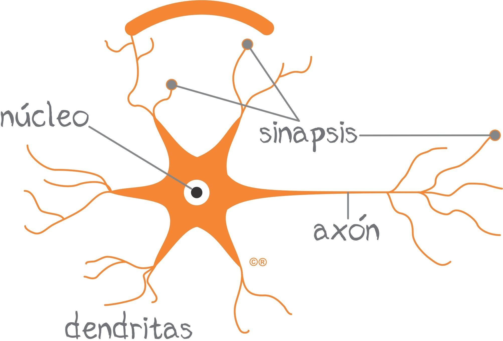 

*Figura 3.1: Representación gráfica neurona biológica*

Las neuronas artificiales imitan el funcionamiento de una neurona biológica. Se basan de una función matemática que recibe unos datos, los pesa, calcula la suma y presenta un resultado por medio una función no lineal.

## 3.2. Perceptrón

El algoritmo del perceptrón o neurona artificial fue publicado en 1957 por Frank Rosenblatt. El objetivo del perceptrón es encontrar un hiperplano, llamado límite de decisión, que separe correctamente un conjunto de datos, linealmente separables, en dos regiones dentro del espacio. 

Podemos entender un hiperplano como un objeto que divide un espacio en dos partes: En un espacio unidimensional, un hiperplano es un punto que divide una línea en dos; en un espacio bidimensional, es una recta que divide el plano en dos mitades; en un espacio tridimensional, es un plano corriente que divide el espacio en dos mitades. Este concepto también puede ser aplicado a espacios de cuatro dimensiones o más. 

Una vez obtenido el hiperplano, este puede utilizarse para clasificaciones binarias.

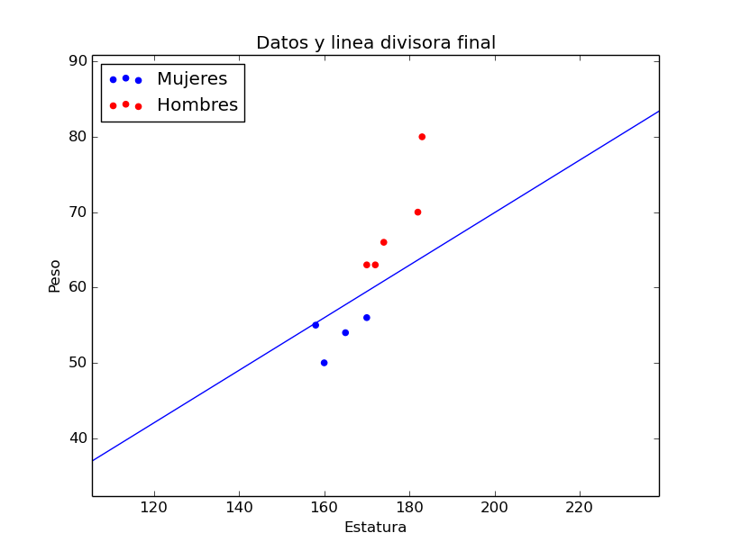

*Figura 3.2.1: Ejemplo de un caso donde se podría emplear un perceptrón para clasificar dos clases según características de entrada.*

Aunque este algoritmo de aprendizaje es muy simple, entender su funcionamiento es esencial para aprender otros métodos más complejos como las redes neuronales artificiales.

### Componentes

El perceptrón simple es un modelo neuronal unidireccional, que está compuesto por una capa de entrada y otra de salida. Este modelo está compuesto por varios componentes:

- **Valores de entrada *(Inputs)*:** Es la información recibida que se le ha proporcionado.

- **Pesos *(Weights)*:** Cada valor de entrada está relacionado con un peso. Estos controlan la fuerza de la conexión de la entrada hasta la parte del procesamiento, esto quiere decir que marcan la importancia que tiene cada una de las entradas en el resultado final. Los pesos serán los valores a aprender, estos se van modificando para ir mejorando el resultado de salida.

- **Sesgo y Umbral *(Bias/Threshold)*:** El sesgo altera la posición del límite de decisión, pero no la orientación. Matemáticamente, este valor se sumará con el resultado de la suma ponderada. El umbral es como una entrada con valor constante de 1 y con un peso correspondiente al sesgo que es variable.

- **Función de activación:** Estas se encargan de modificar y normalizar los valores obtenidos de la suma ponderada. Existen diferentes tipos de funciones de activación. Por ejemplo, la función binaria, que trata los valores obtenidos para conseguir resultados binarios, útiles en clasificaciones. 

- **Valores de salida *(Outputs)*:** Después de todos los cálculos realizados, se consiguen unos valores de salida que pueden ser transmitidos a otras neuronas o ser comparados con resultados verificados y utilizar esta comparación para encontrar errores y mejorar los valores de los pesos.


*Figura 3.2.2: Representación gráfica neurona artificial*

### Explicación matemática

Primeramente, tenemos el vector x, con todas las entradas dadas, y el vector w, con todos los pesos de cada entrada. Además, tenemos un sesgo b establecido y una función de activación f(). Así pues, el resultado de salida será:

$$ y = f(z) = f(x · w + b) $$

$$ z = Σ = x · w + b = x_1· w_1 + x_2 · w_2 + x_3 · w_3 + ··· + x_n · w_n + b $$

 

*Figura 3.2.3: Representación gráfica perceptrón*

### Ejemplo con perceptrón

Imaginemos que queremos conseguir un día perfecto, llegamos a la conclusión de que para conseguirlo necesitamos dos cosas: jugar a videojuegos y hacer deporte. Ambas variables serán binarias, su valor solo puede ser 0 o 1. La variable de salida nos indicará si el día ha sido perfecto o no, también en binario.

- Ejemplo interactivo: [Ejemplo Perceptrón](https://docs.google.com/spreadsheets/d/19ZZPV0xgRLsNb7_vNBh6uezyW3X1ls__-jmpNME201Q/edit?usp=sharing)

- Representación gráfica: [*www.geogebra.org/calculator/e2efnygv*](http://www.geogebra.org/calculator/e2efnygv)

El resultado obtenido sin hacer uso de ninguna función de activación se puede representar en forma de recta que separa los puntos en dos clases. Para conseguir que el resultado sea binario, utilizo la función de activación *Step* que, dependiendo de si el valor resultante es positivo o negativo, nos devuelve un 0 o un 1. Como resultado obtenemos una puerta lógica *AND*.

### Funciones de activación

Una red neuronal sin funciones de activación es muy limitada, ya que el resultado es lineal. La función principal de una función de activación es añadir componentes no lineales a la red. La función de activación devuelve una salida que es generada por la neurona dada una entrada o conjunto de entradas. Existen diferentes funciones de activación con diferentes usos:

- **Función lineal:**

  - **Regresión lineal:**

    Las funciones lineales son la base de muchos algoritmos de aprendizaje. Son muy útiles para conseguir resultados numéricos a partir de entradas, pero no sirven para hacer clasificaciones de más de dos clases. Un ejemplo de problema con función lineal sería una conversión de unidades o para análisis de datos.

$$ f(z) = z $$


*Figura 3.2.4: Función lineal*

- **Funciones no lineales:**

  - **Función Escalón (*Step*):**
    
    Esta función indica que si el resultado es menor que cero, la salida será 0, pero cuando es mayor o igual a cero, dará como salida igual a 1. Esta función se utiliza para hacer clasificaciones o cuando hay salidas categóricas. Por ejemplo, para desarrollar puertas lógicas simples como AND u OR.

$$ si z<0 →f(z)=0 $$  
$$ si z≥0 →f(z)=1 $$


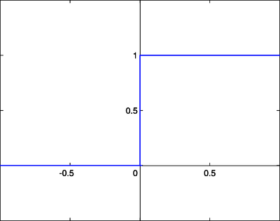  

*Figura 3.2.5: Gráfica función Step*

  - **Función Logística / Sigmoide:**

    Esta función tiene un rango de valores de salida entre 0 y 1, pero esta tiene una curva suave, que nos sirve para conseguir una clasificación interpretada como una probabilidad de 0 a 1. 
    Su uso se recomienda solo en la capa de salida, cuando requerimos un resultado binario. Un caso de utilización de esta función sería en un clasificador de imágenes con dos grupos como, por ejemplo, perros y gatos.

$$ f(z) = \frac{1}{1 + e^{-z}} $$
$$ e ≃ 2,7182 $$

  

*Figura 3.2.6: Gráfica función logística*

  - **Función tangente hiperbólica:**

    Esta función de activación llamada tangente hiperbólica es similar a la función logística, pero tiene un rango de valores de salida de -1 a 1. Es superior a la función logística para capas ocultas, pero no suele dar resultados superiores a los de ReLU. Se puede utilizar para clasificaciones y para resolver problemas donde decides una cosa o la contraria.

$$ f(z) = tanh(z) = \frac{e^z - e^{-z}}{e^z + e^{-z}} $$

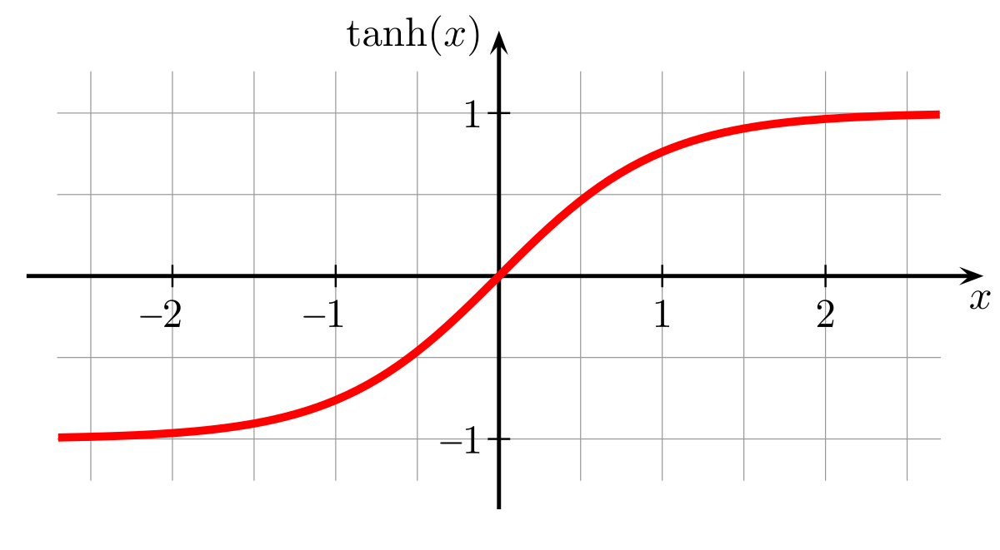  

*Figura 3.2.7: Gráfica función tangente hiperbólica*

  - **Función ReLU:**

    Esta función es la más empleada por el hecho de que permite un aprendizaje muy rápido en las redes neuronales. Si a esta función se le dan valores de entrada negativos, el resultado es cero, pero si se le dan valores positivos, es igual a ese valor. ReLU es la función que normalmente haremos uso. Por ejemplo, se puede hacer uso en modelos relacionados con imágenes porque funciona muy bien con estas.

$$ f(z) = max(0, x) $$

  

*Figura 3.2.8: Gráfica función ReLU*

  - **Función Softmax:**

    Esta función se hace uso para clasificar información. Softmax se utiliza para clases múltiples y asigna probabilidades para cada clase que pertenezca. Es la más popular a la hora de hacer una clasificación donde hay más de dos grupos, por ejemplo, para diferenciar distintas prendas de ropa.

$$ f(z) = \frac{e^z}{Σ(e^z)} $$ 

  

*Figura 3.2.9: Ejemplo función Softmax*

## 3.3. Redes neuronales

Con una sola neurona no podemos resolver problemas complejos. Cuando un conjunto de neuronas se conectan entre sí, forman las llamadas redes neuronales, que están conformadas por capas de neuronas las cuales se envían y comparten información relevante para determinar los *outputs* correspondientes.

Las capas se pueden dividir en 3 grupos:

- **Capa de entrada *(input)***

  Está compuesta por las neuronas que reciben los datos o señales de entrada.
  
- **Capas ocultas *(hidden)***

  Pueden haber más de una y no tienen una conexión directa con el exterior, no tienen conexión con los datos de entrada ni con los datos de salida.
  
- **Capa de salida *(output)***

  Está compuesta de las neuronas que proporcionan la respuesta de la red neuronal.


*Figura 3.3: Representación red neuronal*

Una vez entendido el funcionamiento interno de una neurona y red neuronal, necesitamos entrenarla.

## 3.4. Redes neuronales convolucionales

Una red neuronal convolucional es un tipo de red neuronal que se utiliza comúnmente para hacer análisis de imágenes. Las redes convolucionales son muy efectivas para tareas de visión artificial, como en la clasificación y segmentación de imágenes, entre otras aplicaciones.

El diseño de las redes convolucionales se aprovecha de la estructura espacial de las imágenes. Con una red neuronal normal, introduciríamos los valores de los píxeles como si fuesen variables independientes sin ningún tipo de relación, como si fuese un vector plano. Normalmente, el valor de un píxel en una imagen está muy relacionado con el valor de los píxeles vecinos.

Las redes neuronales convolucionales se caracterizan por hacer uso de un tipo de capa donde se realiza una operación matemática conocida como convolución. Una convolución aplicada en una imagen es una operación que es capaz de producir una nueva imagen utilizando un filtro.

Las redes neuronales convolucionales son como los ojos de las moscas: su campo de visión se encuentra fragmentado en miles de pequeñas imágenes que extraen patrones muy sencillos como niveles de luz y sombra, que su cerebro integra en varias capas de abstracción. En la entrada apenas ve un mosaico, el cerebro lo relaciona y lo clasifica en partes, y los siguientes niveles superiores le asignan etiquetas como comida, obstáculo, matamoscas, etc. 

Cada píxel nuevo se calculará colocando una matriz de números, llamada filtro o kernel, sobre la imagen original. Cada valor del filtro se multiplicará con cada píxel y se sumará todo para encontrar el valor del píxel resultante.

  

*Figura 3.4.1: Ejemplo convolución de una imagen*

Esta operación de convolución sobre una imagen puede detectar diferentes características según qué valores tenga el filtro que definamos. Estos valores son los que la red neuronal irá aprendiendo.


*Figura 3.4.2: Ejemplo de un filtro que se activará cuando encuentre diferencias de contraste y, como resultado, detecte bordes verticales.*

Las imágenes generadas son llamadas mapas de características, ya que se encargan de encontrar patrones y características en las imágenes. 

Los valores de cada píxel van de 0 (negro) a 255 (blanco). Cuando haya píxeles blancos en un mapa de características querrá decir que existe una característica presente en la imagen de entrada.

En una red neuronal convolucional, esta operación se realiza secuencialmente, donde en sus capas más iniciales aprende patrones muy genéricos, como bordes, esquinas y texturas, y en sus capas finales patrones más complejos y avanzados, como ojos o bocas.

La capa de entrada es la que procesa más intensivamente la imagen. Las capas siguientes trabajan sobre el resumen de las anteriores, y obtienen patrones cada vez más abstractos. La primera capa apenas sabe detectar contrastes verticales u horizontales, las intermedias ya pueden detectar bordes y regiones, y las superiores ya saben dónde hay un perro en una foto.

En este tipo de redes, la imagen inicial se va comprimiendo espacialmente, su resolución va disminuyendo, al mismo tiempo que su grosor va aumentando, es decir, el número de mapas de características aumenta. Estos mapas de características finales serán las entradas que daremos a la red. 


*Figura 3.4.3: Red neuronal convolucional.*

En el caso de la figura 3.4.3, la imagen inicial está compuesta por 3 mapas de características (rojo/verde/azul RGB) con una resolución de 224 por 224 píxeles. Después de la convolución se consiguen 4096 mapas de características de un único valor, valores que se introducen en una red neuronal. Las capas convolucionales no disminuyen la resolución, esto lo hacen las capas de Max Pooling.

Para disminuir las resoluciones entre capas convolucionales se utilizan capas de Max Pooling, que no dejan de ser un tipo filtro que toma el valor más grande de la cuadrícula. Reduciendo la resolución de los mapas, pero aumentando la cantidad. 


*Figura 3.4.4: Max Pooling*

# 4. Entrenamiento 

El procedimiento utilizado para llevar a cabo el proceso de aprendizaje en una red neuronal se denomina entrenamiento.

## 4.1. Paradigmas de aprendizaje

Son los mecanismos que permiten que podamos procesar toda aquella información nueva que percibimos para acabar transformándola en conocimiento. Todos los algoritmos y técnicas dentro de este campo pueden ser clasificados en tres grupos según el paradigma de aprendizaje que estén aplicando.

### Aprendizaje supervisado

Cuando hablamos de un aprendizaje supervisado, nos referimos a un tipo de aprendizaje que se encarga de descubrir la relación existente que hay entre unas variables de entrada y unas de salida. El aprendizaje de estos algoritmos aparecen de enseñarles los resultados que quieres conseguir para un determinado valor. Después de muchos ejemplos, el algoritmo será capaz de dar un resultado correcto aunque le muestres valores que no ha visto nunca.  

A estos conjuntos de ejemplos se les suele llamar *dataset*, que es un conjunto de datos tabulados. Un ejemplo de *dataset* sería el caso de un conjunto de imágenes de frutas donde cada una está etiquetada según la fruta que sea. Si entrenamos un modelo con este conjunto de datos, al final aprenderá a diferenciar de qué tipo de fruta se trata aunque la imagen de entrada no pertenezca al *dataset*.

### Aprendizaje no supervisado

El paradigma del aprendizaje no supervisado es aquel que consigue producir conocimiento únicamente de los datos proporcionados como entrada, sin especificar qué resultado queremos llegar a obtener. Este es útil para encontrar patrones de similitud entre los valores de entrada.

### Aprendizaje reforzado

En el aprendizaje reforzado, se desarrollan agentes que deben elegir qué acciones deben hacer en un entorno, simulado o real, para maximizar una recompensa o premio. El caso más común de este paradigma de aprendizaje se encuentra en el campo de los videojuegos, estos agentes aprenden a desenvolverse en un entorno desconocido con tal de ganar el juego o conseguir la puntuación más grande posible, y esto lo consigue a base de prueba y error.

## 4.2. El error

Queremos que las predicciones de la red se acerquen lo máximo posible a los datos reales. 

La función de pérdida (loss function $L(y_r, y_e)$) nos permite medir errores en la predicción, hay diversas funciones de coste, pero todas miden el error teniendo en cuenta los valores predichos (expected) y los reales. Por ejemplo, la más simple es encontrar la distancia entre ambos:

$$ L(y_r, y_e)= (y_r - y_e) $$


*Figura 4.1.1: Este ejemplo muestra gráficamente el valor predicho $y_e$, el valor real $y_r$ y el error, la distancia entre los dos valores.*

Si hacemos la media de todos los errores para cada valor, nos sirve para valorar qué tan bien o mal ha estado la red en general en sus predicciones.

$$ media(y_r - y_e) $$

De todas las funciones de pérdida, las más empleadas son el error cuadrático medio (*mean squared error*) y entropía cruzada binaria (*binary crossentropy*).

### Error cuadrático medio

El error cuadrático medio toma todas las distancias entre los valores predichos y los reales y calcula la media de sus cuadrados. Cuando elevamos al cuadrado penalizamos con mayor intensidad a los puntos que están más alejados de la recta y con menor intensidad a los más cercanos.  

$$ media((y_r - y_e)^2) $$

La tarea de la red neuronal es manipular los parámetros (pesos y sesgo) de la función para encontrar la combinación que minimice esta suma de cuadrados.

### Binary crossentropy

Binary crossentropy es una función de pérdida que se utiliza en tareas de clasificación binaria. Esta compara cada una de las probabilidades predichas con el resultado real de la clase, que puede ser 0 o 1. A continuación, calcula la puntuación que penaliza las probabilidades en función de la distancia al valor esperado.

## 4.3. Backpropagation

Cuando creamos una red neuronal, primero necesitamos entrenarla antes de poder hacer predicciones. 

Durante el entrenamiento, le damos ejemplos que pasan por todas las capas de la red, una por una hacia adelante, realizando las operaciones de las neuronas y nos da un resultado final. Después de varios ejemplos, utilizamos la función de coste para ver qué tan bien o mal ha ido la red en sus predicciones.

Dependiendo de qué mal ha ido, queremos ajustar los parámetros de la red para mejorar los pesos y los sesgos. Según la importancia de cada neurona en el resultado final de la red, se van calculando los errores de sus parámetros y las correcciones correspondientes para mejorar el resultado. Para saber cómo ajustarlos, calculamos el gradiente de la función de coste, con respecto a cada uno de los pesos y sesgos, y lo hacemos capa por capa hacia atrás hasta llegar al inicio.

Este proceso es llamado Backpropagation (Propagación hacia atrás), y para hacerlo utilizamos derivadas, y necesitamos poder calcular las derivadas de las funciones de activación que estamos usando en nuestra red. 

- Ejemplo Backpropagation: 
[¿Qué es una Red Neuronal? Parte 3 : Backpropagation | DotCSV <sub>(6:06 - 9:51)</sub>](https://youtu.be/eNIqz_noix8?t=366)

### Razonamiento matemático

Backpropagation es un algoritmo de optimización utilizado para encontrar los mejores parámetros posibles para nuestra red neuronal. 

Para conseguirlo se encuentran las derivadas parciales para cada peso y sesgo dentro de nuestro conjunto de neuronas.

Las derivadas parciales de una función con diversas variables nos informan de cómo cambia la función cuando se produce un pequeño cambio en una única variable independiente.


*Figura 4.2.1: Ejemplo de la derivada de una función. La derivada de la función $f(x)$ respecto a la variable $x$ es 3. Nos muestra la pendiente de la recta tangente a la función.*

Lo que tratamos de hacer es encontrar el fragmento del error que le corresponde a cada parámetro, cuánto afecta cada parámetro de pesos $w$ y sesgos $b$ a la función de coste $L(a, y)$, donde el valor predicho es $a$ y el valor real es $y$.

 

*Figura 4.2.2: Proceso matemático con derivadas para encontrar la influencia de cada peso en el resultado final $\frac{∂L}{∂W}$.*

Una vez conseguida la influencia de cada uno, se le resta al parámetro inicial en cuestión:

$$ W = W - \frac{∂L}{∂W} $$

$$ b = b - \frac{∂L}{∂b} $$

Pero para encontrar la solución óptima tenemos que multiplicar el resultado anterior por un valor conocido como “Learning rate”.

$$ W = W - α \frac{∂L}{∂W} $$ 

$$ b = b - α \frac{∂L}{∂b} $$

El “Learning rate” es un valor utilizado para suavizar el proceso de aprendizaje. Si este es muy alto puede hacer que el algoritmo nunca llegue a una solución o que esta no sea óptima, pero si este es muy pequeño puede hacer que el proceso de entrenamiento se alargue demasiado o incluso que se estanque. 

Se tiene que descubrir una tasa de aprendizaje buena a través de prueba y error. El rango de valores para una tasa de aprendizaje satisfactoria van de 10<sup>-6</sup> a 1. Un valor predeterminado tradicional para la tasa de aprendizaje es 0,1 o 0,01.

### Descenso del gradiente 

Es un algoritmo clave dentro del campo del Machine Learning, este es un método iterativo de optimización para encontrar el mínimo de una función. Esto nos sirve para encontrar el valor mínimo de la función de error y, por lo tanto, para averiguar los valores necesarios de los pesos de las neuronas para conseguir un porcentaje de error más bajo. Calculamos la derivada en el punto donde nos encontramos y nos movemos en la dirección donde desciende la pendiente, cambiando el valor de los parámetros.

- Ejemplo descenso del gradiente:
[¡Extraños Patrones dentro de una RED NEURONAL! <sub>(3:42 - 6:09)</sub>](https://youtu.be/ysqpl6w6Wzg?t=222)

- Visualizar el procedimiento:  
Ejemplo interactivo para encontrar el mínimo de una función por medio del descenso del gradiente. Indicando el punto donde nos encontramos inicialmente y el *learning rate*. ([*https://uclaacm.github.io/gradient-descent-visualiser/#playground*](https://uclaacm.github.io/gradient-descent-visualiser/#playground))


*Figura 4.2.3: Representación gráfica de la función de error $J(W,b)$. Con el descenso del gradiente, queremos minimizar el valor de esta, que gráficamente sería encontrar el punto inferior de la función. Para conseguirlo, la red va probando diferentes valores de $W$ y $b$.*

En el caso del perceptrón, si utilizamos el descenso del gradiente, podemos obtener los resultados de las derivadas mencionadas anteriormente.

$$ \frac{∂L}{∂W} = -y · x $$

$$ \frac{∂L}{∂b} = -y $$

Llegamos al siguiente resultado, donde conseguimos una función que nos indica el valor necesario de los parámetros para reducir el error:

$$ W = W + α · y · x $$

$$ b = b + α · y $$

### Adam 

Adam es un algoritmo de optimización que sirve para entrenar modelos de aprendizaje. Adam es la fusión de *RMSprop*, propagación cuadrática media, y el *Descenso del Gradiente*. RMSprop se complementa con el descenso del gradiente para hacer que el algoritmo converja más rápidamente en la solución y ahorra recursos. En Adam se combinan los dos métodos en una sola ecuación. Los resultados del optimizador Adam son mejores que los de cualquier otro algoritmo de optimización, tienen un tiempo de cálculo más rápido y requieren menos parámetros para la afinación.

### Funciones de activación

Cuando utilizamos Backpropagation para entrenar la red, necesitamos poder calcular las derivadas de las funciones de activación que estamos utilizando. Si la derivada de la función es 0, esto quiere decir que no tiene ninguna inclinación, no se podrá hacer el cálculo necesario para llevar a cabo el proceso de aprendizaje. Si las derivadas son muy pequeñas o tienden a 0, los cambios de los parámetros de la red serán muy pequeños, este problema es llamado desvanecimiento del gradiente (Vanishing gradient problem).

Hay algunas funciones de activación que tienen algunos inconvenientes a la hora de hacer Backpropagation. Estas son las funciones de activación que no tienen inclinación, como la función Step que no se puede utilizar con este método, o algunas donde la derivada tiende a 0 cuando las entradas son muy grandes o muy pequeñas, como la función Sigmoide.

### Iteraciones 

La corrección de los valores de los parámetros se hace repetidas veces, estas repeticiones son llamadas iteraciones o épocas (*epochs*).

Por cada época el modelo se entrena con todos los datos del *dataset* y, en general, lo hace por pasos (*steps*) donde los valores se procesan en pequeños grupos (*batch size*). La cantidad de iteraciones se especifica a la hora de hacer el entrenamiento. 

## Batch Size

El *batch size* (tamaño del lote) define el número de muestras que se propagarán por la red. Por ejemplo, si tenemos 2000 muestras de entrenamiento y establecemos un *batch size* de 100, el algoritmo toma las primeras 100 muestras del conjunto de datos de entrenamiento y entrena la red. A continuación, toma las segundas 100 muestras y vuelve a entrenar la red. Podemos continuar haciendo este procedimiento hasta que hayamos propagado todas las muestras a través de la red.  

Como se entrena la red utilizando menos muestras, el procedimiento de entrenamiento global requiere menos memoria.

Normalmente, las redes se entrenan más rápidamente. Esto se debe a que actualizamos los pesos después de cada propagación. Si usáramos todas las muestras durante la propagación, sólo haríamos una actualización de los parámetros de la red en cada iteración.

Pero cuanto más pequeño sea el lote, menos precisa será la estimación del gradiente. 

El valor de *batch size* que se utiliza por defecto es 32, porque tiene la menor tasa de error.


*Figura 4.2.4: Gráfico de *batch size* según la 
tasa de error y el tiempo empleado.*

# 5. Programación

En la actualidad existen una gran cantidad de repositorios y bibliotecas de código abierto dedicados al aprendizaje automático. Muchas librerías nos facilitan la experimentación con redes neuronales, simplificando el proceso necesario para crearlas y modificarlas, ahorrándonos así mucho tiempo. 

Machine Learning es un campo complejo, pero existen bibliotecas, como TensorFlow de Google, que facilitan el proceso de obtención de datos, entrenamiento de modelos, realización de predicciones y perfeccionamiento de los resultados.

## 5.1. Google Colab

Google Colab es una herramienta que permite a cualquier usuario escribir y ejecutar código Python en la nube de Google. En caso de necesitar altas prestaciones de cómputo, el entorno permite configurar algunas propiedades del equipo sobre el que se ejecuta el código y permite disponer de un entorno para llevar a cabo tareas que serían difíciles de realizar en un equipo personal. Es especialmente adecuado para tareas de aprendizaje automático, análisis de datos y educación.

## 5.2. TensorFlow 

TensorFlow es una biblioteca de código abierto para la computación numérica y aprendizaje automático desarrollada por Google. Este reúne una serie de modelos y algoritmos de Machine Learning, que se pueden utilizar con Python para crear aplicaciones.

### Keras

Dentro de TensorFlow se puede encontrar el módulo Keras, una de las librerías más utilizadas para implementar modelos de aprendizaje automático. Es un entorno de trabajo que posee unas ciertas herramientas y características útiles que agilizan el desarrollo de un proyecto de programación. Nos permite hacer las redes neuronales de manera sencilla, ahorrando muchas líneas de código.

## 5.3. Otras librerías 

Además de utilizar TensorFlow, utilizaré otras librerías más genéricas en el uso de Python:

### NumPy

NumPy es una biblioteca que da soporte para crear vectores y matrices grandes multidimensionales, junto con una gran cantidad de funciones matemáticas para operar con ellas.

### Matplotlib 

Matplotlib es una biblioteca para la generación de gráficos a partir de datos contenidos en listas, también llamadas *arrays*, en el lenguaje de programación Python y su extensión matemática NumPy.

# 6. Ejemplos prácticos

## 6.1. Perceptrón 

Comienzo desarrollando una red neuronal de una única neurona (perceptrón), que se encargue de analizar un *dataset* para encontrar la relación que hay entre las unidades de velocidad km/h y m/s, y pueda hacer predicciones de conversión.

### Código

Importo todas las librerías necesarias y algunos módulos de Keras.

- El modelo `Sequential` es apropiado para una simple red neuronal por capas, nos sirve para agregar capas secuencialmente al modelo. 

- Una capa `Dense` es un tipo de capa donde cada neurona de esta está conectada a todas las neuronas de la capa siguiente.

```python
# Importo las librerías necesarias
import tensorflow as tf  
import numpy as np
import matplotlib.pyplot as plt

from keras.models import Sequential # Tipo de modelo
from keras.layers.core import Dense # Tipo de capa
from tensorflow.keras.optimizers import Adam # Algoritmo de aprendizaje
```

Genero el *dataset* con unos valores de entrada y salida, que servirán para entrenar al modelo, y los represento gráficamente. Utilizo *arrays* para hacerlo, que son cadenas donde se almacenan un conjunto de valores. 

#### Dataset

| Input (km/h) | Output (m/s) |
|:---:|:---:|
| 123<br>324<br>-22<br>23.4<br>5<br>-76<br>-45<br>5.7<br>-8.98<br>100<br>-180 | 34.1667<br>90<br>-6.11111<br>6.5<br>1.38889<br>-21.1111<br>-12.5<br>1.58333<br>-2.494444<br>27.7778<br>-50 |

```python
# Dataset: Obtenemos los valores de entrada (km/h) y los de salida (m/s)
kmh = np.array([123, 324, -22, 23.4, 5, -76, -45, 5.7, -8.98, 100, -180], dtype = float)
ms = np.array([34.1667, 90, -6.11111, 6.5, 1.38889, -21.1111, -12.5, 1.58333, -2.494444, 27.7778, -50], dtype = float)

# Representación gráfica dataset
plt.xlabel('km / h')
plt.ylabel('m / s') 
plt.scatter(kmh, ms, c='skyblue')
plt.show()
```


Indico la estructura de la red neuronal, utilizando un modelo de tipo secuencial con solo una capa densa formada por una sola neurona.

```python
# Creación de la red neuronal
model = Sequential(name='red-neuronal') # Inicializo el modelo

capa = Dense( # Configuro la capa  
units = 1, # Número de neuronas
input_dim = 1, # Número de entradas
activation = 'linear', # Función de activación  
name = 'perceptron' # Nombre para identificarla
)

model.add(capa) # Añadimos la capa al modelo

# Información de la red neuronal
model.summary() 
```

```
# Model: "red-neuronal"
# _________________________________________________________________
# Layer (type)                Output Shape              Param #   
# =================================================================
# perceptron (Dense)          (None, 1)                 2         
#                                                                  
# =================================================================
# Total params: 2
# Trainable params: 2
# Non-trainable params: 0
```

Compilo el modelo, definiendo la función de coste y el optimizador. Seguidamente, lo entreno con el *dataset*, especificando el número de iteraciones (*epochs*) que hará el modelo. El modelo inicializa los parámetros (pesos y sesgos) de manera aleatoria. En cada iteración, los parámetros el resultado se acercará más a la solución, disminuyendo la cantidad de error.

```python
# Compilación del modelo
model.compile(
loss = 'mean_squared_error', # Función de pérdida
optimizer = Adam(learning_rate=0.001) # Optimizador
)

# Entrenamiento del modelo 
historial = model.fit(
x = kmh, # Valores de entrada
y = ms, # Valores de salida  
epochs = 10000, # Número de iteraciones
verbose = False) # Evita que imprima información de cada iteración
```

Una vez finalizado el entrenamiento, se pueden consultar los valores de los parámetros y hacer una predicción.

```python
# Resultado de los parámetros
w, b = capa.get_weights()
print(f'Parámetros: w = {w[0][0]}, b = {b[0]}')

# Prueba del modelo
x = 36  
y = model.predict([x])
print(f'''La IA dice que {x} km/h son {y[0][0]} m/s.
({x} km/h son {x/3.6} m/s)''') 
```

```
# Parámetros: w = 0.2777777314186096, b = 5.537603556149406e-06
# La IA dice que 36 km/h son 10.000003814697266 m/s.
# (36 km/h son 10.0 m/s)
```

También se pueden hacer diferentes gráficos de algunas medidas registradas durante el proceso de aprendizaje.

```python
# Gráficos de los resultados
plt.title('Error vs. Iteraciones')
plt.xlabel('Iteraciones')
plt.ylabel('Error')
plt.plot(historial.history['loss'], c='skyblue')
plt.show()

plt.title('Datos originales y línea de regresión lineal')  
yPredicted = model.predict(kmh)
plt.scatter(kmh, ms, c='skyblue')
plt.plot(kmh, yPredicted, c='salmon')
plt.show()
```

 

`Google Colab:`  
[*`https://colab.research.google.com/drive/1DV90yZHUp9WwaG-E5kRNOogXHLuqrjGN?usp=sharing`*](https://colab.research.google.com/drive/1DV90yZHUp9WwaG-E5kRNOogXHLuqrjGN?usp=sharing)

## 6.2. Perceptrón: Clasificación binaria

Continuo desarrollando un modelo que se encargue de analizar un conjunto de puntos para encontrar una relación y los clasifique en dos grupos.

Haré un modelo utilizando Keras y el otro solo con NumPy.

### Código NumPy

Primero tengo que importar las librerías y crear el *dataset*. En este caso serán cuatro puntos, la salida solo será 1 cuando los dos valores de la entrada sean 1. (Puerta lógica AND)

```python
# IMPORTO LIBRERÍAS
import numpy as np
import matplotlib.pyplot as plt

# CREACIÓN DATASET  
X = np.array([[0,0], [0,1], [1,0], [1,1]])
Y = np.array([[0], [0], [0], [1]])
```

A continuación, especifico algunas funciones que utilizaré, la función de activación Step y la función de coste. Seguidamente, inicializo los valores de los parámetros del perceptrón de manera aleatoria e indico el *learning rate*.

```python 
# FUNCIONES DE ACTIVACIÓN Y COSTE
step = lambda x: np.heaviside(x, 1) # si x >= 0 ==> y = 1; si x < 0 ==> y = 0
lossFunc = lambda Yr, Ye: Yr - Ye # Error = ValorReal - ValorPredicho

# CONFIGURACIÓN DEL PERCEPTRÓN  
learningRate = 0.01
numEntradas = len(X[0])
W = np.random.rand(1, numEntradas) # Pesos (2 valores) 
b = np.random.rand() # Sesgo
print('Weights:', W)
print('Bias:', b)
```

```
# Weights: [[0.68096276 0.90747431]]  
# Bias: 0.985178751811559
```

Defino la función de predicción de la neurona que emplearé más adelante, hago uso de la función de activación Step para hacer la clasificación binaria: Si el resultado es mayor que 0,5 la salida será 1 y si no, será 0.

En cuanto a la función de entrenamiento, hago un bucle según las iteraciones indicadas, donde en cada una se calcularán los errores para cada punto y se actualizarán los valores de los parámetros. Antes se tienen que calcular los resultados de predicción actuales para poder calcular el error. Al perceptrón, al solo tener una capa y una neurona, se pueden calcular las correcciones de los parámetros con las siguientes ecuaciones: $ W = W + α · y · x $ y $ b = b + α · y $

```python
# PREDICCIONES
def predict(x):
  z = x @ W[0] + b # Ponderación de los inputs con los pesos, más el sesgo. 
  output = step(z)
  return output
  
# ENTRENAMIENTO
errors = []
def train(x, y, lr, epochs):
  global W, b
  stepsPerEpoch = len(x)
  for epoch in range(epochs):
    stepError = []
    for step in range(stepsPerEpoch):
      # Forward pass
      output = predict(x[step])

      # Backpropagation
      error = lossFunc(float(y[step]), output)
      stepError.append(error)
      W = W + (lr * error * x[step]) # W = W(inicial) + (lr * error * x)
      b = b + (lr * error) # b = b(inicial) + (lr * error * 1)

    stepError = np.mean(stepError) 
    errors.append(abs(stepError)) # Recopilación de error para realizar gráfico del entrenamiento
```

Utilizando Matplotlib se pueden visualizar los resultados obtenidos.

```python
showResults("Resultados antes de Entrenamiento")

train(X, Y, learningRate, 100) 

# Error por época
plt.title('Error vs. Iteraciones')  
plt.xlabel('Iteraciones')
plt.ylabel('Error')
plt.plot(range(len(errors)), errors, c='skyblue')
plt.show()

# Resultados finales
showResults("Resultados antes de Entrenamiento")
print(f'Parámetros: w = {W[0]}, b = {b}')
```

```
# Parámetros: w = [0.1849843  0.24473538], b = -0.2645967804709866
```

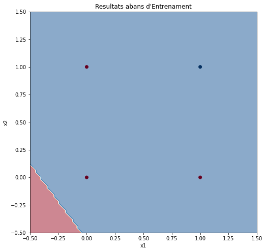 


Una vez realizado todo el entrenamiento del modelo se puede observar que el perceptrón sí que ha conseguido clasificar los cuatro puntos en dos clases, en este caso una puerta lógica AND. Pero este resultado es exitoso porque los dos grupos son linealmente separables, es decir, que son separables utilizando solo una recta. El perceptrón se caracteriza por un límite de decisión formado por una única recta, entonces sí puede resolver este tipo de problema.

### Código Keras

En el caso de utilizar Keras, además de importar las librerías NumPy y Matplotlib, importo los módulos que necesito y haré uso de Keras: el modelo *Sequential* y el tipo de capa *Dense*. El *dataset* seguirá siendo el mismo, una puerta lógica AND.

```python
# IMPORTACIÓN LIBRERÍAS
import numpy as np
import matplotlib.pyplot as plt

from keras.models import Sequential # Tipo de modelo  
from keras.layers.core import Dense # Tipo de capa
from keras.optimizers import Adam # Optimizador

# CREACIÓN DATASET
X = np.array([[0,0], [0,1], [1,0], [1,1]])
Y = np.array([[0], [0], [0], [1]])
```

Con Keras no hace falta desarrollar las funciones de predicción ni de entrenamiento, solo se tienen que especificar los valores y los datos necesarios para entrenar a la red.

Indico que la red tendrá dos entradas y una neurona. A la hora de crear la capa se tiene que especificar la función de activación, usaré la sigmoide, ya que queremos hacer una clasificación binaria y esta nos da valores de 0 a 1. No se puede utilizar la función Step porque esta es lineal y Keras necesita que estas funciones tengan pendiente para poder disminuir el error.

```python
# CREACIÓN PERCEPTRÓN
inputs = 2
neuronas = 1 # Neuronas por capa
  
perceptro = Sequential(
    Dense(
        units = neuronas,  
        input_dim = inputs, # Número de entradas
        activation = 'sigmoid', 
        name = 'perceptron'
        )
    )

perceptro.compile(
    loss = 'binary_crossentropy', # Función de pérdida (Error cuadrático medio) 
    optimizer = Adam(learning_rate=0.5), # Función de coste y learning rate
    metrics = ['accuracy'] # Magnitudes medidas durante el proceso
    )

# Información de la red neuronal
perceptro.summary()
```

```
# Weights: [[0.68096276 0.90747431]]
# Bias: 0.985178751811559 
```

Hago el entrenamiento del perceptrón indicando el número de iteraciones y almaceno el historial del entrenamiento en una variable que consultaré más adelante para analizar el error por cada época.

```python 
showResults("Resultados antes de Entrenamiento")

# ENTRENAMIENTO
historial = perceptro.fit(
  x = X, # Valores de entrada
  y = Y, # Valores de salida
  epochs = 10000, # Número de iteraciones que se hará en el entrenamiento para acercarse a los valores reales
  verbose = False, # Evita que imprima en pantalla información de cada una de las iteraciones
  )

# Resultados finales  
plt.title('Error vs. Iteraciones')
plt.xlabel('Iteraciones')
plt.ylabel('Error') 
plt.plot(historial.history['loss'], c='#053061')
plt.show()

showResults("Resultados antes de Entrenamiento")

parametros = perceptro.get_weights()
weights, bias = parametros
print(f'Parámetros: w = {weights[0]}, {weights[1]}, b = {b}')
```

Entrenamiento de 1000 iteraciones con *learning rate* de 0,01:

```  
# Parámetros: w = [8.809489], [8.77294], b = -1.4852206919837063
```

 


Entrenamiento de 100 iteraciones con *learning rate* de 0,5:

```
# Parámetros: w = [8.809489], [8.77294], b = -1.4852206919837063
```

 


En este caso, si utilizamos un *learning rate* de 0,5, la neurona llega más rápidamente a error 0 que con un *learning rate* de 0,01. Como más elevado es este valor más rápido se aproxima al mínimo de la función de coste, pero hay casos que si este es muy elevado, nunca converge en una solución.

`Google Colab:`  
[*`https://colab.research.google.com/drive/1O1nqoLvMnXhJfZC1h2fkb9PyQKaQw3ue?usp=sharing`*](https://colab.research.google.com/drive/1O1nqoLvMnXhJfZC1h2fkb9PyQKaQw3ue?usp=sharing)

## 6.3. Clasificación binaria

Continuaremos desarrollando una red neuronal que se encargue de analizar un *dataset* para encontrar la relación que hay en un conjunto de puntos y los clasifique en dos grupos.

### Código

Importo todas las librerías necesarias y algunos módulos de Keras.

- El módulo `datasets` de `sklearn` nos permitirá generar *datasets* con características concretas.

```python
# Importo las librerías necesarias
import tensorflow as tf
import numpy as np  
import matplotlib.pyplot as plt

from keras.models import Sequential # Tipo de modelo
from keras.layers.core import Dense # Tipo de capa
from tensorflow.keras.optimizers import SGD # Algoritmo de aprendizaje

from sklearn import datasets # Generación de datasets 
```

Genero un *dataset* con diferentes formas y lo visualizo utilizando Matplotlib. Represento los puntos de diferente color según el valor de $y$.

```python
# Obtención del dataset
dataset = 1 # Podemos elegir entre dataset de círculos o manchas
if dataset == 1:
X, Y = datasets.make_circles(  
n_samples=1000, # Número de puntos
factor=0.5, # Relación de escala entre los dos círculos
noise=0.05 # Qué tan esparcidos están los puntos
)
elif dataset == 2:
X, Y = datasets.make_blobs(
n_samples=1000, # Número de puntos
centers=2, # Número de centros
n_features=2, # Número de columnas del dataset (X, Y)  
random_state=1, # Aleatorización
cluster_std=3 # Concentración  
)
# Visualización dataset
plt.figure(figsize=(8, 8)) 
plt.axes().set_facecolor('#FAFAFA')
plt.title('Dataset')
plt.xlabel('x1')
plt.ylabel('x2')

plt.scatter(X[Y == 0,0], X[Y == 0,1], c='#67001F', label='0 ')  
plt.scatter(X[Y == 1,0], X[Y == 1,1], c='#053061', label='1')

plt.legend(title='y')
plt.show()
```


En este caso, crearé una red neuronal formada por 4 capas: una de entrada con 2 neuronas, dos ocultas de 16 y 8 neuronas con ReLU y una de salida de una neurona con función de activación Sigmoide. El resultado obtenido será entre 0 y 1, una probabilidad de qué grupo pertenece.


```python
# Creación de la red neuronal
nn = [2, 16, 8, 1] # Neuronas por capa

model = Sequential(name='red-neuronal') # Inicialización del modelo

model.add(Dense( # Capa oculta de 16 neuronas ReLU  
units = nn[1],
input_dim = nn[0], # Número de entradas
activation = 'relu',
name = 'hidden1'
))

model.add(Dense( # Capa oculta de 8 neuronas ReLU
units = nn[2],  
activation = 'relu',
name = 'hidden2'
))
model.add(Dense( # Neurona de salida Sigmoide 
units = nn[3],
activation = 'sigmoid',
name = 'output'
))

# Información de la red neuronal
model.summary()
```

```
# Model: "red-neuronal"
# _________________________________________________________________
# Layer (type)                Output Shape              Param #   
# =================================================================
# hidden1 (Dense)             (None, 16)                48        
#                                                                  
# hidden2 (Dense)             (None, 8)                 136       
#                                                                  
# output (Dense)              (None, 1)                 9         
#                                                                  
# =================================================================
# Total params: 193
# Trainable params: 193 
# Non-trainable params: 0
# _________________________________________________________________
```

Desarrollaré una función para visualizar los resultados de la red, crearé una cuadrícula de 100x100 puntos donde se harán predicciones y se dibujarán utilizando `plt.contourf()`. Los valores de entrada de la red neuronal tienen que estar organizados en 2 columnas y para conseguirlo se usa `np.T.reshape(-1, 2)`.


```python
# Función para visualizar los resultados 
def showResults(numIteraciones):

# Delimitación de la visualización (Puntos más lejanos)
maxX1, maxX2 = np.max(X, axis=0)
minX1, minX2 = np.min(X, axis=0)

# Coordenadas mapa de predicción  
x1 = np.linspace(minX1-1, maxX1+1, 100) # Arrays de 100 puntos  
x2 = np.linspace(minX2-1, maxX2+1, 100) # equidistantes
x, y = np.meshgrid(x1, x2) # Cuadrícula de predicción 100x100

# Predicción con cada punto de la cuadrícula
input = np.stack((x, y)).T.reshape(-1, 2)
output = model.predict(input).T.reshape(100,100)

# Visualización
if numIteraciones == -1:
plt.figure(figsize=(8, 8))
plt.title('Resultados finales') 
else:
plt.figure(figsize=(5, 5))
plt.title(f'Resultados actuales ({numIteraciones} iteraciones)')

plt.xlabel('x1')
plt.ylabel('x2') 

# Límite de la decisión  
plt.contourf(x, y, output, cmap='RdBu', alpha=0.5)

# Dataset
plt.scatter(X[Y == 0,0], X[Y == 0,1], c='#67001F', label='0 ')
plt.scatter(X[Y == 1,0], X[Y == 1,1], c='#053061', label='1')

plt.legend(title='y')

plt.show()
```

Compilo el modelo, utilizaré el error cuadrático medio como función de pérdida y el Descenso del gradiente como optimizador, y lo entreno con el *dataset*. He programado una función para que se muestren los resultados cada 500 iteraciones.


```python
# Compilo el modelo de aprendizaje
model.compile(  
loss = 'mse', # Función de pérdida (Error cuadrático medio)
optimizer = SGD(learning_rate=0.003), # Función de coste 
metrics = ['accuracy'] # Métricas medidas durante el proceso
)

# Entrenamiento del modelo
print('Iniciando entrenamiento...')

# Creo objeto de tipo Callback
class epochsResults(tf.keras.callbacks.Callback):
# Cuando acabe cada iteración se ejecutará la función  
def on_epoch_end(self, epoch, logs): 
n = 500 # Cada n iteraciones se mostrarán los resultados
if epoch%n == 0:
showResults(epoch)

historial = model.fit(
x = X, # Valores de entrada
y = Y, # Valores de salida
epochs = 4000, # Número de iteraciones  
verbose = False, # Evita que imprima información de cada iteración
callbacks=[epochsResults()] # Función para mostrar resultados
)

showResults(-1) 

print('Modelo entrenado.')
```

```
# Iniciando entrenamiento...
```
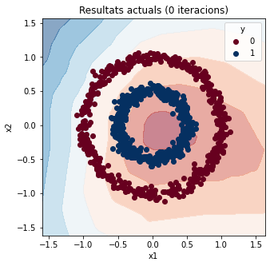 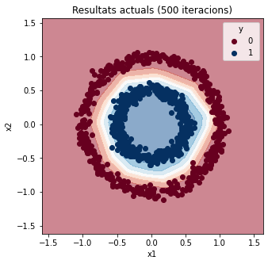 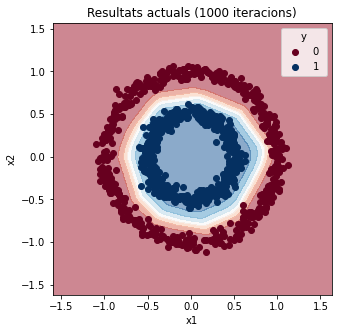 

```
# Modelo entrenado.
```

Una vez finalizado el entrenamiento, se pueden analizar las mejoras de los resultados. La precisión es una de las métricas utilizadas para evaluar los modelos de clasificación. La precisión es la fracción de predicciones que nuestro modelo ha acertado. ($ Precisión = \frac{Predicciones\,correctas}{Predicciones\,totales} $)

```python
# Gráficos del entrenamiento
plt.title('Error vs. Iteraciones')
plt.xlabel('Iteraciones')  
plt.ylabel('Error')
plt.plot(historial.history['loss'], c='#053061') 
plt.show()
plt.title('Precisión vs. Iteraciones')
plt.xlabel('Iteraciones')
plt.ylabel('Precisión')
plt.plot(historial.history['accuracy'], c='#053061')
plt.show()
```

 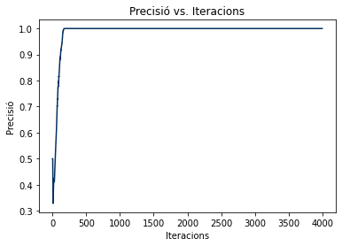

Se pueden hacer predicciones una vez finalizado el proceso de aprendizaje. Los valores de entrada se tienen que organizar para que la red los pueda utilizar.

```python 
# Prueba del modelo
x = (0, 0)
print('Prueba del modelo:')
input = np.array(x).T.reshape(-1, 2) 
output = model.predict(input)
print(f'La IA dice que el punto ({input[0,0]}, {input[0,1]}) es de la clase {int(np.round(output[0,0]))}.')
```

```
# Prueba del modelo:
# La IA dice que el punto (0, 0) es de la clase 1.
```

`Google Colab:`
[*`https://colab.research.google.com/drive/114ym1lio1XeDrOKabxYeIvF0AHRVwkBc?usp=sharing`*](https://colab.research.google.com/drive/114ym1lio1XeDrOKabxYeIvF0AHRVwkBc?usp=sharing)

# 7. Primer proyecto: Clasificador de perros y gatos

## 7.1. Objetivos

El objetivo final del primer proyecto será desarrollar un clasificador binario de imágenes que pueda diferenciar si el animal que aparece en la imagen es un perro o un gato. Probaré de hacerlo con cuatro modelos diferentes y analizaré los resultados obtenidos, para hacer una comparación entre los cuatro modelos: dos Densos y dos Convolucionales, con aumento de datos y sin él.

## 7.2. Nuevas técnicas utilizadas 

### Aumento de datos

La idea del aumento de datos es aplicar diversas transformaciones sobre las entradas originales, obteniendo muestras ligeramente diferentes, pero iguales en esencia, lo que actúa como un regularizador y ayuda a reducir el sobreajuste cuando se entrena un modelo de aprendizaje automático.

Este sobreajuste, o también llamado *overfitting*, hace referencia a entrenar una red con tanta información que acaba memorizándola en lugar de aprender los patrones. Si por ejemplo entrenamos la red con unas imágenes de animales concretas, dará todos los resultados correctos con las imágenes entrenadas, pero con imágenes que no haya visto nunca los resultados no serán correctos. Al entrenar la red con imágenes editadas y modificadas, los valores serán más globales y, en lugar de memorizar, entenderá lo que ve y aprenderá a encontrar los patrones de cualquier imagen, consiguiendo un modelo entrenado más versátil. 

## 7.3. Código

Importo todas las librerías necesarias y los módulos de Keras necesarios.

- La librería `cv2` permite editar imágenes y visualizarlas. También sirve para normalizar las imágenes de entrada.
- `TensorBoard` permite visualizar los gráficos de los entrenamientos, para analizarlos.  
- Para hacer la red convolucional necesitaré las capas de tipo `Conv2D`, para aplicar los filtros convolucionales, y `MaxPooling2D`, para disminuir la resolución de los mapas de características.

```python 
# Importo las librerías necesarias
import tensorflow as tf
import tensorflow_datasets as tf_datasets
import numpy as np
import matplotlib.pyplot as plt
import cv2 # Edición de imágenes  
import keras as kr

from keras.models import Sequential # Tipo de modelo
from keras.layers import Flatten, Dense, Conv2D, MaxPooling2D # Tipo de capa
from keras.preprocessing.image import ImageDataGenerator # Generador de imágenes  
from keras.callbacks import TensorBoard # Análisis de los resultados
```

Importo el *dataset* de Gatos y Perros de TensorFlow. 

```python
# Corrección temporal:  
# TensorFlow datasets tiene error al descargar el dataset de perros y  
# gatos. Lo solucionaron el 16 de mayo, pero sigue fallando en Google # Colab.
# Entonces se agrega esta línea adicional. Más información aquí:
# https://github.com/tensorflow/datasets/issues/3918
setattr(tf_datasets.image_classification.cats_vs_dogs, '_URL', 'https://download.microsoft.com/download/3/E/1/3E1C3F21-ECDB-4869-8368-6DEBA77B919F/kagglecatsanddogs_5340.zip')

dataset, datasetInfo = tf_datasets.load('cats_vs_dogs', as_supervised=True, with_info=True)

# Información del dataset
print('Información dataset:') 
print(datasetInfo)
```

```
# Downloading and preparing dataset cats_vs_dogs/4.0.0  
# Dataset cats_vs_dogs downloaded and prepared... (Microsoft, s. f.)
```

Se pueden visualizar las imágenes de entrenamiento del *dataset* de diferentes maneras.

```python
# Mostrar 5 ejemplos del dataset
print('Primeros 5 ejemplos:')
tf_datasets.as_dataframe(dataset['train'].take(5), datasetInfo)
```

```
# Información dataset:
```

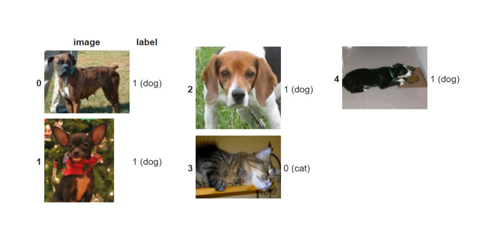

```python
# Visualización ejemplos del dataset inicial
plt.figure(figsize = (20, 20))
for num, (image, animal) in enumerate(dataset['train'].take(5)):
plt.subplot(1, 5, num + 1) # Hago una tabla de 1 fila y 5 columnas  
plt.xticks([])
plt.yticks([])
plt.imshow(image) # Se muestran las imágenes
```

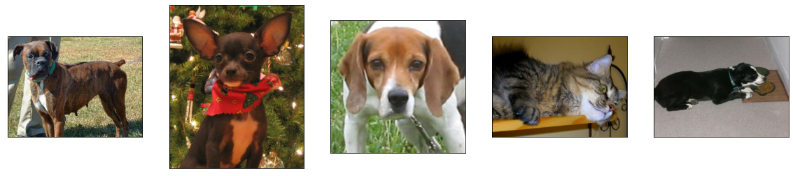

Las redes neuronales tienen un número de entradas específico y, por lo tanto, si se quieren entrenar con diversas imágenes, se tienen que cambiar las resoluciones de las imágenes para que sean iguales. Además, cada color RGB (red/rojo, green/verde, blue/azul) es considerado como un mapa de características diferente, para simplificar el funcionamiento de la red se pasan todas a un único mapa de características inicial (Blanco y negro).

```python
# Manipulación del dataset inicial (Para visualizarlo) 
# Cambio la resolución de las imágenes y las paso a blanco y negro.  
imageSize = 100
imageResolution = (imageSize, imageSize)
plt.figure(figsize = (20, 20))

for num, (image, animal) in enumerate(dataset['train'].take(20)): # Se seleccionan 20 ejemplos
image = cv2.resize( # Cambio de resolución  
image.numpy(), # Array numpy de la imagen
imageResolution # Resolución
)
image = cv2.cvtColor( # Cambio de color
image, 
cv2.COLOR_BGR2GRAY # Blanco y negro
)
  
plt.subplot(5, 5, num + 1) # Hago una tabla de 5 fila y 5 columnes
plt.xticks([]) 
plt.yticks([])
plt.imshow(image, cmap = 'gray') # Se muestran los resultados en escala de grises
```

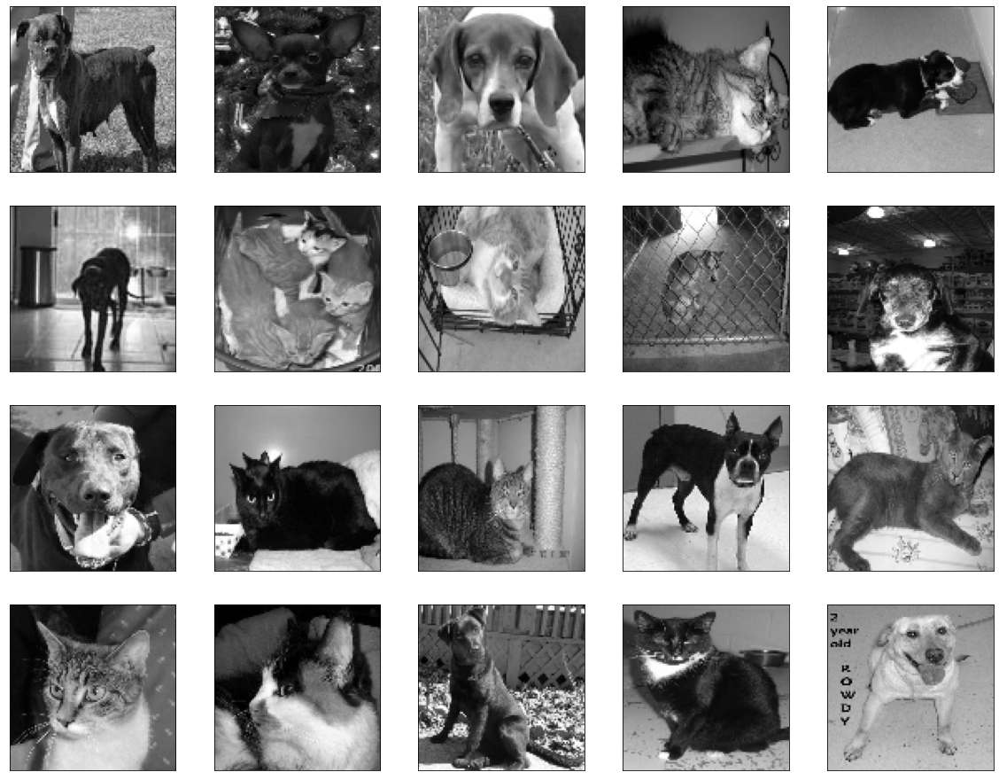

El código anterior sirve para poder visualizar las entradas como lo vería la red, ahora se tienen que editar todas las imágenes y añadirlas al *dataset* de entrenamiento. Los valores de los píxeles, que son de 0 a 255, los pasaré a valores de entre 0 y 1 para facilitar las operaciones. Normalizar los valores sirve para facilitar las operaciones requeridas por la red con más facilidad.


```python
# Manipulación del dataset (Para el entrenamiento) 
trainingData = []

for i, (image, animal) in enumerate(dataset['train']):  
image = cv2.resize(image.numpy(), imageResolution) # Cambio resolución
image = cv2.cvtColor(image, cv2.COLOR_BGR2GRAY) # Cambio color 
image = image.reshape(imageSize, imageSize, 1) # Cambio de forma
trainingData.append([image, animal])

print('Núm. Datos Entrenamiento:', len(trainingData))

# Normalización del dataset
X = []
Y = []

for image, animal in trainingData:
X.append(image)  
Y.append(animal)

X = np.array(X).astype(float)/255 # Se normalizan los valores iniciales (de 0 a 255) -> (de 0 a 1)  
Y = np.array(Y).astype(int) 
```

```
# Núm. Datos Entrenamiento: 23262
```

Especifico las variables de entrenamiento que haré uso en todos los modelos. Utilizaré la función de pérdida de *Binary Crossentropy* porque es un problema binario y el optimizador Adam porque es un optimizador rápido y eficiente.

```python
# Variables del entrenamiento
lossFunction = 'binary_crossentropy' 
adamOpti = 'adam' # learning_rate = 0.001 (por defecto)
iteraciones = 100  
batchSize = 32 # Ejemplos por iteración 
showInfo = True
```

Los modelos Densos estarán compuestos por dos capas de 100 neuronas con ReLU y una capa de una neurona Sigmoide.

```python
# Modelo Denso
modelDens = Sequential([
Flatten(input_shape=(imageSize, imageSize, 1)),
Dense(units=100, activation='relu'),  
Dense(units=100, activation='relu'),
Dense(units=1, activation='sigmoid')
])

modelDens.compile(
loss = lossFunction,
optimizer = adamOpti,  
metrics = ['accuracy']
)
```

Los modelos Convolucionales tendrán 4 capas convolucionales de 32, 64 y 128 filtros de 3x3. Escojo filtros de 3x3 porque son los más económicos que son simétricos desde todas direcciones, ya que tienen un píxel en el centro. Estos comprimirán la resolución de las entradas para conseguir mapas de características con la información útil que necesita la red para aprender. Utilizando capas de Max Pooling, se reduce la resolución de los mapas de características a la mitad y se duplica su cantidad. Los mapas finales se utilizarán de entrada en un modelo formado por una capa de 100 neuronas con ReLU y una capa con una neurona Sigmoide.

```python 
# Modelo Convolucional
modelConv = Sequential([
# Red convolucional
Conv2D(  
filters=32,
kernel_size=(3,3),
activation='relu',
input_shape=(imageSize, imageSize, 1)
),
MaxPooling2D(pool_size=2, strides=2),

Conv2D(filters=64, kernel_size=(3,3), activation='relu'), 
MaxPooling2D(pool_size=2, strides=2),

Conv2D(filters=128, kernel_size=(3,3), activation='relu'),
MaxPooling2D(pool_size=2, strides=2),
                        
# Red neuronal  
Flatten(),
Dense(units=100, activation='relu'),
Dense(units=1, activation='sigmoid')
])

modelConv.compile(
loss = lossFunction,
optimizer = adamOpti,
metrics = ['accuracy']  
)
```

Hago un *dataset* utilizando Aumento de Datos a partir de las imágenes de entrada utilizando el generador de imágenes de Keras para conseguir nuevas imágenes y que el modelo no se memorice las imágenes de entrenamiento. Este *dataset* se hará uso posteriormente para entrenar los otros modelos.

```python
# Aumento de datos
examples = 10

plt.figure(figsize = (20, 20))
# Visualización imágenes originales
for i in range(examples):
plt.subplot(5, 5, i + 1)  
plt.xticks([])
plt.yticks([])
plt.imshow(X[i].reshape(imageResolution), cmap = 'gray')

# Configuración del generador de imágenes 
dataGenerator = ImageDataGenerator(  
rotation_range = 30, # Rotación
width_shift_range = 0.2, # Desplazamiento a los lados 
height_shift_range = 0.2, # Desplazamiento arriba o abajo
shear_range = 15, # Inclinación
zoom_range = [0.75, 1.5], # Zoom
horizontal_flip = True, # Voltear horizontalmente
vertical_flip = True # Voltear verticalmente
)
dataGenerator.fit(X) # Aplicamos la configuración

# Visualización imágenes generadas 
plt.figure(figsize = (20, 20))
for imagen, etiqueta in dataGenerator.flow(X, Y, shuffle = False):
for i in range(examples):  
plt.subplot(5, 5, i + 1)
plt.xticks([])
plt.yticks([])
plt.imshow(imagen[i].reshape(imageResolution), cmap = 'gray') 
break
```

Si se utiliza aumento de datos, se tiene que dividir manualmente el *dataset*, el 85% de los ejemplos serán para entrenamiento y el 15% será para validar los resultados.

```python
# Separación datos entrenamiento y validación
print('Datos totales:', len(X))
trainData = round(len(X) * 0.85) 
print('Datos entrenamiento:', trainData)
print('Datos validación:', len(X) - trainData)

# Dividimos el dataset  
X_train = X[:trainData]
X_valid = X[trainData:]

Y_train = Y[:trainData]  
Y_valid = Y[trainData:]

# Dataset de entrenamiento con aumento de datos
trainingDataset = dataGenerator.flow(X_train, Y_train, batch_size = batchSize) 
```

```
# Datos totales: 23262
# Datos entrenamiento: 19773
# Datos validación: 3489
```

Los modelos con aumento de datos serán iguales que los otros.

```python
# Modelo Denso (Aumento de Datos)
modelDensAD = Sequential([
Flatten(input_shape=(imageSize, imageSize, 1)),
Dense(units=100, activation='relu'),
Dense(units=100, activation='relu'), 
Dense(units=1, activation='sigmoid')
])

modelDensAD.compile(
loss=lossFunction,
optimizer=adamOpti,
metrics=['accuracy']
)
```

```python
# Modelo Convolucional (Aumento de Datos)  
modelConvAD = Sequential([
Conv2D(filters=32, kernel_size=(3,3), activation='relu', input_shape=(imageSize, imageSize, 1)),
MaxPooling2D((2, 2)),
Conv2D(filters=64, kernel_size=(3,3), activation='relu'),
MaxPooling2D((2, 2)),
Conv2D(filters=128, kernel_size=(3,3), activation='relu'), 
MaxPooling2D((2, 2)),
Flatten(),
Dense(units=100, activation='relu'),
Dense(units=1, activation='sigmoid')
])

modelConvAD.compile(  
loss=lossFunction,
optimizer=adamOpti,
metrics=['accuracy']
)
```

Primero entreno los modelos sin aumento de datos, utilizo el *callback* de TensorBoard para guardar el historial del entrenamiento.

```python
# Entrenamiento Modelo Denso
tensorboardDens = TensorBoard(log_dir='logs/dens') # Visualización con TensorBoard

print('Iniciando entrenamiento...')  
modelDens.fit(
X, Y, # Ejemplos
batch_size = batchSize,  
validation_split = 0.15, # Porcentaje de datos de validación
epochs = iteraciones, # Iteraciones
verbose = showInfo,
callbacks=[tensorboardDens] # Callback de TensorBoard
)
print('Modelo Denso entrenado.')  

# Guardo el modelo
modelDens.save('Dens.h5')
modelDens.save_weights('weightsDens.h5')
```

```
# Iniciando entrenamiento...
# Epoch 1/100
# 618/618 - 6s - loss: 0.7045 - accuracy: 0.5408 - val_loss: 0.6843 -  
# val_accuracy: 0.5648 - 6s/epoch - 9ms/step
# Epoch 2/100
# 618/618 - 2s - loss: 0.6771 - accuracy: 0.5748 - val_loss: 0.7114 -
# val_accuracy: 0.5261 - 2s/epoch - 3ms/step 
# ···
# Epoch 99/100
# 618/618 - 3s - loss: 0.5578 - accuracy: 0.7204 - val_loss: 0.7333 -
# val_accuracy: 0.5742 - 3s/epoch - 5ms/step
# Epoch 100/100
# 618/618 - 2s - loss: 0.5544 - accuracy: 0.7214 - val_loss: 0.7404 -
# val_accuracy: 0.5745 - 2s/epoch - 3ms/step
# Modelo Denso entrenado
```

```python  
# Entrenamiento Modelo Convolucional
tensorboardConv = TensorBoard(log_dir='logs/conv')
print('Iniciando entrenamiento...')
modelConv.fit(
X, Y,  
batch_size = batchSize,
validation_split = 0.15,  
epochs = iteraciones,
verbose = showInfo,
callbacks = [tensorboardConv]
)
print('Modelo Convolucional entrenado.')

# Se guarda el modelo
modelConv.save('Conv.h5')  
modelConv.save_weights('weightsConv.h5')
```

``` 
# Iniciando entrenamiento...
# Epoch 1/100
# 618/618 - 19s - loss: 0.6255 - accuracy: 0.6329 - val_loss: 0.5472 -
# val_accuracy: 0.7198 - 19s/epoch - 30ms/step
# Epoch 2/100
# 618/618 - 8s - loss: 0.4732 - accuracy: 0.7732 - val_loss: 0.4669 -  
# val_accuracy: 0.7688 - 8s/epoch - 13ms/step
# ···
# Epoch 99/100
# 618/618 - 8s - loss: 7.0674e-05 - accuracy: 0.9999 - val_loss: 2.9432 -
# val_accuracy: 0.8424 - 8s/epoch - 13ms/step 
# Epoch 100/100
# 618/618 - 9s - loss: 7.0683e-05 - accuracy: 0.9999 - val_loss: 2.9497 -
# val_accuracy: 0.8438 - 9s/epoch - 14ms/step
# Modelo Convolucional entrenado.
```

Después, entreno los modelos con aumento de datos para hacer la comparativa posteriormente entre todos los modelos entrenados.

```python
# Entrenamiento Modelo Denso (Aumento de Datos)  
tensorboardDensAD = TensorBoard(log_dir='logs/densAD')

print('Iniciando entrenamiento...')
modelDensAD.fit(
trainingDataset, # Ejemplos de entrenamiento
epochs = iteraciones,  
batch_size = batchSize,
validation_data = (X_valid, Y_valid), # Ejemplos de validación
verbose = showInfo,
callbacks = [tensorboardDensAD]
)
print('Modelo DensAD entrenado.')
# Guardo el modelo
modelDensAD.save('DensAD.h5')
modelDensAD.save_weights('weightsDensAD.h5')
```

```
# Iniciando entrenamiento...
# Epoch 1/100
# 618/618 - 19s - loss: 0.7165 - accuracy: 0.5085 - val_loss: 0.6931 -
# val_accuracy: 0.4809 - 19s/epoch - 30ms/step  
# Epoch 2/100
# 618/618 - 18s - loss: 0.6936 - accuracy: 0.4992 - val_loss: 0.6932 -
# val_accuracy: 0.4993 - 18s/epoch - 28ms/step
# ···
# Epoch 99/100
# 618/618 - 17s - loss: 0.6932 - accuracy: 0.4979 - val_loss: 0.6932 -
# val_accuracy: 0.4999 - 17s/epoch - 27ms/step
# Epoch 100/100
# 618/618 - 16s - loss: 0.6932 - accuracy: 0.5007 - val_loss: 0.6932 -
# val_accuracy: 0.4999 - 16s/epoch - 27ms/step
# Modelo DensAD entrenado. 
```

```python
# Entrenamiento Modelo Convolucional (Aumento de Datos)
tensorboardConvAD = TensorBoard(log_dir='logs/convAD')

print('Iniciando entrenamiento...')
modelConvAD.fit(  
trainingDataset,
epochs = iteraciones,
batch_size = batchSize,
validation_data = (X_valid, Y_valid),
verbose = showInfo, 
callbacks = [tensorboardConvAD]
)
print('Modelo ConvolucionalAD entrenado.')

# Guardo el modelo
modelConvAD.save('ConvAD.h5')
modelConvAD.save_weights(weightsConvAD.h5')
```

```
# Iniciando entrenamiento...
# Epoch 1/100
# 618/618 - 21s - loss: 0.6862 - accuracy: 0.5455 - val_loss: 0.6751 -
# val_accuracy: 0.5678 - 21s/epoch - 33ms/step
# ···
# val_accuracy: 0.8478 - 20s/epoch - 33ms/step
# Epoch 100/100  
# 618/618 - 21s - loss: 0.3519 - accuracy: 0.8440 - val_loss: 0.2881 -
# val_accuracy: 0.8707 - 21s/epoch - 33ms/step
# Modelo ConvolucionalAD entrenado. 
```

Una vez finalizado el entrenamiento, se pueden observar los resultados de cada entrenamiento utilizando TensorBoard.

Se visualizan la cantidad de error y el porcentaje de precisión de cada modelo por cada época. Las épocas eran las iteraciones que se producían en el entrenamiento donde se iban mejorando los valores de los parámetros para mejorar los resultados. 

```python
# Resultados finales
%load_ext tensorboard
%tensorboard --logdir logs
``` 

```
- Precisión por época
```

 

```
- Cantidad de error por época  
```

 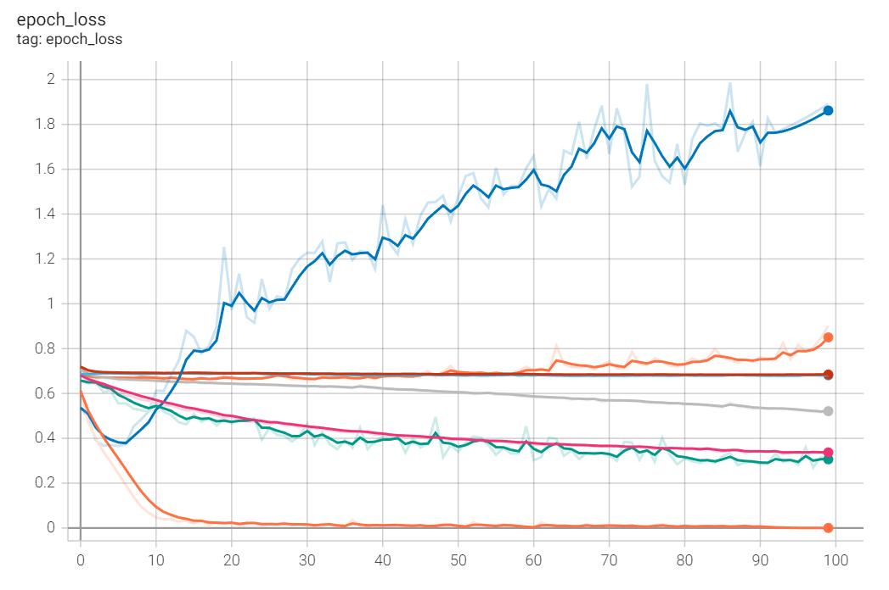

Si es necesario, se pueden volver a cargar otros modelos previamente guardados ya entrenados.

```python
# Cargo los modelos.  
import keras as kr

modelDens = kr.models.load_model('Dens.h5')
modelDens.load_weights('weightsDens.h5')

modelConv = kr.models.load_model('Conv.h5')
modelConv.load_weights('weightsConv.h5')

modelDensAD = kr.models.load_model('DensAD.h5') 
modelDensAD .load_weights('weightsDensAD.h5')

modelConvAD = kr.models.load_model('ConvAD.h5')
modelConvAD.load_weights('weightsConvAD.h5')
```

Una vez se tiene el modelo final entrenado ya se pueden hacer predicciones con nuevas imágenes para poder clasificarlas. 

```python
# Probar modelos guardados
from google.colab import files, output
import PIL.Image

# Edito la imagen de entrada para conseguir las
# mismas características que las de entrenamiento.  
def normalizarImagen (image):
try:
imageResolution  
except:
imageResolution = (100, 100)

image = np.array(image) # Convertimos la imagen a un array
image = cv2.resize(image, imageResolution) # Cambio de resolución
image = cv2.cvtColor(np.float32(image), cv2.COLOR_BGR2GRAY) # Imagen a blanco y negro
image = np.array(image).astype(float)/255 # Normalización de los píxeles
visualizarInput(image)
input = image.reshape(1, imageSize, imageSize, 1) # Cambio de forma
return input

# Visualización de la imagen de entrada
def visualizarInput (image):
# Visualización del input con Matplotlib  
plt.figure(figsize=(10, 10))
plt.subplot(3, 3, 1)
plt.imshow(image, cmap='gray')
plt.title('Input')
plt.axis('off')
plt.show()

# Según el output se encuentra la clase. 0 = Gato 1 = Perro
def resultado (output):
print(f'Output:\n{float(output)}')
# Si el output es más grande que 0.5, es un perro y si no, es un gato. 
output = round(float(output), 2)
if output >= 0.5:  
resultado = 'Perro'
else:
resultado = 'Gato'
return resultado

uploadedFiles = files.upload()
output.clear()
print('PRUEBAS FINALES DEL MODELO\n')

for nameFile in uploadedFiles.keys():
# Carga del modelo subido
if nameFile.endswith('.h5'):
if 'weights' in nameFile:
model.load_weights('__weights.h5')  
else:
model = kr.models.load_model('__model.h5')
# Predicción de las imágenes subidas
else:
imagen = PIL.Image.open(str(nameFile))
input = normalizarImagen(imagen)
output = model.predict(input) 
print(f'Es un {resultado(output)}.\n')
```

**PRUEBAS FINALES DEL MODELO**


`Google Colab:`  
[*`https://colab.research.google.com/drive/1a-grtvD1fC7eMjpRZsc3L5idoNU_TCfl?usp=sharing`*](https://colab.research.google.com/drive/1a-grtvD1fC7eMjpRZsc3L5idoNU_TCfl?usp=sharing)

## 7.4. Análisis de los resultados

Gracias a los gráficos finales se pueden analizar los resultados de cada modelo entrenado:

### Denso

En el modelo denso se puede observar un claro ejemplo de *overfitting*, ya que con los datos de entrenamiento tiene mucha precisión y poco error, pero con las imágenes de validación pasa todo lo contrario. Esto quiere decir que la red se memoriza las imágenes de entrenamiento, pero a la hora de hacer predicciones con imágenes que nunca ha visto la red no sabe cómo clasificarlas.

- Precisión por época:


- Error por época:  

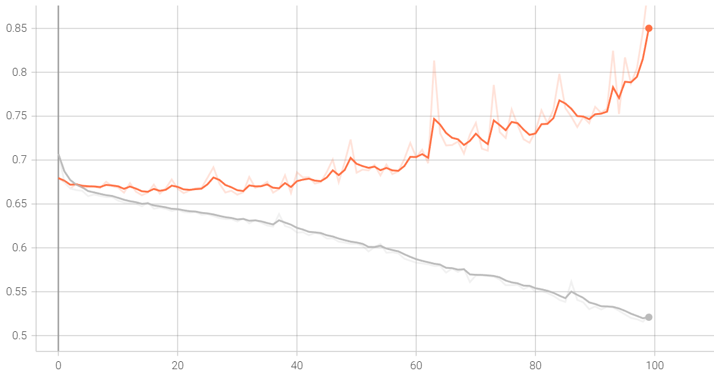

### Convolucional

En el modelo convolucional se ve un caso más exagerado de sobreajuste que en el modelo denso, ya que los modelos de convolución tienen mejores resultados con el análisis de imágenes que los densos. El modelo llega rápidamente a una precisión del 100% y a un porcentaje de error del 0%, pero solo con las imágenes de entrenamiento. En cambio, con las imágenes de validación la cantidad de error se dispara.

- Precisión por época:


- Error por época:

  

### Denso (Aumento de datos)

Con aumento de datos se puede observar que los resultados de entrenamiento y validación van juntos, aumentando y disminuyendo a la vez. Pero al ser un modelo denso y no ver las imágenes en su conjunto, este no aprende nada, ya que acaba con resultados casi iguales a los iniciales. 

- Precisión por época: 


- Error por época:


### Convolucional (Aumento de datos)

En el modelo convolucional con aumento de datos, ambos gráficos van juntos, pero además, esta red sí que aprende. Finalmente, se consigue aproximadamente una precisión del 85% y un porcentaje de error de un 32%. Todo esto con solo 100 épocas, si entrenáramos más el modelo, se obtendrían mejores resultados.

- Precisión por época:

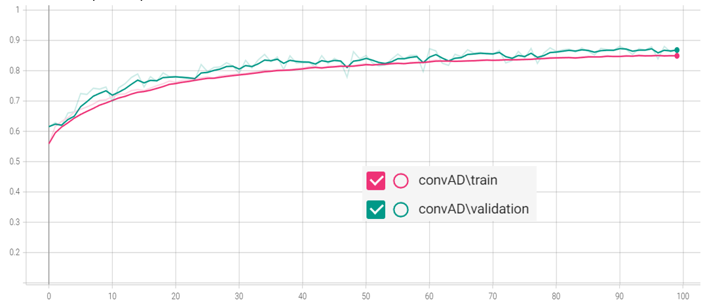

- Error por época: 


## 7.5. Conclusiones
Los modelos densos no han funcionado nada bien para hacer clasificaciones con imágenes, ya que estas reciben los valores de cada píxel por separado y no terminan de encontrar ninguna relación de cada píxel con los píxeles adyacentes.

En cambio, los modelos convolucionales sí que pueden encontrar una relación de cada píxel con sus vecinos gracias a las capas de convolución. Acaban comprimiendo la información que hay en varios píxeles en un único valor.

Respecto al aumento de datos, se ve una clara diferencia entre los modelos que lo tienen y los que no. Este método sirve para hacer las redes neuronales más versátiles a la hora de entrenar modelos con imágenes, ya que modifica las imágenes de entrada para poder identificar cada grupo esté en la posición y rotación que sea. 

Por ejemplo, si entrenamos un clasificador de números con imágenes donde se encuentren siempre centrados, el modelo sin aumento de datos aprenderá a clasificar números correctamente siempre que estos se encuentren centrados en la imagen. Si estos se ponen en pequeño en una esquina de la imagen, el modelo dará resultados erróneos. El aumento de datos sirve para esto, en este caso, para identificar perros y gatos estén de la manera que sea: rotados, boca abajo, en la posición que sea, etc.

En conclusión, en el ámbito de clasificar imágenes con *Machine Learning*, el aumento de datos es clave para evitar el *overfitting* junto con las capas convolucionales para aumentar la precisión.

# 8. Segundo proyecto: Clasificador de edades

Aunque el proyecto de clasificador de perros y gatos tuvo un resultado exitoso, decidimos realizar un modelo un poco más complejo como, por ejemplo, un clasificador de edades para comprobar si una persona es o no alumno del centro educativo, teniendo en cuenta solo la edad.

## 8.1. Planteamiento

Tomé como base el modelo de clasificador anterior cambiando algunas líneas de código, así como la función de activación de la última capa de la red a Softmax, porque en lugar de hacer una clasificación binaria, en este caso, hay más de dos clases. 

Hice una búsqueda de datasets formados por imágenes de personas clasificadas por edad y encontré un proyecto llamado “UTKFace” [(Zhifei Z., Yang S., Hairong Q., 2017)](https://susanqq.github.io/UTKFace/). Por suerte, estaba disponible al público con fines de investigación no comerciales, conformado por 24107 imágenes clasificadas.

También tuve que separar manualmente las entradas de ejemplo, aunque venían etiquetadas con el nombre del archivo (*[edad]_[género]_[etnia]_[fecha/hora].jpg*), tuve que crear un *array* con los diferentes valores.

## 8.2. Código 

Lo primero que tuve que cambiar fue la manera de cargar el *dataset*. Hice un bucle donde se fueran cargando de una en una cada imagen, y se fueran etiquetando según el nombre del archivo. Después visualicé algunos ejemplos del *dataset* para ver cómo el modelo recibiría los inputs.

```python
path = '/content/drive/MyDrive/AI/AgeChecker/Dataset'
imgSize = 100
plt.figure(figsize = (20, 20))  
print('Age (0 - 116 Years) - Gender (0 Male, 1 Female) - Race (0 White, 1 Black, 2 Asian, 3 Indian, 4 Others)\n')

i = 0
for img in os.listdir(path):
if i == 5:  
break
i += 1

# img = [edad]_[género]_[etnia]_[fecha/hora].jpg 
classData = str(img).split('_') # classData = (edad, género, etnia, fecha)
ageValue = int(classData[0])
genderValue = int(classData[1])
raceValue = int(classData[2])

if genderValue == 0:
gender = 'Male'
else:
gender = 'Female'
  
if raceValue == 0:  
race = 'White'
elif raceValue == 1:
race = 'Black' 
elif raceValue == 2:
race = 'Asian'
elif raceValue == 3:
race = 'Indian'
else:
race = 'Other'
         
dataInfo = f'{ageValue} year(s), {race} {gender}'

img_array = cv2.imread(os.path.join(path,img), cv2.IMREAD_GRAYSCALE) # Cambio de color (Blanco y negro)  
img_array = cv2.resize(img_array, (imgSize, imgSize)) # Cambio resolución (Cuadrada)

plt.subplot(5, 5, i) # Hago una tabla de 5 fila y 5 columnas
plt.title(dataInfo)
plt.xticks([])
plt.yticks([]) 
plt.imshow(img_array, cmap = 'gray')
```

```
# Age (0 - 116 Years) - Gender (0 Male, 1 Female) - Race (0 White, 1 Black, 2 Asian, 3 Indian, 4 Others)
```


Para entrenar a la red, creé dos *arrays* con las imágenes, en blanco y negro, pasadas a una cadena de valores, de 0 a 1 según cada píxel, que serían los inputs y estas estarían relacionadas con cada grupo de edad.

Decidí hacerlo dos veces, un entrenamiento con intervalos de cinco años y otro con intervalos de diez años, para ver si había alguna diferencia. 

Luego desordeno el orden de los ejemplos de entrenamiento y cambio los valores de los píxeles a un rango de 0 a 1. También cambio las etiquetas a una cadena de valores, ya que es lo que quiero que me devuelva el modelo al hacer una predicción. Recibiré las probabilidades de cada clase de donde terminaré escogiendo la clase con más probabilidad de ser la solución correcta.

```python
trainingData = []

totalSamples = len(os.listdir(path))
i = 1

agesClasses = [10, 20, 30, 40, 50, 60, 70, 80, 90, 100]

# Creación del dataset 
def createTrainingData():
  global i
  path = '/content/drive/MyDrive/AI/AgeChecker/Dataset'
  imgSize = 100

  for img in os.listdir(path):
    console.clear()
    print(f'{i}/{totalSamples}')

    i += 1
    classData = str(img).split('_')
    ageValue = int(classData[0])

    if ageValue <= 10:
      classNum = 0
    elif ageValue <= 20:
      classNum = 1 
    elif ageValue <= 30:
      classNum = 2
    elif ageValue <= 40:
      classNum = 3
    elif ageValue <= 50:
      classNum = 4
    elif ageValue <= 60:
      classNum = 5
    elif ageValue <= 70:
      classNum = 6
    elif ageValue <= 80:
      classNum = 7
    elif ageValue <= 90:
      classNum = 8
    else:
      classNum = 9

    img_array = cv2.imread(os.path.join(path,img), cv2.IMREAD_GRAYSCALE)
    img_array = cv2.resize(img_array, (imgSize, imgSize))
    trainingData.append([img_array, classNum])

createTrainingData()


import random
random.shuffle(trainingData)

X = []
y = []

for features, label in trainingData:
  X.append(features)
  y.append(label)  

X = np.array(X).astype(float)/255 # Transforma valores de (0, 255) => (0, 1)
X = np.array(X).reshape(-1, imgSize, imgSize, 1)  
y = np.array(y).astype(int)
y = kr.utils.np_utils.to_categorical(y, len(agesClasses))
# Transforma los valores enteros a arrays de probabilidad
# Ejemplo: [5] => [0, 0, 0, 0, 0, 1, 0, 0, 0, 0]  
#          [3] => [0, 0, 0, 1, 0, 0, 0, 0, 0, 0]
```

```
# 24107/24107
```

Realizo un aumento de datos para intentar mejorar la precisión de los resultados. Utilizo el mismo código que el modelo de perros y gatos.

```python
# Aumento de datos  
examples = 10
imageResolution = (imgSize, imgSize)

# Visualización imágenes originales
print('Dataset Original:')
plt.figure(figsize = (20, 20))
for i in range(examples):
  plt.subplot(5, 5, i + 1)
  plt.xticks([])
  plt.yticks([])
  plt.imshow(X[i].reshape(imageResolution), cmap = 'gray')
plt.show()

# Configuración del generador de imágenes
dataGenerator = ImageDataGenerator(
    rotation_range = 30, # Rotación
    width_shift_range = 0.2, # Desplazamiento a los lados 
    height_shift_range = 0.2, # Desplazamiento arriba o abajo
    shear_range = 15, # Inclinación  
    zoom_range = [0.75, 1.5], # Zoom  
    horizontal_flip = True, # Voltear horizontalmente
    vertical_flip = True # Voltear verticalmente
    )
dataGenerator.fit(X) # Aplicamos la configuración  

# Visualización imágenes generadas
print('\nDataset Aumento de Datos:')
plt.figure(figsize = (20, 20)) 
for imagen, etiqueta in dataGenerator.flow(X, y, shuffle = False):
  for i in range(examples):
    plt.subplot(5, 5, i + 1)
    plt.xticks([])
    plt.yticks([])
    plt.imshow(imagen[i].reshape(imageResolution), cmap = 'gray')
  plt.show()
  break
```

```
# Dataset Original:
```

```  
# Dataset Aumento de Datos:
```


A la hora de entrenar el modelo he utilizado la misma parte de código que en el modelo convolucional con aumento de datos que el de perros y gatos. Que está compuesto de 4 capas convolucionales de 32, 64 y 128 filtros de 3x3, una capa ReLU con 100 neuronas y una capa Sigmoide con una neurona.

Para hacer predicciones con los modelos entrenados se tiene que cambiar la forma de las imágenes de entrada a la misma forma que las imágenes empleadas para el entrenamiento: resolución cuadrada de 100x100 píxeles en blanco y negro con valores de 0 a 1 para cada píxel. El resultado de la predicción será una lista de las probabilidades que tiene cada intervalo de edad de ser la edad correcta.

Se toma la probabilidad más alta de todas como resultado final de la predicción. 

```python
# Probar modelos guardados
from google.colab import files, output # Subir archivos al Colab
import PIL.Image # Abrir imágenes  

# Editamos la imagen de entrada para conseguir las
# mismas características que las de entrenamiento.
def normalizarImagen (image):
  try:
    imageResolution
  except:
    imageSize = 100
    imageResolution = (imageSize, imageSize)

  image = np.array(image) # Convertimos la imagen a un array
  image = cv2.resize(image, imageResolution) # Cambio de resolución
  image = cv2.cvtColor(np.float32(image), cv2.COLOR_BGR2GRAY) # Imagen a blanco y negro
  image = np.array(image).astype(float)/255 # Normalización de los píxeles
  visualizarInput(image)
  input = image.reshape(1, imageSize, imageSize, 1) # Cambio de forma
  return input

# Visualización de la imagen de entrada  
def visualizarInput (image):
  # Visualización la input con Matplotlib
  plt.figure(figsize=(10, 10))
  plt.subplot(3, 3, 1)
  plt.imshow(image, cmap='gray')
  plt.title('Input')
  plt.axis('off')
  plt.show()

# Según el output encontramos la clase. 
def resultado (output):
  print(f'Output:\n{round(100*np.max(output), 2)}% seguro.')

  resultado = int(np.argmax(output))
  agesClasses = [10, 20, 30, 40, 50, 60, 70, 80, 90, 100]
  resultado = agesClasses[resultado]

  resultado = f'Tiene unos {resultado} años.'
  return resultado

uploadedFiles = files.upload()
output.clear()
print('PRUEBAS FINALES DEL MODELO\n')

for nameFile in uploadedFiles.keys():
  # Carga del modelo subido
  if nameFile.endswith('.h5'):
    if 'weights' in nameFile:
      model.load_weights('__weights.h5')  
    else:
      model = kr.models.load_model('__model.h5')
  # Predicción de las imágenes subidas
  else:
    try:
      imagen = PIL.Image.open(str(nameFile))
      input = normalizarImagen(imagen)

      output = model.predict(input)
      print(f'{resultado(output)}\n')
    except:
      print(f'¡Error {str(nameFile)}!')
```


`Google Colab:`  
[*`https://colab.research.google.com/drive/1lOvxgnW7f4DQ8mUYKWn7mtkjzEGwCFBl?usp=sharing`*](https://colab.research.google.com/drive/1lOvxgnW7f4DQ8mUYKWn7mtkjzEGwCFBl?usp=sharing)

## 8.3. Resultados

Después de realizar el entrenamiento del modelo de clasificación por edades, se puede ver diferencias de precisión final con otros modelos entrenados previamente de clasificadores binarios, como el de perros y gatos.

### Perros y gatos

Muestra un buen rendimiento durante todo el entrenamiento, la cantidad de error disminuye y el porcentaje de precisión aumenta tanto con valores de entrenamiento como con los valores de validación. Termina consiguiendo una precisión de un 90% después de 300 iteraciones. 


### Edades

Los modelos de clasificación no binarios no muestran un rendimiento tan bueno como el modelo anterior. Al principio la cantidad de error disminuye y la precisión aumenta tanto con imágenes de entrenamiento y validación, pero después de unas iteraciones el modelo solo tiene un aprendizaje positivo con las imágenes de entrenamiento mientras que con las imágenes de validación no pasa igual. Un posible caso de *overfitting*, causado muy probablemente por la falta de ejemplos de entrenamiento aunque se han utilizado 20491 imágenes de personas, en lugar de 19773 imágenes en el caso de los perros y gatos.  

Resultados con intervalos de 5 años:


Resultados con intervalos de 10 años:  


Después de finalizar el entrenamiento el modelo de intervalos de 5 consigue una precisión de un 30% y el de intervalos de 10 consigue una precisión de poco menos del 50%. Se tiene que tener en cuenta que el primer modelo se entrenó por 200 iteraciones y el segundo solo por 100.

## 8.4. Conclusiones

Por lo tanto, se puede llegar a la conclusión de que los modelos de clasificación no binarios de imágenes aprenden mejor cuando hay menos grupos para clasificar.

También se tiene que tener en cuenta que en el caso anterior de clasificación de perros y gatos, los dos grupos eran más fáciles de diferenciar, en cambio, en este caso hay más de dos grupos y todos tienen muchos rasgos en común todas las imágenes se parecen.  

Como observaciones, se puede añadir que el entrenamiento de los modelos no es instantáneo y que los tiempos para entrenar cada modelo es de unas cuantas horas. Utilizando Google Colab, el procedimiento de entrenamiento es mucho más lento que en un ordenador potente y por eso terminé decidiendo entrenarlos en mi propio ordenador. Al ser Google Colab un recurso gratuito, es normal que esté un poco limitado en este sentido. Por otro lado, si dejabas el programa funcionando durante un tiempo, este pedía verificación de si estabas cerca y si no lo estabas, el programa dejaba de funcionar. Como puntos positivos de esta herramienta es que es muy útil si estás usando un portátil o un móvil.

# 9. Resultados de los modelos 

Una vez finalizada la parte práctica, probé de entrenar los modelos cambiando algunos datos para ver su impacto en el resultado final. En el mismo documento he guardado el historial de entrenamientos de los tres modelos finales.

Para probar los modelos, también creé una web, reutilizando el código de una plantilla para probar modelos entrenados con Keras [(Ringa Tech., YouTube)](https://www.youtube.com/c/RingaTech).

## 9.1. Gráficos modelos

Para visualizar el comportamiento del *learning rate*, el número de épocas, el aumento de datos y los diferentes tipos de modelos, realicé los entrenamientos cambiando las diferentes variables y formé una tabla con los diferentes gráficos de los resultados finales. También están los gráficos de todos los modelos finales que he publicado en la página de clasificación (*<https://classificador.vercel.app>*). [Tabla Modelos Clasificación](https://docs.google.com/spreadsheets/d/1l83isgMk8DEoyaeg716v9KQvrtVLO5eJOdUv59d6nz4/edit?usp=sharing)

## 9.2. Web de los modelos 

Terminé aprovechando los modelos de clasificación finales para desarrollar una simple página web donde se pueden poner a prueba. Utilicé GitHub para colgar el código fuente de la web en la red. GitHub es una plataforma con la capacidad de alojar proyectos en la nube, empleada principalmente para almacenar y compartir el código de programas informáticos. Para hacerla accesible públicamente, usé Vercel, una plataforma que ofrece alojamiento gratuito para páginas web estáticas. La web ha sido publicada en la URL de *<https://classificador.vercel.app>* y el código fuente en *<https://github.com/zVictorium/classificador>*.

# 10. Conclusiones finales

Con este trabajo he podido aprender que las redes neuronales no son más que cálculos y funciones matemáticas entrelazadas que forman una gran función muy compleja y, según los valores de entrada, se consigue uno o más valores como resultado.

Las derivadas tienen un rol fundamental en el proceso de entrenamiento de las redes neuronales, ya que ayudan a encontrar el mínimo de la función de coste, y acercarnos a los valores de los parámetros adecuados para obtener buenos resultados. Por otra parte, tengo que admitir que he tenido dificultades a la hora de la comprensión del funcionamiento de las derivadas parciales, pero he entendido el funcionamiento teórico que se utiliza para el aprendizaje.  

Si hacemos uso de Machine Learning, es imprescindible contar con un buen *dataset* con una gran cantidad de ejemplos.

Gracias a las herramientas disponibles en la actualidad, he comprobado que es posible el desarrollo y entrenamiento de redes neuronales con relativa facilidad, sin la necesidad de tener un ordenador potente ni de tener que escribir tanto código.

También he confirmado que es muy importante utilizar redes neuronales convolucionales para el análisis de imágenes, junto con un procedimiento de aumento de datos para hacer al modelo más versátil, a pesar de que los modelos de clasificación de edad no han tenido resultados tan positivos.

Para finalizar, tengo que admitir que este trabajo me ha servido para aprender mucho sobre este campo en el que estaba muy interesado desde hacía tiempo y que me ha permitido conocer y analizar el comportamiento que hay en el interior de las redes sin limitarme a la experimentación con modelos creados por otras personas. 

También animo a todas las personas interesadas a que hagan una continuación de la investigación o que aprovechen la información de este trabajo como fuente para entender mejor el interior del aprendizaje automático.

# 11. Agradecimientos

Este trabajo ha sido interesante y gratificante, pero a la vez muy complejo en cuanto a la parte teórica. Al principio no sabía por dónde empezar, pero, gracias a la ayuda de mis profesores, pude iniciar la investigación con mejor orientación. Por este motivo quiero agradecer a las personas que han dedicado su tiempo en darme apoyo:

A mi tutor del trabajo, Miguel Ángel, por darme consejo sobre los puntos que podría mejorar y por facilitarme el acceso a fuentes de información y cursos sobre el tema. 

A Ignasi Fibla, por acceder a hacerme una introducción y orientación sobre inteligencia artificial.  

A Eusebi López, mi profesor de tecnología, por dedicar su tiempo en buscar cursos y contactos con conocimiento de IA.

# 12. Webgrafía

## 12.1. Imágenes

- Fig. 2.3 : Santana, C. [Dot CSV]. (2017, 1 de noviembre). “¿Qué es el Machine Learning?¿Y Deep Learning? Un mapa conceptual | DotCSV” [Vídeo]. YouTube. <https://youtu.be/KytW151dpqU?t=266>

- Fig. 3.1 : Esquema de la neurona. (2020, 16 de septiembre). Esquema.net. Recuperado 14 de octubre de 2022, de <https://esquema.net/neurona/>

- Fig. 3.2.1 : Byte, B. Y. (s. f.). Programando una red neuronal simple. Recuperado 14 de octubre de 2022, de <https://bitybyte.github.io/Programando-una-red-neuronal/>

- Fig. 3.2.2 : La neurona artificial. (s. f.). Recuperado 14 de octubre de 2022, de <https://www.ibiblio.org/pub/linux/docs/LuCaS/Presentaciones/200304curso-glisa/redes_neuronales/curso-glisa-redes_neuronales-html/x38.html>

- Fig. 3.2.3 : Colaboradores de Wikipedia. (2021, 12 de noviembre). Perceptrón. Wikipedia, la enciclopedia libre. Recuperado 14 de octubre de 2022, de <https://es.wikipedia.org/wiki/Perceptrón>

- Fig. 3.2.4-3.2.8, 3.3 : Ai, B. (2021, 12 de diciembre). Redes neuronales - Bootcamp AI. Medium. Recuperado 14 de octubre de 2022, de <https://bootcampai.medium.com/redes-neuronales-13349dd1a5bb>

- Fig. 3.2.9 : Ringa Tech. (2022, 25 de mayo). “Funciones de activación a detalle (Redes neuronales)” [Vídeo]. YouTube. <https://youtu.be/_0wdproot34?t=1177>

- Fig. 2.3 : Santana, C. [Dot CSV]. (2020, 12 de noviembre). “👁‍🗨 ¡Redes Neuronales CONVOLUCIONALES! ¿Cómo funcionan?” [Vídeo]. YouTube. <https://youtu.be/V8j1oENVz00?t=420>

- Fig. 3.4.3 : ¿Qué son las Redes Convolucionales? (s. f.). Codificando Bits. Recuperado 14 de octubre de 2022, de <https://www.codificandobits.com/blog/redes-convolucionales-introduccion/>

- Fig. 3.4.4 : Max-pooling / Pooling - Computer Science Wiki. (s. f.). Recuperado 14 de octubre de 2022, de [https://computersciencewiki.org/index.php/Max-pooling_/_Pooling](https://computersciencewiki.org/index.php/Max-pooling_/_Pooling)

- Fig. 4.1.1 : Santana, C. [Dot CSV]. (2017, 16 de diciembre). “Regresión Lineal y Mínimos Cuadrados Ordinarios | DotCSV” [Vídeo]. YouTube. <https://youtu.be/k964_uNn3l0?t=360>

- Fig. 4.2.1-4.2.3 : AprendeInnovando. (2021, 24 de enero). “CÓMO FUNCIONA el entrenamiento de Redes Neuronales 🧠 (5 Minutos)” [Vídeo]. YouTube. <https://youtu.be/t1EIJNk-gdA>

- Fig. 4.2.4 : Thakur, A. (2022, 24 de marzo). What’s the Optimal Batch Size to Train a Neural Network? W&B. Recuperado 14 de octubre de 2022, de <https://wandb.ai/ayush-thakur/dl-question-bank/reports/What-s-the-Optimal-Batch-Size-to-Train-a-Neural-Network---VmlldzoyMDkyNDU>

## 12.2. Fuentes y recursos

- edX. (s. f.). Introducción a la Inteligencia Artificial. Recuperado 28 de octubre de 2022, de <https://www.edx.org/course/introduccion-a-la-inteligencia-artificial?index=product>

- edX. (s. f.). CS50’s Introduction to Artificial Intelligence with Python. Recuperado 28 de octubre de 2022, de <https://www.edx.org/course/cs50s-introduction-to-artificial-intelligence-with-python?index=product>

- Santana, C. [Dot CSV]. (s.f.). Inicio [Canal de YouTube]. YouTube. Recuperado el 14 de octubre de 2022, de <https://www.youtube.com/c/DotCSV>

- Ringa Tech. (s.f.). Inicio [Canal de YouTube]. YouTube. Recuperado el 14 de octubre, 2022, de <https://www.youtube.com/c/RingaTech> 

- Zhifei Z., Yang S., Hairong Q. (2017). Age Progression/Regression by Conditional Adversarial Autoencoder. Recuperado 14 de octubre de 2022, de <https://susanqq.github.io/UTKFace/>

- Microsoft. (s. f.). Kaggle Cats and Dogs Dataset. Microsoft Downloads. Recuperado 20 de octubre de 2022, de <https://www.microsoft.com/en-us/download/details.aspx?id=54765>

- Wikipedia contributors. (2022, 25 de octubre). Machine learning. Wikipedia. <https://en.wikipedia.org/wiki/Machine_learning> 

- Wikipedia contributors. (2022, 24 de agosto). Perceptron. Wikipedia. Recuperado 14 de octubre de 2022, de <https://en.wikipedia.org/wiki/Perceptron>

- Wikipedia contributors. (2022, 25 de agosto). Activation function. Wikipedia. Recuperado 14 de octubre de 2022, de <https://en.wikipedia.org/wiki/Activation_function>

- Wikipedia contributors. (2022, 25 de octubre). Machine learning. Wikipedia. <https://en.wikipedia.org/wiki/Machine_learning>

- Wikipedia contributors. (2022, 13 de octubre). Convolutional neural network. Wikipedia. Recuperado 14 de octubre de 2022, de <https://en.wikipedia.org/wiki/Convolutional_neural_network>

- Ramírez, F. (2021, 25 junio). Las matemáticas del Machine Learning: Funciones de activación - Think Big Empresas. Think Big. Recuperado 28 de octubre de 2022, de <https://empresas.blogthinkbig.com/las-matematicas-del-machine-learning-funciones-de-activacion/>

- Descenso de gradiente (artículo). (s. f.). Khan Academy. Recuperado 28 de octubre de 2022, de <https://es.khanacademy.org/math/multivariable-calculus/applications-of-multivariable-derivatives/optimizing-multivariable-functions/a/what-is-gradient-descent>

- Ai, B. (2021, 12 de diciembre). Redes neuronales - Bootcamp AI. Medium. Recuperado 28 de octubre de 2022, de <https://bootcampai.medium.com/redes-neuronales-13349dd1a5bb>

- Calvo, J. (s. f.). Crear Red Neuronal desde las matemáticas. Blog EuropeanValley. Recuperado 28 de octubre de 2022, de <https://www.europeanvalley.es/noticias/crear-red-neuronal-desde-las-matematicas/>  

- La neurona artificial. (s. f.). Recuperado 28 de octubre de 2022, de <https://www.ibiblio.org/pub/linux/docs/LuCaS/Presentaciones/200304curso-glisa/redes_neuronales/curso-glisa-redes_neuronales-html/x38.html>

*Esta es una version traducida del documento del trabajo, puedes ver la versión original [aquí](docs/original.pdf).*